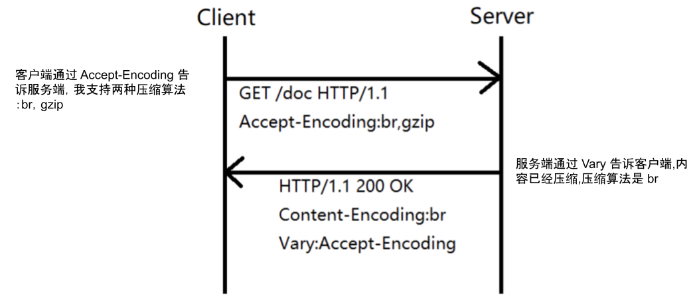
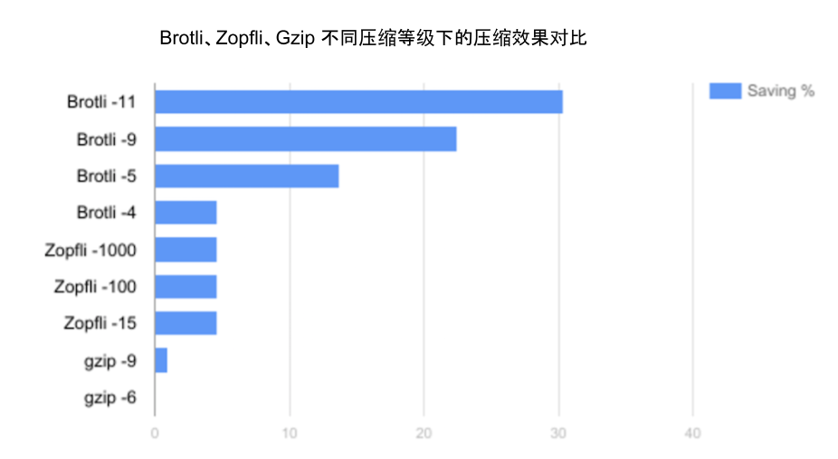

# 2.4 使用 Brotli 压缩传输内容

压缩传输内容是提升 HTTP 服务可用性的关键手段。比如使用 Gzip 压缩一个 100KB 的文件，通常会减少到 30KB，不仅能提高网络传输效率，还能减少带宽成本。

所有现代浏览器、客户端和 HTTP 服务器软件都支持压缩技术，它们之间使用协商机制确定采用的压缩算法：

- HTTP 客户端发送 Accept-Encoding 首部，列出支持的压缩算法及优先级
- 服务器选择兼容算法压缩响应，通过 Content-Encoding 首部告知客户端

默认使用 Gzip，但针对 HTTP 文本内容还有更高压缩率的 Brotli 算法。Brotli 是 Google 推出的开源无损压缩算法，内部有预定义字典，涵盖超过 1,300 个 HTTP 领域常用单词和短语。

"Brotli 会将这些常见的词汇和短语作为整体匹配，从而大幅提升文本型内容的压缩密度。"

各类型压缩算法在不同压缩等级下的效果对比显示，Brotli 压缩效果比常用的 Gzip 高出 17% 至 30%。

## Nginx 启用 Brotli 配置

```
http {
    brotli on;
    brotli_comp_level 6;
    brotli_buffers 16 8k;
    brotli_min_length 20;
    brotli_types text/plain text/css application/json application/x-javascript text/xml application/xml application/xml+rss text/javascript application/javascript image/svg+xml;
}
```




