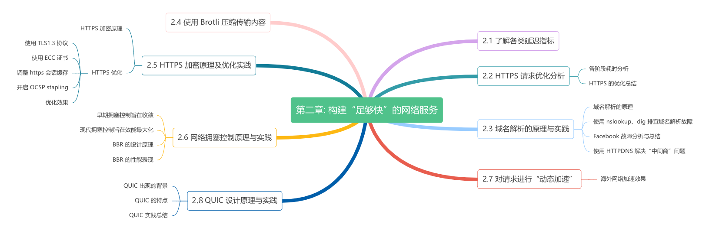

# 第二章: 构建"足够快"的网络服务

> 永远不要低估一辆满载着硬盘的卡车，在高速公路上飞驰时的带宽。
>
> —— by《计算机网络》作者 Andrew S. Tanenbaum

不少人的第一直觉是"路由的 hops、运营商线路的质量，决定网络的延迟以及吞吐量"，由此盲目断定网络因开发者不可控而无法插手。实际上，应用层的网络请求是否与传输协议提倡的方式匹配，这对提升网络吞吐量、降低网络延迟也施加不小的影响。最能体现这一点的，便是各类网络优化技巧。

本章，我们将分析应用层 HTTPS 请求的完整过程，探讨其中 DNS、SSL、QUIC 以及网络拥塞控制的原理，研究各种网络优化技巧，讨论实现"构建足够快的网络服务"目标！

本章内容安排如图 2-0 所示。

---

## 2.1 了解各类延迟指标

既然目标是"足够快"，首先需要对计算机中"快"的概念有一个基本的认识。

伯克利大学有个动态网页，里面汇总了历年计算机中各类操作延迟（也称时延）的变化。2020年的数据中，从CPU一级缓存读取仅需1纳秒，而从主存访问需100纳秒。SSD随机读约16微秒，同一数据中心往返约0.5毫秒，DNS解析约50毫秒，美国到欧洲的数据包传输约150毫秒，容器冷启动则需约5秒。

这些延迟数据与软件设计和性能调优息息相关。例如，由于物理距离的限制，无论如何优化，也无法将从上海到美国的HTTPS请求延迟降到750毫秒以下。

参考：https://colin-scott.github.io/personal_website/research/interactive_latency.html

时间单位换算：1秒 = 10³毫秒 = 10⁶微秒 = 10⁹纳秒
