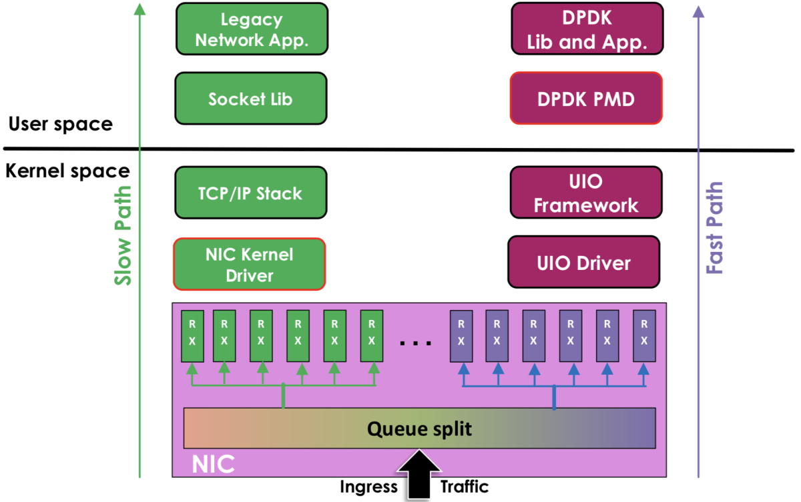

# 3.4.1 数据平面开发套件 DPDK

## Summary

This section introduces DPDK (Data Plane Development Kit), a kernel bypass technology created by Intel in 2010 for high-performance networking. Originally targeting Intel hardware, it now supports multiple vendors.

## Key Points

- DPDK enables network packets to bypass the Linux kernel protocol stack entirely
- Uses User space I/O (UIO) technology to transmit data directly between NIC and user space applications
- **Real-world application:** iQIYI's open-source DPVS project demonstrates 300% higher PPS performance compared to standard LVS
- Offers significant cost savings for large-scale deployments by improving per-server performance

> "DPDK 绕过了 Linux 内核协议栈的数据包处理过程，在用户空间直接进行收发和处理。"

