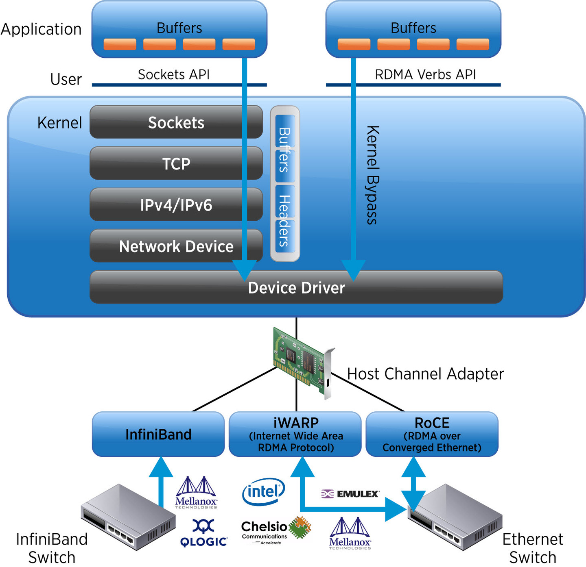
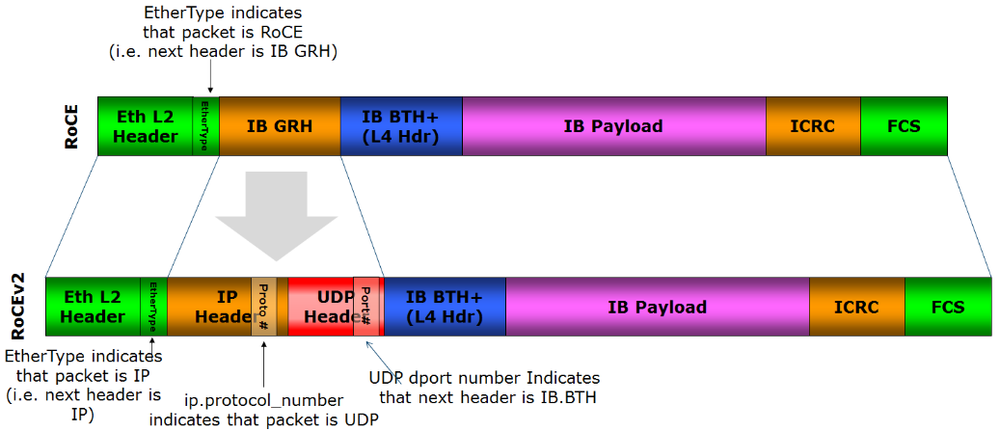

# 3.4.3 RDMA Technology Overview

This article from "深入高可用系统原理与设计" (Chapter 3.4.3) explains Remote Direct Memory Access technology.

## Key Points

### What is RDMA?

RDMA allows applications to access remote host memory directly through the RDMA Verbs API, without operating system or CPU involvement in data copying, significantly reducing latency and CPU overhead.

### Three Protocol Implementations

**Infiniband** - Proposed by IBTA in 2000, offers excellent performance (less than 3 microsecond latency, 400Gb/s+ throughput), but requires dedicated equipment and doesn't兼容以太网标准. Used by ChatGPT's distributed ML systems.

**iWARP** - Encapsulates RDMA in TCP/IP, but TCP's handshake and congestion control mechanisms削弱 its performance advantages, leading to its decline.

**RoCE** - Released by IBTA in 2010, "移植" Infiniband's data format to Ethernet. Two versions:
- RoCEv1: Layer 2 only, same subnet
- RoCEv2: IP-based, supports跨子网 communication

### Loss Sensitivity

RDMA networks are extremely sensitive to packet loss. RoCE requires lossless Ethernet support, typically using DCQCN (Microsoft/Mellanox) or HPCC (Alibaba) algorithms.

According to Microsoft Azure, RDMA traffic accounted for 70% of their datacenter traffic by 2023.

