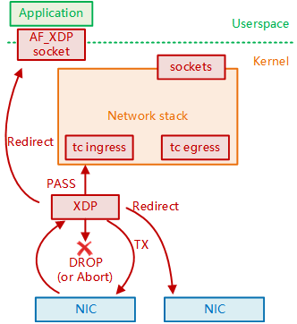

# 3.4.2 eBPF 和 快速数据路径 XDP

## Title: 3.4.2 eBPF 和 快速数据路径 XDP

## Key Concepts Covered

### Introduction

- DPDK uses "kernel bypass" and couldn't integrate well with Linux ecosystem
- In 2016, David S. Miller declared "DPDK is not Linux"
- Same year, XDP (eXpress Data Path) emerged as Linux's own "highway"
- XDP offers DPDK-like performance while staying within the kernel

### BPF Technology

- BPF (Berkeley Packet Filter) allows running verified code in kernel space
- Original BPF existed since Linux 2.5 for packet capture
- eBPF (Extended BPF) introduced in Linux 3.18 became a universal execution engine

### Four Main Hook Types

1. **TC (Traffic Control)** - Network traffic control layer processing
2. **Tracepoints** - Static probes in kernel subsystems for performance analysis
3. **LSM (Linux Security Modules)** - Security policy enforcement
4. **XDP** - Lowest level hook in NIC driver, for ultra-high-speed packet processing

### XDP Return Codes (5 types)

- **XDP_ABORTED** - Error/exception in processing
- **XDP_DROP** - Packet dropped at driver level (DDoS protection)
- **XDP_PASS** - Continue to kernel network stack
- **XDP_TX** - Send back to incoming interface
- **XDP_REDIRECT** - Redirect to other NIC/CPU or user space via AF_XDP

### Cilium Example

- Uses eBPF/XDP to implement conntrack and NAT independently of Netfilter
- Standard Linux commands (conntrack, netstat, ss, lsof) don't show Cilium data
- Requires Cilium-specific commands like:
  - `cilium bpf nat list`
  - `cilium bpf ct list global`

