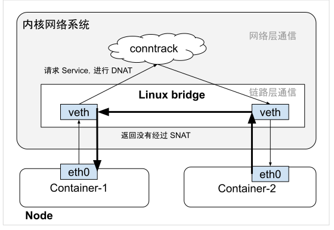

# 3.3.3 连接跟踪模块 conntrack

## Overview

The chapter covers conntrack (connection tracking), which monitors communications in the Linux kernel. It tracks not only TCP connections but also UDP, ICMP and other connection types.

## How Conntrack Works

When Linux receives a packet, conntrack creates a connection record and updates connection states like NEW or ESTABLISHED. For TCP handshakes:

1. Client sends TCP SYN
2. Linux creates new connection record marked as NEW
3. After handshake completes, connection becomes ESTABLISHED

View records using: `cat /proc/net/nf_conntrack`

## Connection with iptables and NAT

Conntrack records are essential for iptables connection state matching and serve as the foundation for SNAT and DNAT operations. The Kubernetes kube-proxy relies on this mechanism. When a request accesses a Service, traffic gets DNAT forwarded to a Pod's IP and port. The response then undergoes SNAT to maintain the proper address translation.

## The Bridge Problem

A critical issue emerges when client and Pod exist on the same host. During response handling, the Linux bridge detects the target IP resides on the same bridge and forwards packets via the link layer without triggering the network layer's conntrack module. This causes SNAT to fail, resulting in incomplete NAT mappings and communication failures.

## Solution

Linux kernel introduced the bridge-nf-call-iptables configuration to ensure iptables rules activate within bridges. This maintains complete conntrack connection records for proper NAT processing, which explains why this setting must be enabled when deploying Kubernetes clusters.

