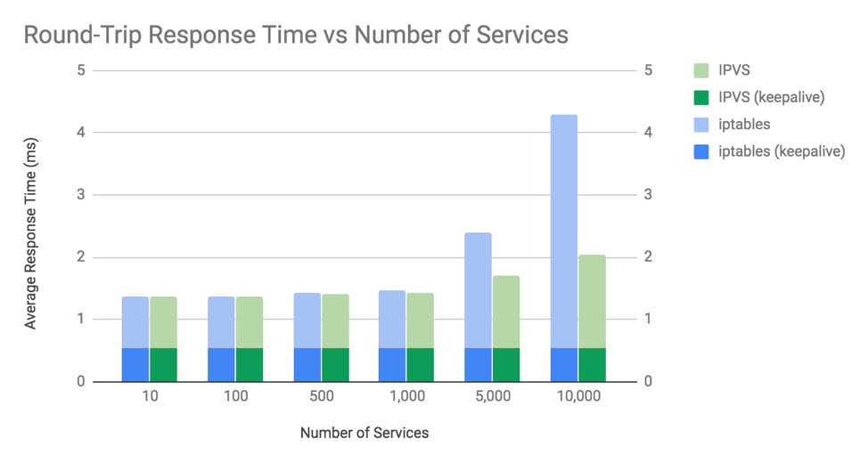

# 3.3.2 数据包过滤工具 iptables

iptables is a packet filtering tool built on Netfilter. It provides five default chains corresponding to Netfilter's hooks: PREROUTING, INPUT, FORWARD, OUTPUT, and POSTROUTING.

iptables organizes common operations into five tables: raw (bypasses connection tracking), mangle (modifies packet fields like ToS/TTL), nat (network address translation), filter (packet filtering - the default), and security (SELinux integration).

## 常见动作

- **ACCEPT**：允许数据包通过
- **DROP**：静默丢弃数据包
- **REJECT**：拒绝数据包并返回 ICMP 错误
- **DNAT/SNAT**：修改目标/源地址
- **REDIRECT**：端口映射
- **MASQUERADE**：动态 SNAT

## Kubernetes 中的应用

在 Kubernetes 中，kube-proxy 使用 iptables 自定义链来实现 Service 负载均衡。当创建 Service 时，会添加规则，通过 DNAT 规则将流量从 Service VIP 转发到后端 Pod IP。

然而，iptables 模式存在扩展限制。当 Service 数量达到约 1,000 时，由于规则爆炸，性能会显著下降。IPVS 模式被添加以解决这一问题，使用 Linux 内核的四层负载均衡器，在大规模场景下性能更好。

对于大型集群，建议使用 IPVS 模式或 Cilium（通过内核旁路技术可以完全消除 kube-proxy）。
