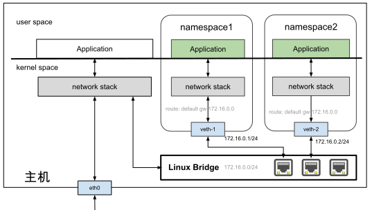

# 3.5.4 虚拟交换机 Linux Bridge

Linux Bridge 是 Linux 系统中的虚拟交换机，用于连接多个网络接口组成局域网。其工作原理是：当数据帧进入时，根据帧类型和目标 MAC 地址，通过 FDB（转发表）进行转发或洪泛处理。

## 核心功能

Linux Bridge 支持广播帧转发到所有桥接设备，以及单播帧的智能转发。未知 MAC 地址的帧会被洪泛到所有接口，同时学习并记录 MAC 与端口的映射关系。

## 实际应用

文章通过示例展示如何将两个网络命名空间通过 Linux Bridge 连接：创建 br0 网桥，创建 veth1/veth2 配对设备分别加入不同命名空间，将虚拟网卡接入网桥，配置 IP 地址，最后实现两个命名空间的二层互通。

Linux Bridge 本质上也是虚拟网络设备，可配置 MAC 和 IP 地址，支持 IP 路由功能，这为容器与主机间的通信奠定了基础。

