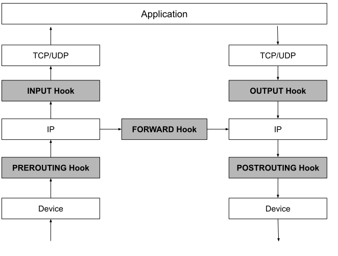

# 3.3.1 Netfilter 的 5 个钩子

Netfilter 在网络协议栈埋下了 5 个钩子，用来干预 Linux 网络通信。内核模块向这些钩子注册回调函数，数据包经过时自动触发处理。

## 5个钩子

- **PREROUTING**：数据包进入协议栈即触发，用于修改目标 IP（DNAT）
- **FORWARD**：数据包不发给本机时触发，本机作为路由器中转处理
- **INPUT**：数据包发给本机时触发，处理发往本机的包
- **OUTPUT**：本地进程处理后、IP 路由前触发，可限制本机访问
- **POSTROUTING**：数据包出协议栈前触发，用于源地址转换（SNAT）

Netfilter 允许同一钩子注册多个回调函数，按优先级形成回调链，使得 iptables 等上层应用都具有"链"的概念。

