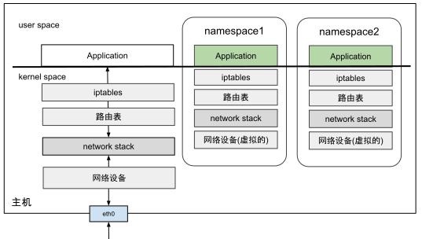

# 3.5.1 网络命名空间

从 Linux 内核 2.4.19 版本开始，逐步集成了多种命名空间技术，以实现对各类资源的隔离。其中，网络命名空间（Network Namespace）是最为关键的一种，也是容器技术的核心。

网络命名空间允许 Linux 系统内创建多个独立的网络环境，每个环境拥有独立的网络资源，如防火墙规则、网络接口、路由表、ARP 邻居表及完整的网络协议栈。当进程运行在某个网络命名空间内时，就像独享一台物理主机。

## 常用命令

- 创建命名空间：`ip netns add ns1`
- 查看设备：`ip netns exec ns1 ip link list`
- 查看 iptables：`ip netns exec ns1 iptables -L -n`

## 关键概念

- 不同的网络命名空间默认是隔离的
- 通信需要虚拟网络设备
- 虚拟网卡连接虚拟交换机
- 操作方式与物理局域网配置相似，但通过虚拟方式实现
