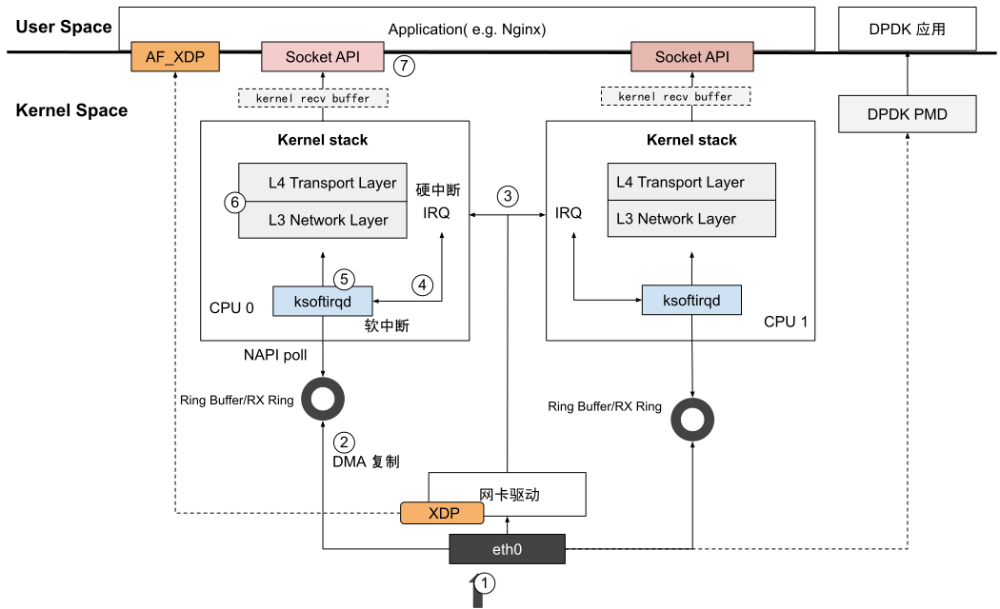

# 3.2 Linux 系统收包流程

This section explains how network packets move through Linux kernel modules after arriving at the network interface card (NIC). The packet receiving flow includes:

1. NIC receives the packet
2. DMA transfers data to RingBuffer
3. IRQ notifies kernel
4. SoftIRQ processing via ksoftirqd
5. NAPI poll converts packets to skb format
6. Protocol stack processing (L3 routing, L4 NAT/conntrack)
7. Packet delivered to socket receive buffer for applications

Key concepts: RingBuffer as circular buffer, skb (Socket Buffer) as core data structure, softirq handling, and mention of XDP/DPDK as kernel bypass solutions for high-performance networking.

