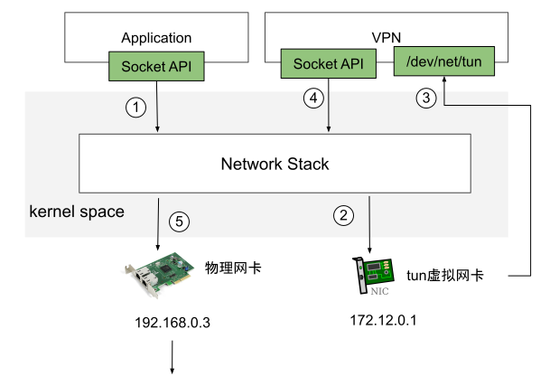

# TUN 和 TAP 虚拟网络设备

TUN 和 TAP 是 Linux 内核自 2.4.x 版本引入的虚拟网卡设备，专为用户空间与内核空间之间的数据传输而设计。

## 主要区别

- **TUN 设备**：工作在网络层（Layer 3），用于处理 IP 数据包，模拟网络层接口
- **TAP 设备**：工作在数据链路层（Layer 2），用于处理以太网帧，传输完整以太网帧

## 工作原理

TUN/TAP 设备对应的字符设备文件为 /dev/net/tun。当用户空间程序打开该字符设备文件时，TUN/TAP 驱动会创建并注册虚拟网卡，默认命名为 tunX 或 tapX。

## VPN 隧道示例

1. 普通用户程序发起网络请求
2. 数据包进入内核协议栈，路由至 tun0 设备
3. VPN 程序读取 /dev/net/tun 文件中的数据包
4. VPN 程序对数据包进行封装操作
5. 处理后的数据包再次写入内核网络栈，通过 eth0 发送到目标网络

## 应用场景

封装数据包以构建网络隧道是实现虚拟网络的常见方式。例如，容器网络插件 Flannel 早期版本曾使用 TUN 设备实现容器间通信。

## 性能问题

TUN 设备数据传输需经过两次协议栈，涉及多次封包与解包操作，导致性能损耗。这也是 Flannel 后来弃用 TUN 设备的主要原因。

