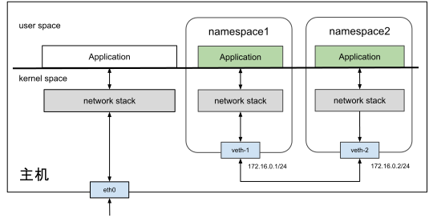

# 3.5.3 虚拟网卡 Veth

## Overview

The article explains Veth (Virtual Ethernet), a virtual network interface introduced in Linux kernel 2.6 alongside network namespaces. Veth operates on the principle of "reversing data transmission direction," converting outgoing packets into incoming packets at the receiving end for reprocessing by the kernel network stack.

## Key Concepts

### What is Veth?

Veth functions like an Ethernet cable with two "水晶头" (RJ45 connectors). When data is sent from one end, it appears at the other end. This is why Veth is described as a "pair of devices" (Veth-Pair).

### Primary Use Case

Veth connects isolated network namespaces to enable communication between them.

## Configuration Example

### Step 1: Create Veth Pair
```
$ ip link add veth1 type veth peer name veth2
```

### Step 2: Assign to Different Namespaces
```
$ ip link set veth1 netns ns1
$ ip link set veth2 netns ns2
```

### Step 3: Configure IP Addresses (172.16.0.0/24 subnet)
```
$ ip netns exec ns1 ip link set veth1 up
$ ip netns exec ns1 ip addr add 172.16.0.1/24 dev veth1
$ ip netns exec ns2 ip link set veth2 up
$ ip netns exec ns2 ip addr add 172.16.0.2/24 dev veth2
```

### Step 4: Verify Connectivity
```
$ ip netns exec ns1 ping -c10 172.16.0.2
```

## Limitation

The article notes that while Veth solves direct container-to-container communication, it becomes impractical for multiple containers. Each container would need dedicated Veth pairs for every other container it communicates with. This limitation introduces the need for virtual switches like Linux Bridge for multi-container networking scenarios.


