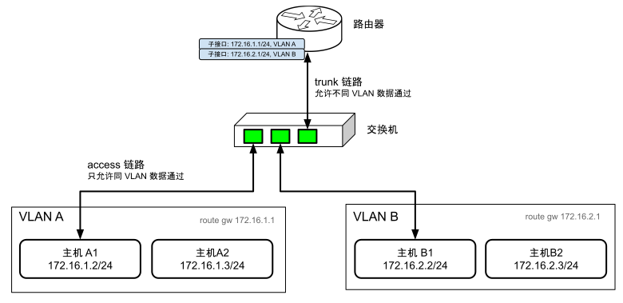
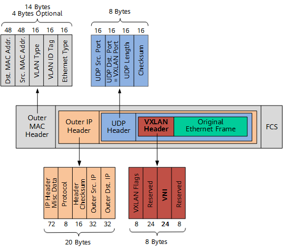
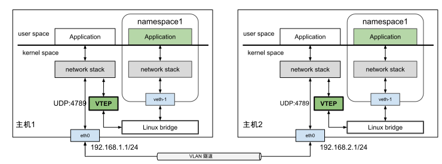

# 3.5.5 虚拟网络通信技术 VXLAN

## SDN Overview

The core idea involves building a virtual network layer over existing physical infrastructure. SDN separates the control plane from the data plane, abstracting network services from underlying hardware for direct software control.

The SDN model consists of two components: an underlay network (physical routers and switches for data transmission) and an overlay network (logical networks built on top for interconnecting virtual machines and containers).

## VLAN (Virtual Local Area Network)

VLAN's primary function divides broadcast domains, isolating devices within the same physical network. It solves broadcast storms by using VLAN tags in Ethernet frame headers to restrict broadcasts to devices sharing the same VLAN ID.

However, VLAN has significant limitations. The 12-bit VLAN ID field supports only 4,094 VLANs maximum, which proves insufficient for large data centers. Additionally, cross-datacenter communication proves difficult since VLAN operates at Layer 2.

## VXLAN (Virtual Extensible LAN)

VXLAN, defined by IETF, represents a tunnel encapsulation technology under NVO3 standards. It encapsulates Layer 2 Ethernet frames within Layer 4 UDP packets for transmission across Layer 3 networks.

The VXLAN packet structure includes a VXLAN header with a 24-bit VNI field supporting up to 16.77 million networks, a UDP header with destination port 4789, and outer IP and MAC headers for host addressing.

VTEP (VXLAN Tunnel Endpoints) devices handle encapsulation and decapsulation in Linux systems, appearing as virtual VXLAN network interfaces.

## Linux Configuration Example

The example demonstrates creating a bridge, adding a VXLAN interface with VNI 100, binding to eth0, and joining the interface to the bridge.

## Key Advantages

VXLAN addresses VLAN's limitations through its 24-bit VNI field supporting over 16 million logical Layer 2 networks, and its ability to create tunnels across physical networks. Containers and VMs can migrate between networks while remaining in the same Layer 2 domain without network reconfiguration.

