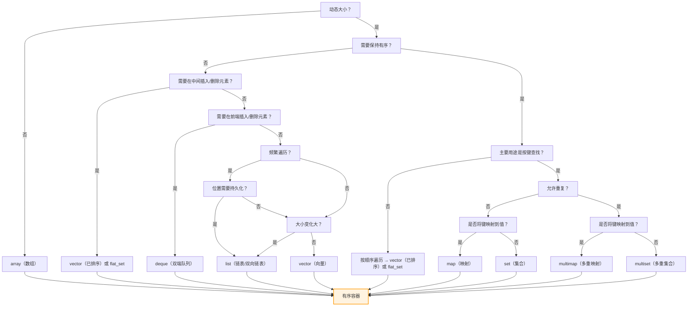
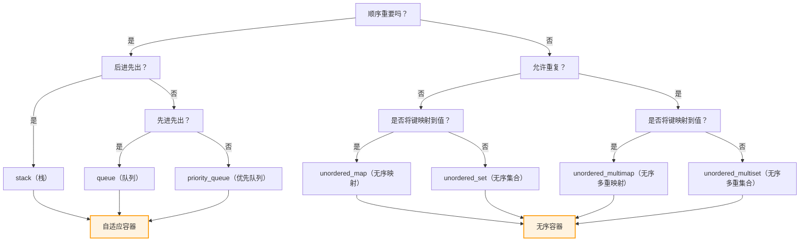

# C++ STL containers overview

本目录包含了 C++ STL 容器的详细分析和介绍。

## 容器分类

### 序列容器 (Sequence Containers)
- [array](array.md) - 固定大小数组
- [vector](vector.md) - 动态数组
- [deque](deque.md) - 双端队列
- [forward_list](forward_list.md) - 单向链表
- [list](list.md) - 双向链表

### 容器适配器 (Container Adapters)
- [stack](stack.md) - 栈
- [queue](queue.md) - 队列
- [priority_queue](priority_queue.md) - 优先队列

### 关联容器 (Associative Containers)
- [set](set.md) - 集合
- [multiset](multiset.md) - 多重集合
- [map](map.md) - 映射
- [multimap](multimap.md) - 多重映射

### 无序关联容器 (Unordered Associative Containers)
- [unordered_set](unordered_set.md) - 无序集合
- [unordered_multiset](unordered_multiset.md) - 无序多重集合
- [unordered_map](unordered_map.md) - 无序映射
- [unordered_multimap](unordered_multimap.md) - 无序多重映射

## 容器对比表

|        容器        |    底层数据结构   |                         时间复杂度                        | 有无序 | 可不可重复 |                                     其他                                       |
|:------------------:|:--------------:|:----------------------------------------------------:|:------:|:----------:|:----------------------------------------------------------------------------:|
| array              | 数组              | 随机读改 O(1)                                             | 无序   | 可重复     | 支持随机访问                                                                 |
| vector             | 数组              | 随机读改、尾部插入、尾部删除 O(1) 头部插入、头部删除 O(n) | 无序   | 可重复     | 支持随机访问                                                                    |
| deque              | 双端队列          | 头尾插入、头尾删除 O(1)                                   | 无序   | 可重复     | 一个中央控制器 + 多个缓冲区，支持首尾快速增删，支持随机访问                       |
| forward_list       | 单向链表          | 插入、删除 O(1)                                           | 无序   | 可重复     | 不支持随机访问                                                               |
| list               | 双向链表          | 插入、删除 O(1)                                           | 无序   | 可重复     | 不支持随机访问                                                               |
| stack              | deque / list      | 顶部插入、顶部删除 O(1)                                   | 无序   | 可重复     | deque 或 list 封闭头端开口，不用 vector 的原因应该是容量大小有限制，扩容耗时     |
| queue              | deque / list      | 尾部插入、头部删除 O(1)                                   | 无序   | 可重复     | deque 或 list 封闭头端开口，不用 vector 的原因应该是容量大小有限制，扩容耗时     |
| priority_queue     | vector + max-heap | 插入、删除 O(log2n)                                       | 有序   | 可重复     | vector容器+heap处理规则                                                      |
| set                | 红黑树            | 插入、删除、查找 O(log2n)                                 | 有序   | 不可重复   |                                                                              |
| multiset           | 红黑树            | 插入、删除、查找 O(log2n)                                 | 有序   | 可重复     |                                                                              |
| map                | 红黑树            | 插入、删除、查找 O(log2n)                                 | 有序   | 不可重复   |                                                                              |
| multimap           | 红黑树            | 插入、删除、查找 O(log2n)                                 | 有序   | 可重复     |                                                                              |
| unordered_set      | 哈希表            | 插入、删除、查找 O(1) 最差 O(n)                           | 无序   | 不可重复   |                                                                              |
| unordered_multiset | 哈希表            | 插入、删除、查找 O(1) 最差 O(n)                           | 无序   | 可重复     |                                                                              |
| unordered_map      | 哈希表            | 插入、删除、查找 O(1) 最差 O(n)                           | 无序   | 不可重复   |                                                                              |
| unordered_multimap | 哈希表            | 插入、删除、查找 O(1) 最差 O(n)                           | 无序   | 可重复     |                                                                              |

## 选择指南

### 什么时候选择哪个容器？

1. **需要随机访问**：`vector`, `deque`, `array`
2. **频繁头尾操作**：`deque`
3. **频繁中间插入删除**：`list`, `forward_list`
4. **需要排序**：`set`, `map`
5. **快速查找**：`unordered_set`, `unordered_map`
6. **LIFO 操作**：`stack`
7. **FIFO 操作**：`queue`
8. **优先级操作**：`priority_queue`

---

## 详细容器分析

以下是 C++ STL 中所有容器头文件及其对应容器的详细说明，包括使用场景、优缺点和实现原理：

## 1. `<vector>`
**容器：** `std::vector`
- **使用场景**：动态数组，适用于需要随机访问、尾部高效插入/删除的场景（如动态列表、缓冲区）。
- **优点**：
  - 连续内存布局（缓存友好）
  - O(1) 随机访问
  - 尾部插入/删除 O(1) 均摊时间
- **缺点**：
  - 中间插入/删除 O(n)
  - 扩容时需整体复制（成本高）
- **实现原理**：动态数组，通过 3 个指针实现：
  ```cpp
  _Start → 指向首个元素
  _Finish → 指向最后一个元素的下一位
  _End_of_storage → 指向分配内存的末尾
  ```
  扩容策略：通常按 `2x` 或 `1.5x` 增长。

---

## 2. `<deque>`
**容器：** `std::deque`
- **使用场景**：双端队列，适用于需要头尾高效插入/删除的场景（如任务队列、滑动窗口）。
- **优点**：
  - 头尾插入/删除 O(1)
  - 随机访问 O(1)
- **缺点**：
  - 中间插入/删除 O(n)
  - 非连续内存（缓存局部性差）
- **实现原理**：分块数组（块链结构）：
  ```plaintext
  [块1] → [块2] → [块3]
  每个块是固定大小的数组
  中央映射表（map）管理块指针
  ```

---

## 3. `<list>`
**容器：** `std::list`
- **使用场景**：双向链表，适用于频繁任意位置插入/删除（如高频修改的列表）。
- **优点**：
  - 任意位置插入/删除 O(1)
  - 无容量限制
- **缺点**：
  - 随机访问 O(n)
  - 内存开销大（每个元素需 2 指针）
- **实现原理**：双向链表节点：
  ```cpp
  struct Node {
      T value;
      Node* prev;
      Node* next;
  };
  ```

---

## 4. `<forward_list>`
**容器：** `std::forward_list`
- **使用场景**：单向链表，适用于内存敏感场景（如嵌入式系统）。
- **优点**：
  - 内存开销最小（每个元素 1 指针）
  - 插入/删除 O(1)
- **缺点**：
  - 仅单向遍历
  - 无 `size()` 方法（C++11）
- **实现原理**：单向链表节点：
  ```cpp
  struct Node {
      T value;
      Node* next;
  };
  ```

---

## 5. `<array>`
**容器：** `std::array`
- **使用场景**：固定大小数组（替代 C 风格数组），适用于栈分配场景。
- **优点**：
  - 完全栈分配（零堆开销）
  - 支持 STL 接口
- **缺点**：
  - 编译时固定大小
- **实现原理**：封装 C 风格数组：
  ```cpp
  template <typename T, size_t N>
  struct array {
      T _Elems[N];
  };
  ```

---

## 6. `<set>/<multiset>`
**容器：** `std::set`, `std::multiset`
- **使用场景**：有序唯一/非唯一集合（如字典、排行榜）。
- **优点**：
  - 自动排序
  - 查找 O(log n)
- **缺点**：
  - 插入/删除 O(log n)
  - 内存开销大（每个节点需 3 指针）
- **实现原理**：红黑树（自平衡 BST）：
  ```cpp
  struct Node {
      T value;
      Color color; // RED/BLACK
      Node* left;
      Node* right;
      Node* parent;
  };
  ```

---

## 7. `<map>/<multimap>`
**容器：** `std::map`, `std::multimap`
- **使用场景**：键值对映射（如数据库索引、配置存储）。
- **实现原理**：红黑树（同 set），节点存储 `pair<const Key, Value>`。
- 优缺点同 set。

---

## 8. `<unordered_set>/<unordered_multiset>`
**容器：** `std::unordered_set`, `std::unordered_multiset`
- **使用场景**：哈希集合（需快速查找、不要求顺序）。
- **优点**：
  - 平均 O(1) 查找/插入
- **缺点**：
  - 最坏情况 O(n)
  - 迭代顺序不确定
- **实现原理**：拉链法哈希表：
  ```cpp
  vector<Bucket> buckets;
  // Bucket 是链表（或红黑树，当冲突严重时）
  ```

---

## 9. `<unordered_map>/<unordered_multimap>`
**容器：** `std::unordered_map`, `std::unordered_multimap`
- **使用场景**：哈希映射（如缓存、快速检索）。
- **实现原理**：拉链法哈希表（同 unordered_set），存储 `pair<const Key, Value>`。
- 优缺点同 unordered_set。

---

## 10. `<stack>`
**容器适配器：** `std::stack`
- **使用场景**：LIFO 栈（如 DFS、表达式求值）。
- **底层容器**：默认 `deque`（可指定 `vector`/`list`）。
- **接口限制**：仅 `push()`, `pop()`, `top()`。

---

## 11. `<queue>`
**容器：** `std::queue`, `std::priority_queue`
- **`queue` 使用场景**：FIFO 队列（如 BFS、消息队列）。
  - 底层默认 `deque`
- **`priority_queue` 使用场景**：优先级队列（如 Dijkstra 算法）。
  - 底层默认 `vector` + 堆算法：
    ```cpp
    // 用 make_heap/push_heap/pop_heap 维护
    ```

---

## 容器选择流程图





---

### 关键对比表
| 容器                | 随机访问 | 插入/删除         | 内存连续性 | 最佳场景               |
|---------------------|----------|-------------------|------------|------------------------|
| `vector`            | O(1)     | 尾部 O(1)         | 连续       | 随机访问 + 尾部操作    |
| `deque`             | O(1)     | 头尾 O(1)         | 部分连续   | 双端队列               |
| `list`              | O(n)     | 任意位置 O(1)     | 否         | 高频任意位置修改       |
| `unordered_map`     | N/A      | 平均 O(1)         | 否         | 快速键值查找           |
| `map`               | N/A      | O(log n)          | 否         | 有序遍历               |
| `priority_queue`    | N/A      | 插入 O(log n)     | 部分连续   | 按优先级处理元素       |

> 注：所有关联容器（set/map）的查找复杂度均为 **O(log n)**（有序）或 **平均 O(1)**（无序）。

---

# 迭代器

## 头文件：`<iterator>`
**主要组件：** 迭代器类型、迭代器特性（iterator_traits）、迭代器适配器（如反向迭代器、插入迭代器等）、以及一些与迭代器相关的函数。

### 1. 迭代器（Iterator）概念
迭代器是一种设计模式，它提供了一种方法来顺序访问一个聚合对象中的各个元素，而又不暴露该对象的内部表示。在C++中，迭代器类似于指针，它指向容器中的元素，并提供了操作来遍历容器。

#### 迭代器的分类（按功能）：
1. **输入迭代器（Input Iterator）**：只能读取指向的元素，且只能前移（单遍扫描）。例如：`istream_iterator`。
2. **输出迭代器（Output Iterator）**：只能写入指向的元素，且只能前移（单遍扫描）。例如：`ostream_iterator`。
3. **前向迭代器（Forward Iterator）**：具有输入迭代器的所有功能，并且可以多次遍历（多遍扫描）。例如：`forward_list`的迭代器。
4. **双向迭代器（Bidirectional Iterator）**：在前向迭代器的基础上，支持后移。例如：`list`、`set`、`map`的迭代器。
5. **随机访问迭代器（Random Access Iterator）**：在双向迭代器的基础上，支持任意偏移量的跳跃（如`+n`、`-n`）、比较大小等。例如：`vector`、`deque`、`array`的迭代器。

#### 迭代器的使用场景：
- 遍历容器中的元素。
- 作为STL算法的参数，实现算法与容器的分离。
- 用于范围for循环（底层使用迭代器）。

#### 迭代器的优点：
- 提供统一的接口来访问不同类型的容器。
- 支持泛型算法，使得同一算法可以用于不同的容器。
- 隐藏了容器的内部实现，提高了代码的复用性和安全性。

#### 迭代器的缺点：
- 不同类别的迭代器支持的操作不同，使用不当可能导致编译错误或运行时错误。
- 迭代器失效问题：当容器发生修改（如插入、删除）时，某些迭代器可能失效（例如`vector`的插入可能导致所有迭代器失效）。

#### 迭代器的实现原理：
迭代器通常被实现为类类型，它重载了指针相关的操作符（如`*`、`->`、`++`、`--`等）。每个容器内部会定义自己的迭代器类型，如：
```cpp
template <typename T>
class vector {
public:
    class iterator {
        T* ptr;
    public:
        // 重载操作符...
        T& operator*() { return *ptr; }
        iterator& operator++() { ++ptr; return *this; }
        // ... 其他操作符
    };
    // ...
};
```
迭代器的类别通过其标签（tag）来标识，这些标签是空类型（如`std::input_iterator_tag`），用于在泛型编程中通过特性类（`iterator_traits`）进行分发。

### 2. 迭代器适配器（Iterator Adapters）
迭代器适配器是`<iterator>`中提供的一些工具，用于修改或增强迭代器的行为。

#### 反向迭代器（Reverse Iterator）
- **使用场景**：从容器的尾部向头部遍历。
- **实现原理**：将递增操作转换为递减操作。例如，`rbegin()`返回的迭代器指向最后一个元素，`rend()`返回的迭代器指向第一个元素的前一个位置。

#### 插入迭代器（Insert Iterator）
- **使用场景**：将赋值操作转换为插入操作，包括：
  - `back_insert_iterator`：使用容器的`push_back`方法（在尾部插入）。
  - `front_insert_iterator`：使用容器的`push_front`方法（在头部插入）。
  - `insert_iterator`：使用容器的`insert`方法（在指定位置插入）。
- **实现原理**：重载赋值运算符和递增运算符。例如：
  ```cpp
  *back_inserter = value; // 转换为 container.push_back(value);
  ```

#### 流迭代器（Stream Iterator）
- **输入流迭代器（istream_iterator）**：从输入流中读取数据。
- **输出流迭代器（ostream_iterator）**：向输出流写入数据。

#### 移动迭代器（Move Iterator）
- **使用场景**：将解引用操作转换为右值引用，用于移动元素而不是复制。
- **实现原理**：重载`*`运算符以返回右值引用。

### 3. 迭代器特性（Iterator Traits）
`std::iterator_traits`是一个模板类，用于获取迭代器的特性，如迭代器类别、值类型、指针类型等。它对于编写泛型代码非常重要，因为它允许算法根据迭代器的类别进行优化（例如，随机访问迭代器可以使用`+n`，而双向迭代器则只能使用`++`）。

### 4. 迭代器操作
`<iterator>`头文件还提供了一些操作迭代器的函数，如：
- `std::advance(it, n)`：将迭代器前进n位（对于随机访问迭代器是O(1)，对于其他迭代器是O(n)）。
- `std::distance(first, last)`：计算两个迭代器之间的距离（对于随机访问迭代器是O(1)，否则是O(n)）。
- `std::next(it, n)`, `std::prev(it, n)`：返回迭代器前进或后退n位后的迭代器。

## 总结表：迭代器类别及其支持的操作
| 迭代器类别         | 读 | 写 | 多遍扫描 | 前移 | 后移 | 随机访问 |
|--------------------|----|----|----------|------|------|----------|
| 输入迭代器         | ✓  |    |          | ✓   |      |          |
| 输出迭代器         |    | ✓  |          | ✓   |      |          |
| 前向迭代器         | ✓  | ✓  | ✓        | ✓   |      |          |
| 双向迭代器         | ✓  | ✓  | ✓        | ✓   | ✓    |          |
| 随机访问迭代器     | ✓  | ✓  | ✓        | ✓   | ✓    | ✓        |

> 注意：随机访问迭代器支持`+n`、`-n`、`<`、`>`等操作。

## 迭代器失效问题
不同的容器在修改操作后迭代器的失效情况不同：

| 容器                | 插入操作后迭代器失效情况                     | 删除操作后迭代器失效情况                     |
|---------------------|---------------------------------------------|---------------------------------------------|
| `vector`            | 可能全部失效（若重新分配）                  | 被删除元素及其后的迭代器失效                |
| `deque`             | 所有迭代器失效（若在中间插入）              | 所有迭代器失效（若在中间删除）              |
| `list`              | 不会失效（除指向被删除元素）                | 仅被删除元素的迭代器失效                    |
| `map/set`           | 不会失效（除指向被删除元素）                | 仅被删除元素的迭代器失效                    |
| `unordered_map/set` | 可能全部失效（若重新哈希）                  | 仅被删除元素的迭代器失效                    |

使用迭代器时需特别注意失效规则，避免悬垂迭代器。

## 迭代器 (Iterators)
**头文件：** `<iterator>`
迭代器是 STL 的核心抽象，提供统一访问容器元素的接口，使算法能独立于容器实现。

### 迭代器分类
根据功能分为 5 类（能力递增）：

| 类型 | 支持操作 | 典型容器 |
|------|----------|----------|
| **输入迭代器** | 只读、单向移动 (`++`) | `istream_iterator` |
| **输出迭代器** | 只写、单向移动 (`++`) | `ostream_iterator` |
| **前向迭代器** | 读写、单向移动 (`++`) | `forward_list` |
| **双向迭代器** | 读写、双向移动 (`++`, `--`) | `list`, `set`, `map` |
| **随机访问迭代器** | 读写、随机跳跃 (`+n`, `-n`), 比较 | `vector`, `deque`, `array` |

---

## 使用场景
1. **泛型算法**
   STL 算法通过迭代器操作容器：
   ```cpp
   // 所有支持随机访问的容器
   std::sort(vec.begin(), vec.end());
   std::copy(list.begin(), list.end(), std::back_inserter(vec));
   ```

2. **范围遍历**
   统一语法访问不同容器：
   ```cpp
   for (auto it = cont.begin(); it != cont.end(); ++it) {
       *it = ...; // 修改元素
   }
   ```

3. **适配器模式**
   连接容器与算法：
   ```cpp
   std::vector<int> vec;
   std::copy(std::istream_iterator<int>(std::cin), // 输入适配
            std::istream_iterator<int>(),
            std::back_inserter(vec)); // 输出适配
   ```

---

## 优缺点
| 优点 | 缺点 |
|------|------|
| **解耦容器与算法** | 学习曲线陡峭（5 种类型） |
| **统一访问接口** | 错误使用导致未定义行为 |
| **支持惰性求值** (如 `transform`) | 迭代器失效问题 |
| **内存效率** (相比直接下标访问) | 调试困难（抽象层） |

---

## 实现原理
### 1. 迭代器本质
是类类型重载指针操作符的包装器：
```cpp
template <typename T>
struct VectorIterator {
    T* ptr;

    // 重载关键操作符
    T& operator*() { return *ptr; }
    Iterator& operator++() { ++ptr; return *this; }
    bool operator!=(const Iterator& other) { ... }
};
```

### 2. 类型萃取 (`iterator_traits`)
提供迭代器属性信息：
```cpp
template <typename Iter>
struct iterator_traits {
    using value_type = typename Iter::value_type;
    using difference_type = typename Iter::difference_type;
    // ...
};

// 特化指针类型
template <typename T>
struct iterator_traits<T*> {
    using value_type = T;
    using difference_type = ptrdiff_t;
    // ...
};
```

### 3. 迭代器适配器
| 适配器 | 功能 | 实现原理 |
|--------|------|----------|
| `reverse_iterator` | 反向遍历 | 内部翻转 `++`/`--` 方向 |
| `back_insert_iterator` | 尾部插入 | 重载 `=` 为 `push_back` |
| `move_iterator` | 移动元素 | 解引用返回右值引用 |

---

## 迭代器失效规则
| 容器 | 插入操作 | 删除操作 |
|------|----------|----------|
| `vector` | 所有迭代器可能失效 | 被删元素后失效 |
| `deque` | 首尾插入局部失效 | 首尾删除局部失效 |
| `list` | 永不失效 | 仅被删元素失效 |
| `map/set` | 永不失效 | 仅被删元素失效 |

> 关键准则：**修改容器后立即更新迭代器**

---

## 最佳实践
1. 优先使用 `auto` 声明迭代器：
   ```cpp
   for (auto it = cont.cbegin(); it != cont.cend(); ++it)
   ```

2. 随机访问场景用 `[]` 替代迭代器：
   ```cpp
   // 更高效
   for (size_t i = 0; i < vec.size(); ++i)
       vec[i] = ...;
   ```

3. 使用 C++20 范围视图：
   ```cpp
   for (int x : vec | std::views::filter(is_even))
       ... // 无显式迭代器
   ```

迭代器是 STL 通用性的基石，合理使用可写出高效且容器无关的代码。
