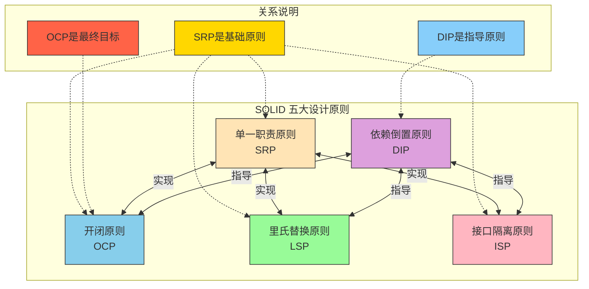

# 五大设计原则之间的关系

以下图表展示了SOLID五大设计原则之间的关系：

## 关系解释

根据文档内容，我们可以总结出以下几点关系：

1. **开闭原则（OCP）是最终目标**
   - 修改代码容易引入Bug，而扩展相对安全
   - 设计时就考虑扩展性，能提供更好的代码扩展性

2. **单一职责原则（SRP）是重要基础**
   - 帮助实现里氏替换原则、接口隔离原则和开闭原则
   - 职责单一的模块更容易被组合、替换和修改

3. **依赖倒置原则（DIP）是一种高层次指导原则**
   - 作用在更高层次、更广范围内的分离和替换代码方法
   - 强调依赖抽象而非具体实现

4. **相互关联**
   - 各原则都涉及分离和替换这两个关键动作
   - 单一职责是实现其他原则的基础
   - 依赖倒置原则指导着其他原则的应用方向

这种关系表明，五大设计原则并非孤立存在，而是相互关联、相互支撑的整体设计理念。