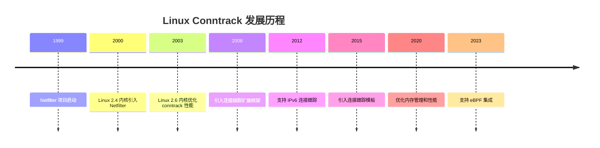
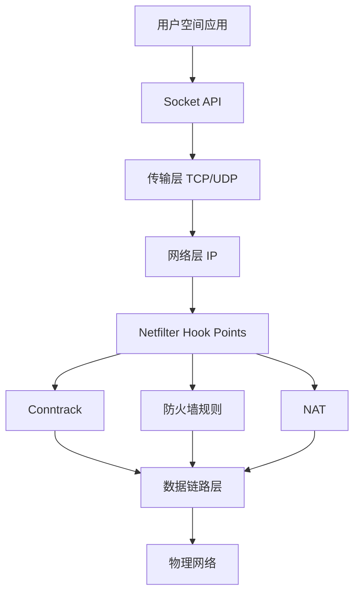
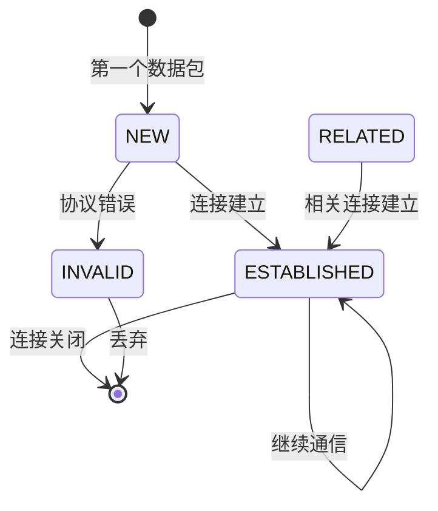
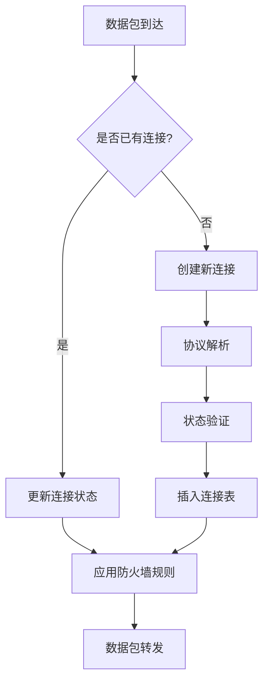
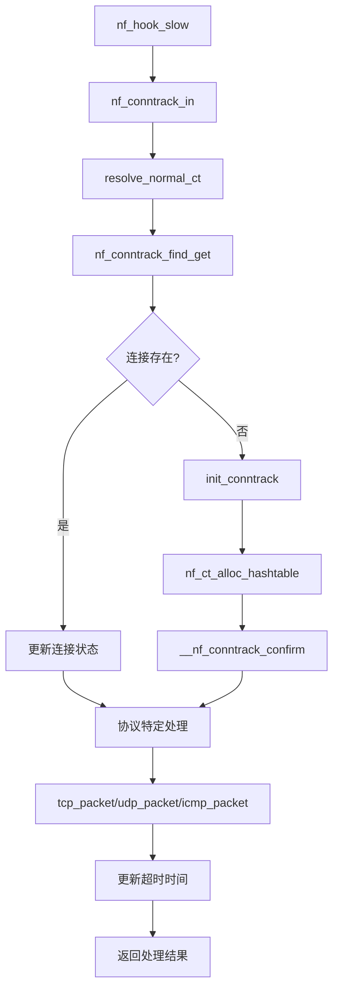

# Linux Conntrack 系统详解

## 目录
- [1. 概述与背景](#1-概述与背景)
- [2. 技术原理](#2-技术原理)
- [3. 源码分析](#3-源码分析)
- [4. 应用案例](#4-应用案例)
- [5. 高级特性](#5-高级特性)
- [6. 最佳实践](#6-最佳实践)

---

## 1. 概述与背景

### 1.1 什么是 Conntrack

**连接跟踪（Connection Tracking）** 是 Linux 内核中 Netfilter 框架的核心组件，用于跟踪网络连接的状态信息。它维护一个连接表，记录每个网络连接的状态、方向、协议等信息，为防火墙、NAT 等功能提供基础支持。

#### 核心特性
- **状态感知**：能够识别连接的不同状态（新建、已建立、相关、无效等）
- **协议支持**：支持 TCP、UDP、ICMP 等主流协议
- **高性能**：基于哈希表实现，支持高并发连接跟踪
- **可扩展**：支持自定义协议和扩展功能

### 1.2 发展历史



### 1.3 在网络栈中的位置



---

## 2. 技术原理

### 2.1 核心概念

#### 连接状态定义
Conntrack 定义了四种主要的连接状态：

| 状态 | 描述 | 典型场景 |
|------|------|----------|
| **NEW** | 新连接的第一个包 | SYN 包、UDP 第一个包 |
| **ESTABLISHED** | 已建立的连接 | TCP 三次握手完成、UDP 双向通信 |
| **RELATED** | 相关连接 | FTP 数据连接、ICMP 错误消息 |
| **INVALID** | 无效连接 | 不符合协议规范的数据包 |

#### 五元组标识
每个连接由以下五元组唯一标识：
```c
struct nf_conntrack_tuple {
    struct nf_conntrack_man src;    // 源地址信息
    struct nf_conntrack_man dst;    // 目标地址信息
    struct {
        __be16 all;                 // 协议相关字段
    } u;                            // 联合体，包含端口等信息
};
```

### 2.2 连接状态机



### 2.3 工作流程



### 2.4 数据结构

#### 核心数据结构
```c
// 连接跟踪条目
struct nf_conn {
    struct nf_conntrack ct_general;  // 通用连接跟踪信息
    
    struct nf_conntrack_tuple_hash tuplehash[IP_CT_DIR_MAX];
    struct net *ct_net;              // 网络命名空间
    
    struct nf_conntrack_zone zone;   // 连接跟踪区域
    struct nf_conntrack_tuple tuple; // 连接元组
    
    struct nf_conntrack_l4proto *l4proto; // 传输层协议
    struct nf_conntrack_l3proto *l3proto; // 网络层协议
    
    unsigned long timeout;           // 超时时间
    unsigned long status;            // 连接状态
};
```

---

## 3. 源码分析

### 3.1 核心文件结构

```
net/netfilter/
├── nf_conntrack_core.c          # 核心连接跟踪逻辑
├── nf_conntrack_proto_tcp.c     # TCP 协议支持
├── nf_conntrack_proto_udp.c     # UDP 协议支持
├── nf_conntrack_proto_icmp.c    # ICMP 协议支持
├── nf_conntrack_netlink.c       # Netlink 接口
└── nf_conntrack_extend.c        # 扩展功能支持
```

### 3.2 关键函数分析

#### 连接跟踪入口函数
```c
unsigned int nf_conntrack_in(struct net *net,
                            struct nf_hook_state *state,
                            struct sk_buff *skb)
{
    struct nf_conn *ct, *tmpl;
    enum ip_conntrack_info ctinfo;
    struct nf_conntrack_l3proto *l3proto;
    struct nf_conntrack_l4proto *l4proto;
    unsigned int dataoff, thoff;
    u_int8_t protonum;
    int set_reply = 0;
    int ret;

    if (skb->nfct) {
        /* 如果数据包已经有连接跟踪信息，直接处理 */
        tmpl = (struct nf_conn *)skb->nfct;
        if (tmpl && nf_ct_is_template(tmpl)) {
            /* 处理模板连接 */
            ct = nf_ct_get(skb, &ctinfo);
            if (ct)
                set_reply = 1;
        }
    }

    /* 解析网络层协议 */
    l3proto = __nf_ct_l3proto_find(skb->nfctinfo);
    if (l3proto->get_l4proto(skb, skb_network_offset(skb),
                            &dataoff, &protonum) <= 0) {
        NF_CT_STAT_INC_ATOMIC(state->net, invalid);
        ret = NF_ACCEPT;
        goto out;
    }

    /* 解析传输层协议 */
    l4proto = __nf_ct_l4proto_find(protonum);
    if (l4proto->error != NULL || l4proto->packet != NULL) {
        ret = l4proto->error(net, tmpl, skb, dataoff, &ctinfo,
                            protonum, state);
    } else {
        ret = generic_packet(net, tmpl, skb, dataoff, ctinfo,
                           protonum, state);
    }

out:
    return ret;
}
```

#### 连接解析函数
```c
static inline struct nf_conn *
resolve_normal_ct(struct net *net, struct nf_conn *tmpl,
                  struct sk_buff *skb, unsigned int dataoff,
                  u_int8_t protonum, struct nf_conntrack_l3proto *l3proto,
                  struct nf_conntrack_l4proto *l4proto,
                  enum ip_conntrack_info *ctinfo)
{
    struct nf_conntrack_tuple tuple;
    struct nf_conntrack_tuple_hash *h;
    struct nf_conn *ct;

    /* 构建连接元组 */
    if (!nf_ct_get_tuple(skb, skb_network_offset(skb),
                        dataoff, protonum, net, &tuple, l3proto, l4proto)) {
        pr_debug("Can't get tuple\n");
        return NULL;
    }

    /* 查找现有连接 */
    h = nf_conntrack_find_get(net, &tuple);
    if (!h) {
        /* 创建新连接 */
        h = init_conntrack(net, tmpl, &tuple, l3proto, l4proto,
                          skb, dataoff);
        if (!h)
            return NULL;
        if (IS_ERR(h))
            return (void *)h;
    }
    ct = nf_ct_tuplehash_to_ctrack(h);

    /* 设置连接信息 */
    *ctinfo = IP_CT_NEW;
    if (nf_ct_is_confirmed(ct))
        *ctinfo = IP_CT_ESTABLISHED;

    return ct;
}
```

### 3.3 TCP 协议支持

#### TCP 状态跟踪
```c
static int tcp_packet(struct nf_conn *ct,
                     struct sk_buff *skb,
                     unsigned int dataoff,
                     enum ip_conntrack_info ctinfo,
                     const struct nf_hook_state *state)
{
    struct tcphdr *tcph, _tcph;
    struct nf_conntrack_tuple *tuple;
    enum tcp_conntrack new_state, old_state;
    unsigned int index, *timeouts;

    /* 获取 TCP 头部 */
    tcph = skb_header_pointer(skb, dataoff, sizeof(_tcph), &_tcph);
    if (tcph == NULL)
        return -NF_ACCEPT;

    /* 获取连接状态 */
    if (CTINFO2DIR(ctinfo) == IP_CT_DIR_ORIGINAL)
        index = get_conntrack_index(tcph);
    else
        index = get_conntrack_index(tcp_invert_tuple(&ct->tuplehash[IP_CT_DIR_ORIGINAL].tuple));

    old_state = ct->proto.tcp.state;
    new_state = tcp_conntracks[old_state][index][get_conntrack_index(tcph)];

    /* 状态转换验证 */
    if (new_state == TCP_CONNTRACK_MAX) {
        pr_debug("nf_ct_tcp: invalid state transition %s -> %s\n",
                 tcp_conntrack_names[old_state],
                 tcp_conntrack_names[new_state]);
        return -NF_ACCEPT;
    }

    /* 更新连接状态 */
    ct->proto.tcp.state = new_state;
    ct->proto.tcp.seen[CTINFO2DIR(ctinfo)].td_end = 
        segment_seq_plus_len(ntohl(tcph->seq), skb->len - dataoff, tcph);

    return NF_ACCEPT;
}
```

### 3.4 函数调用图



---

## 4. 应用案例

### 4.1 防火墙配置

#### 状态防火墙规则
```bash
# 允许已建立连接的数据包
iptables -A INPUT -m conntrack --ctstate ESTABLISHED,RELATED -j ACCEPT

# 允许新连接（仅限特定端口）
iptables -A INPUT -p tcp --dport 80 -m conntrack --ctstate NEW -j ACCEPT
iptables -A INPUT -p tcp --dport 443 -m conntrack --ctstate NEW -j ACCEPT

# 拒绝无效连接
iptables -A INPUT -m conntrack --ctstate INVALID -j DROP
```

#### 连接跟踪表管理
```bash
# 查看连接跟踪表
cat /proc/net/nf_conntrack

# 设置连接跟踪表大小
echo 65536 > /proc/sys/net/netfilter/nf_conntrack_max
```

### 4.2 性能优化配置

#### 内核参数调优
```bash
# 连接跟踪表大小
net.netfilter.nf_conntrack_max = 65536

# TCP 连接超时时间
net.netfilter.nf_conntrack_tcp_timeout_established = 432000

# UDP 连接超时时间
net.netfilter.nf_conntrack_udp_timeout = 30

# ICMP 连接超时时间
net.netfilter.nf_conntrack_icmp_timeout = 30
```

#### 内存优化
```c
// 连接跟踪表哈希桶数量计算
static unsigned int nf_conntrack_htable_size __read_mostly;
static int nf_conntrack_hash_rnd_initted __read_mostly;

static unsigned int hash_conntrack_raw(const struct nf_conntrack_tuple *tuple,
                                     const struct net *net)
{
    unsigned int n;

    n = (tuple->src.l3num ^ tuple->dst.protonum ^ tuple->src.u.all ^
         tuple->dst.u.all ^ net_hash_mix(net));
    return ((u64)n * GOLDEN_RATIO_PRIME_32) >> 32;
}
```

### 4.3 监控和调试

#### 连接跟踪统计
```bash
# 查看连接跟踪统计信息
cat /proc/net/stat/nf_conntrack

# 输出示例
entries  searched found new invalid ignore delete delete_list insert insert_failed drop early_drop icmp_error  expect_new expect_create expect_delete search_restart
    1024        0     0   0       0      0      0          0      0            0    0          0          0            0            0             0              0
```

#### 性能分析
```c
// 连接跟踪性能统计
struct nf_conntrack_stat {
    unsigned int searched;      // 搜索次数
    unsigned int found;         // 找到次数
    unsigned int new;           // 新建连接数
    unsigned int invalid;       // 无效连接数
    unsigned int ignore;        // 忽略的连接数
    unsigned int delete;        // 删除的连接数
    unsigned int delete_list;   // 删除列表中的连接数
    unsigned int insert;        // 插入的连接数
    unsigned int insert_failed; // 插入失败的连接数
    unsigned int drop;          // 丢弃的连接数
    unsigned int early_drop;    // 早期丢弃的连接数
    unsigned int icmp_error;    // ICMP 错误数
    unsigned int expect_new;    // 期望新连接数
    unsigned int expect_create; // 期望创建连接数
    unsigned int expect_delete; // 期望删除连接数
    unsigned int search_restart; // 搜索重启次数
};
```

---

## 5. 高级特性

### 5.1 连接跟踪扩展

#### 扩展框架
```c
struct nf_ct_ext_type {
    void (*destroy)(struct nf_conn *ct);
    size_t len;
    u8 align;
    u8 id;
};

// 扩展功能注册
int nf_ct_extend_register(struct nf_ct_ext_type *type)
{
    int ret = 0;

    mutex_lock(&nf_ct_extend_mutex);
    if (nf_ct_extend_id[type->id] == NULL) {
        rcu_assign_pointer(nf_ct_extend_id[type->id], type);
    } else {
        ret = -EBUSY;
    }
    mutex_unlock(&nf_ct_extend_mutex);
    return ret;
}
```

#### 应用层协议识别 (ALG)
```c
// FTP ALG 示例
static int nf_nat_ftp_fmt_cmd(struct nf_conn *ct, enum nf_ct_ftp_type type,
                             char *buffer, size_t buflen,
                             union nf_inet_addr *addr, u16 port)
{
    switch (type) {
    case NF_CT_FTP_PORT:
    case NF_CT_FTP_PASV:
        return snprintf(buffer, buflen, "%u,%u,%u,%u,%u,%u",
                       ((unsigned char *)&addr->ip)[0],
                       ((unsigned char *)&addr->ip)[1],
                       ((unsigned char *)&addr->ip)[2],
                       ((unsigned char *)&addr->ip)[3],
                       port >> 8, port & 0xFF);
    }
    return 0;
}
```

### 5.2 容器和虚拟化支持

#### 网络命名空间
```c
// 每个网络命名空间独立的连接跟踪表
struct net {
    struct nf_conntrack_net ct;
    // ... 其他网络相关字段
};

struct nf_conntrack_net {
    struct nf_conntrack_hash *hash;
    struct nf_conntrack_stat __percpu *stat;
    struct nf_ct_event_notifier __rcu *nf_conntrack_event_cb;
    struct nf_exp_event_notifier __rcu *nf_expect_event_cb;
    unsigned int users4;
    unsigned int users6;
    bool dying;
};
```

---

## 6. 最佳实践

### 6.1 配置建议

#### 生产环境配置
```bash
# /etc/sysctl.conf
# 连接跟踪表大小（根据内存和连接数调整）
net.netfilter.nf_conntrack_max = 131072

# TCP 连接超时时间（5分钟）
net.netfilter.nf_conntrack_tcp_timeout_established = 300

# TCP 连接超时时间（2分钟）
net.netfilter.nf_conntrack_tcp_timeout_time_wait = 120

# UDP 连接超时时间（30秒）
net.netfilter.nf_conntrack_udp_timeout = 30

# ICMP 连接超时时间（30秒）
net.netfilter.nf_conntrack_icmp_timeout = 30

# 哈希表大小（通常为 conntrack_max 的 1/8）
net.netfilter.nf_conntrack_buckets = 16384
```

#### 安全考虑
```bash
# 限制连接跟踪表大小防止 DoS 攻击
net.netfilter.nf_conntrack_max = 65536

# 启用连接跟踪验证
net.netfilter.nf_conntrack_tcp_loose = 0

# 设置合理的超时时间
net.netfilter.nf_conntrack_tcp_timeout_established = 3600
```

### 6.2 故障处理

#### 常见问题诊断
```bash
# 1. 连接跟踪表满
echo "连接跟踪表满的解决方案："
echo "1. 增加 nf_conntrack_max 值"
echo "2. 减少超时时间"
echo "3. 检查是否有连接泄漏"

# 2. 性能问题
echo "性能优化建议："
echo "1. 调整哈希表大小"
echo "2. 使用连接跟踪模板"
echo "3. 启用连接跟踪缓存"
```

#### 监控指标
```bash
# 关键监控指标
# 1. 连接跟踪表使用率
# 2. 连接创建/删除速率
# 3. 内存使用情况
# 4. CPU 使用率

# 监控脚本示例
#!/bin/bash
while true; do
    current=$(cat /proc/sys/net/netfilter/nf_conntrack_count)
    max=$(cat /proc/sys/net/netfilter/nf_conntrack_max)
    usage=$((current * 100 / max))
    echo "$(date): 连接跟踪表使用率: ${usage}%"
    sleep 60
done
```

---

## 参考资料

1. [Linux 内核源码 - net/netfilter/](https://elixir.bootlin.com/linux/latest/source/net/netfilter)
2. [Netfilter 官方文档](https://netfilter.org/documentation/)
3. [Linux 网络文档](https://www.kernel.org/doc/html/latest/networking/index.html)
4. [iptables 连接跟踪](https://netfilter.org/documentation/HOWTO/packet-filtering-HOWTO-7.html)

---

*本文档基于 Linux 5.15+ 内核版本编写，涵盖了 conntrack 系统的核心原理、源码分析和实际应用。*
