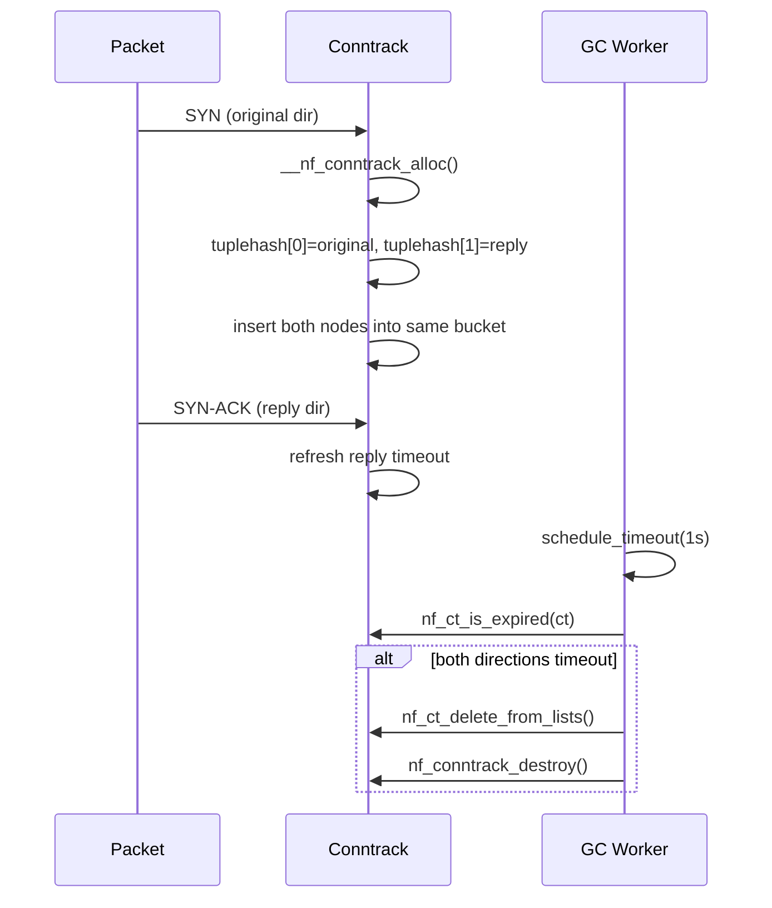

# Linux conntrack 双向流与 GC 机制源码级速查表

> 基于 Linux 5.15 内核，仅保留关键数据结构 & 流程，方便快速回顾。

---

## 1  概念速记

数据结构说明

| 术语             | 含义                                             |
| -------------- | ---------------------------------------------- |
| `nf_conn`      | 一条“连接跟踪条目”，内核里双向流的唯一实例                         |
| `tuple`        | 五元组：`(src, dst, sport, dport, proto)`          |
| `bucket`       | 哈希表槽位，一个链表头                                    |
| `tuplehash[2]` | `nf_conn` 内嵌的 **长度为 2 的数组**，分别保存原始/应答方向的 tuple |
| `timeout`      | `jiffies` 值，每个方向独立计时；任一方向收到报文都会刷新              |


## 2  数据结构一览

```c
struct nf_conn {
    /* 两个方向的 tuple + 链表节点 */
    struct nf_conntrack_tuple_hash tuplehash[IP_CT_DIR_MAX];
#define IP_CT_DIR_ORIGINAL 0
#define IP_CT_DIR_REPLY    1

    /* 每个方向独立的超时、计数器、NAT 映射 */
    u32 timeout;                       /* jiffies，按方向复用 */
    struct nf_conn_counter __percpu *counters;
    union nf_conntrack_proto proto;    /* TCP/UDP/ICMP 私有状态 */
    ...
};

struct nf_conntrack_tuple_hash {
    struct hlist_nulls_node hnnode;    /* 挂 bucket 链表 */
    struct nf_conntrack_tuple tuple;   /* 真正的五元组 */
};
```

---

## 3  hash 计算 → 同 bucket
1. 收到报文 → `nf_ct_get_tuple()` 先“归一化”成 canonical tuple  
2. `hash = jhash2(tuple, zone)`  
3. 无论 original 还是 reply，**hash 值相同** → 落到 **同一个 bucket**

---

## 4  生命周期时序


---

## 5  垃圾回收 (GC) 细节

| 维度 | 描述 |
| --- | --- |
| **触发时机** | <li>周期性线程：`ct_gc_worker()`，默认 1 Hz</li><br><li>内存压力：已用条目 > `nf_conntrack_max`</li> |
| **判定条件** | `time_after(jiffies, ct->timeout)` |
| **清理动作** | <li>同时摘除 `tuplehash[0].hnnode` & `tuplehash[1].hnnode`</li><br><li>`kmem_cache_free(nf_conn_cachep, ct)`</li> |
| **并发安全** | bucket 链表使用 `hlist_nulls` + RCU；GC 时持 `ct_zone_lock` |


---

## 6  速查公式
```text
nf_conn 数量  ==  活跃连接数
tuplehash 数组长度  ==  2
链表节点(每连接)  ==  2
hash bucket 占用  ==  1
```

---

## 7  调优接口
| 文件 | 作用 |
|---|---|
| `/proc/sys/net/netfilter/nf_conntrack_max` | 表项上限 |
| `/proc/sys/net/netfilter/nf_conntrack_buckets` | bucket 数 |
| `/proc/sys/net/netfilter/nf_conntrack_tcp_timeout_established` | TCP 超时 |

---

> 一句话记忆：  
> **一个 `nf_conn` 存两条链表节点，挂同一 bucket；两边都静默即被 GC 一次性回收。**
