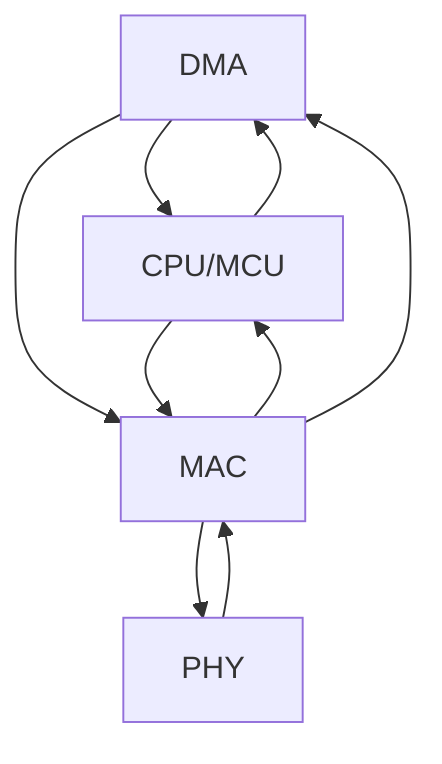

# PHY & MAC 层架构

## PHY & MAC 层级结构

从上到下的层级关系：

| 层级 | 说明 |
| -- | -- |
| I/F  | 比如PCI总线。负责将IP数据包（或其他协议）传递给MAC层。  |
| MAC  | 包含MAC子层和LLC子层。|
| MII/SMI | Media Independent Interface，介质独立界面。连接MAC和PHY。MAC对PHY的工作状态的确定和对PHY的控制则是使用SMI（Serial Management Interface）界面通过读写PHY的寄存器来完成的。|
| PHY | 以太网的物理层又包括MII/GMII（介质独立接口）子层、PCS（物理编码子层）、PMA（物理介质附加）子层、PMD（物理介质相关）子层、MDI子层。对PHY来说，没有帧的概念，都是二进制数据。|
| I/F | 如RJ45接口。|

> **注意**: 除了上述核心组件，实际硬件还包括稳压、滤波等电路组件。可以看到，基本上涉及算法的功能都在MAC层实现，因为到了PHY层就无法区分协议了。

## 固件与驱动

### 固件 (Firmware)
- 运行在设备自身的微控制器内部的代码
- 原则上，应该将尽可能多的功能实现在固件中
- 理想情况是只有固件没有驱动

### 驱动 (Driver)  
- 那些操作系统相关的、无法跨系统通用的、必须独立出来的代码
- 主要处理系统特定的接口和功能

## 硬件架构

## 参考资料

1. [CSDN - PHY和MAC详解](https://blog.csdn.net/ZCShouCSDN/article/details/80090802)
2. [IEEE 802.3 标准](https://standards.ieee.org/ieee/802.3/7071/)
