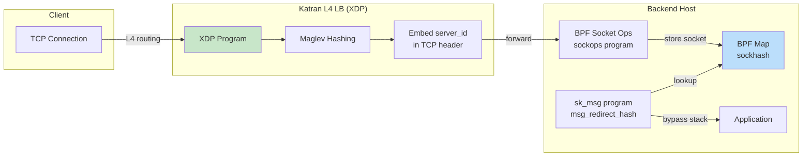

# Facebook XDP/eBPF Traffic Routing Infrastructure

## Two-Stage Traffic Routing
1. **LB node → backend host**: L4 routing (Katran, XDP-based)
2. **Host internal**: kernel → sockets via BPF (L7)

## Key Technical Solutions

### 1. Stateless L4 Routing (Katran)
- XDP-based L4 load balancer using **Maglev hashing**
- **Problem**: Backend failures cause connection resets
- **Solution**: Embed `server_id` in TCP header via `BPF_PROG_TYPE_SOCK_OPS`

### 2. Zero-Downtime Releases
- Old approach: Graceful shutdown causes capacity loss
- BPF solution: `bpf_sk_reuseport` attaches to socket layer for packet routing
- Uses `BPF_MAP_TYPE_REUSEPORT_SOCKARRAY` to control traffic switching

## Technical Challenges Encountered
- CPU spikes from listening socket hashtable (only used `dst_port` as hash key)
- Fixed via kernel improvements

## Key Takeaways
- **Stateless routing**: No connection state sharing between LB nodes
- **BPF enables per-socket load balancing** without shared sockets between processes
- Supports both **TCP and UDP** (including QUIC)
- Production-scale eBPF for consistent routing and seamless deployments

## Architecture Pattern
```
XDP (NIC) → kernel protocol stack → BPF socket ops → application socket
                ↑
         Katran LB (Maglev)
```

## Related Pages
- [[entities/linux/ebpf/ebpf-networking]] — eBPF networking hook points
- [[entities/linux/ebpf/ebpf-xdp]] — XDP details
- [[entities/linux/network/load-balancing]] — Load balancing concepts
- [[entities/linux/network/modern-lb-proxy]] — Envoy, service mesh context

## Images


*Figure: Katran L4 load balancer — XDP-based production load balancing at Facebook*


*Figure: Katran vs IPVS — superior performance with Maglev hashing*


*Figure: Maglev consistent hashing — minimal re-mapping during backend changes*


*Figure: BPF sk_reuseport — zero-downtime service deployment*


*Figure: BPF sockhash map — stores socket references for fast lookup*

## Architecture Diagram


