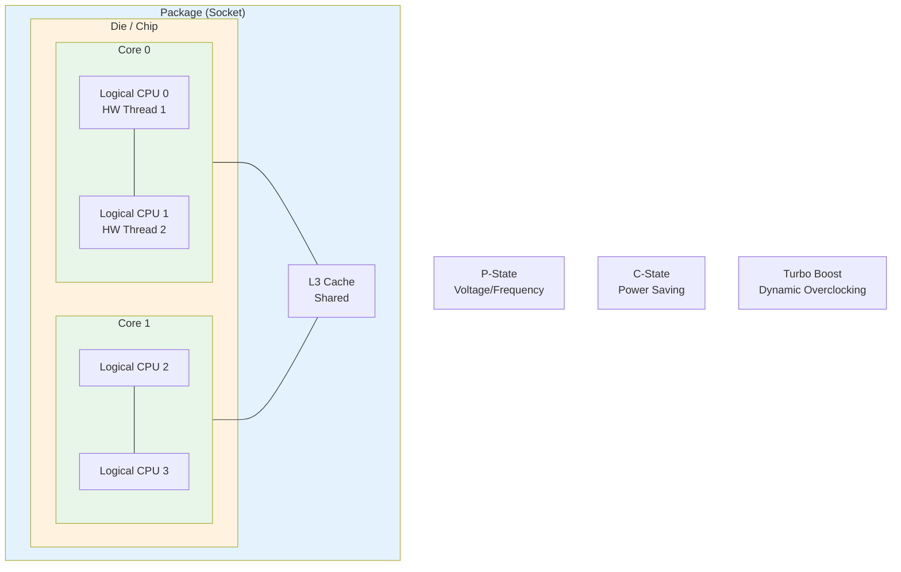

# Linux Server Power and Performance Management: CPU Hardware Basics

## Core Content

### CPU Topology Hierarchy
- **Package**: Physical socket on motherboard containing cores
- **Core**: Hardware processor units, each can execute independently
- **Hyper-Threading**: Hardware threads sharing L1 cache within a core; doubles logical CPU count
- **Logical CPU**: Scheduling unit the Linux kernel manages; each has own run queue

### Frequency Concepts
- **P-State**: Voltage-frequency combination stored in MSR (Model Specific Registers). Higher frequency = higher voltage = more power
- **LFM/HFM**: Low Frequency Mode / High Frequency Mode — min/max frequencies in P-state table
- **Base Frequency**: Marketing term for HFM (p-state maximum)
- **Turbo/Boost**: Dynamic overclocking when some cores idle. Constraint: "higher turbo frequency = fewer cores can operate at that frequency"
- **TDP**: Thermal Design Power — average power at base frequency

### Key Insight
Kernel task scheduling operates on **logical CPUs**, not physical cores. With hyper-threading, sibling hardware threads can run at **different frequencies**.

## Key Takeaways
- Linux scheduler works on logical CPUs, not physical cores
- Modern CPUs with HT show sibling threads can have different frequencies
- TDP is baseline consumption; turbo operations exceed TDP and need better cooling
- Turbo boost is limited by total power/thermal budget across all cores

## Related Pages
- [[entities/linux/kernel/cpu-power-management]] — Entity page with detailed power management
- [[entities/linux/kernel/irq-softirq]] — Related IRQ handling concepts
- [[entities/linux/network/net-stack-implementation-rx]] — Network RX path (CPU state impacts packet processing latency)

## Images

*Figure: CPU Package — physical socket containing cores and shared resources*

*Figure: CPU topology hierarchy: Package → Die → Core → Logical CPU (HT)*

*Figure: Hyper-Threading — sibling threads sharing L1 cache within a core*

*Figure: P-State voltage/frequency relationship — higher frequency = higher voltage = more power*

*Figure: Turbo boost — dynamic overclocking when some cores idle*

## CPU Topology Architecture

