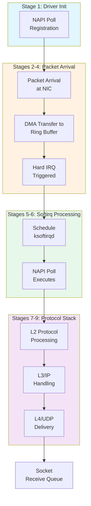

# Linux Network Stack RX Implementation Deep Dive

## 9-Stage RX Pipeline (NIC → Socket)

```
1. Driver initialization (NAPI poll registration)
2. NIC packet arrival
3. DMA transfer to kernel ring buffer
4. Hardware IRQ triggering (when NAPI not active)
5. Softirq scheduling to ksoftirqd thread
6. NAPI poll executing to drain ring buffer
7. L2 protocol processing
8. L3/IP protocol handling
9. L4/UDP delivery to socket receive queue
```

## Core Technical Concepts

### Ring Buffer (DMA)
Circular queue where NIC writes incoming packets directly to pre-allocated kernel memory. Avoids CPU involvement during initial copy.

### NAPI (New API)
Hybrid interrupt-driven + polling approach:
- When active: batch-receives packets without IRQ generation
- Between polls: new packets trigger interrupts to restart cycle
- Prevents IRQ storm under high load

### Softirq Processing
- `ksoftirqd` per-CPU threads execute `net_rx_action()`
- Budget limits: `netdev_budget` (default 300 packets), `netdev_budget_usecs` (default 2ms)
- `time_squeeze` counter in `/proc/net/softnet_stat` = ring still has packets but budget exhausted

### GRO (Generic Receive Offloading)
Software packet merging — combines similar packets before protocol stack delivery. Reduces CPU overhead for bulk transfers.

### Packet Distribution Mechanisms
| Mechanism | Type | Description |
|-----------|------|-------------|
| **RSS** | Hardware | Hardware queues per CPU |
| **RPS** | Software | Software redistribution |
| **RFS** | Software | Flow-aware steering |

## Key Monitoring Metric
`/proc/net/softnet_stat` column `time_squeeze`: indicates when softirq budget exhausted but packets remain in ring buffer — a tuning trigger.

## Related Pages
- [[entities/linux/network/net-stack-tuning-rx]] — Tuning parameters
- [[entities/linux/network/net-stack-overview]] — Stack overview
- [[entities/linux/kernel/irq-softirq]] — Softirq mechanics
- [[entities/linux/kernel/skbuff-deep-dive]] — sk_buff structure
- [[entities/linux/kernel/net/linux-kernel-net-subsystem]] — Kernel network subsystem

## Images


*Figure: 9-Stage RX Pipeline from NIC to Socket*


*Figure: DMA Ring Buffer — circular queue where NIC writes incoming packets*


*Figure: NAPI poll cycle with GRO (Generic Receive Offloading)*


*Figure: L3/IP Protocol processing stack*


*Figure: UDP delivery path to socket receive queue*

## 9-Stage RX Pipeline Architecture


