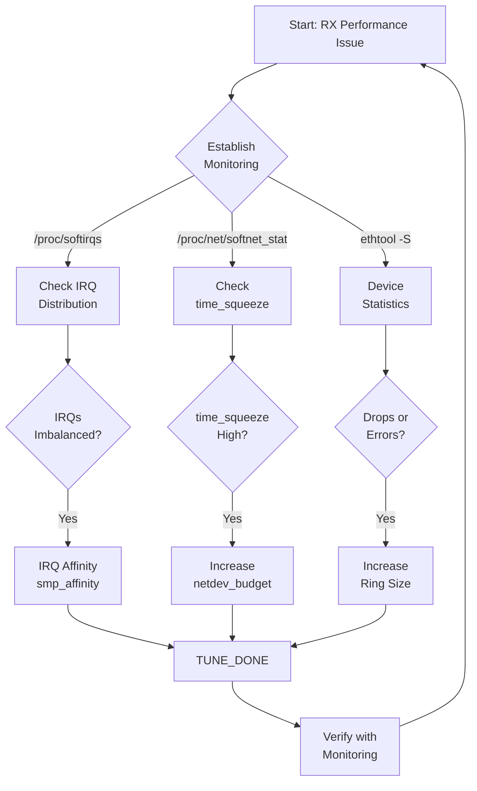

# Linux Network Stack RX: Configuration Tuning Guide

## Core Tuning Parameters

### 1. Network Device Driver (ethtool)
| Command | Purpose | Example |
|---------|---------|---------|
| `ethtool -l/-L` | RX queue quantity | `ethtool -L eth0 rx 8` |
| `ethtool -g/-G` | RX queue size (ring buffer) | `ethtool -G eth0 rx 4096` |
| `ethtool -x/-X` | RSS queue weights | `ethtool -X eth0 equal 2` |
| `ethtool -n/-N` | RSS RX hash fields | `ethtool -N eth0 rx-flow-hash udp4 sdfn` |
| `ethtool -k/-K` | Offloads (GRO, etc.) | `ethtool -K eth0 gro on` |
| `ethtool -c/-C` | Interrupt coalescing | `ethtool -C eth0 adaptive-rx on` |

### 2. IRQ Configuration
- **Interrupt Coalescing**: `adaptive-rx on` adapts between throughput/latency
- **IRQ Affinity**: `/proc/irq/<id>/smp_affinity` (hex bitmask) binds IRQs to CPUs

### 3. Softirq Configuration (sysctl)
| Parameter | Default | Description |
|-----------|---------|-------------|
| `net.core.netdev_budget` | 300 | Max packets per softirq cycle |
| `net.core.netdev_budget_usecs` | 2000 | Max CPU time per softirq cycle |
| `net.core.dev_weight` | 64 | Backlog poll loop weight |

### 4. GRO / RPS / RFS
- **GRO**: `ethtool -k eth0 | grep generic-receive-offload`; merges similar packets before protocol stack
- **RPS**: `/sys/class/net/DEVICE/queues/QUEUE/rps_cpus` — software packet distribution
- **RFS**: `net.core.rps_sock_flow_entries` + per-queue `rps_flow_cnt` — flow-aware steering

### 5. Protocol Stack
- **rmem_max**: Socket receive buffer max (critical for high-throughput/QUIC)
- **netdev_max_backlog**: Backlog queue size (default 1000)
- **Timestamping**: `netdev_tstamp_prequeue`

### 6. CPU Power State (Critical for Latency)
```bash
# Disable CPU power saving for consistent latency
AMD_pstat=disable idle=poll noohz=off iommu=pt
# Or: AMD_idle.max_cstate=1 processor.max_cstate=1
```

## Monitoring Interfaces
- `/proc/softirqs` — Soft interrupt distribution
- `/proc/net/softnet_stat` — Per-CPU network processing stats
- `ethtool -S <device>` — Device statistics

## Key Insight
No universal configuration exists — tune based on specific workload requirements. Always establish monitoring before tuning.

## Related Pages
- [[entities/linux/network/net-stack-implementation-rx]] — RX implementation details
- [[entities/linux/network/net-stack-overview]] — Network stack principles
- [[entities/linux/kernel/irq-softirq]] — Softirq mechanics
- [[entities/linux/ebpf/ebpf-networking]] — XDP/BPF integration points

## Images


*Figure: Linux Network Stack RX Overview — key tuning touch points*


*Figure: CPU power state affects latency — disable power saving for consistent low latency*


*Figure: CPU frequency correlation with softirq time_squeeze metric*

## Tuning Decision Tree


