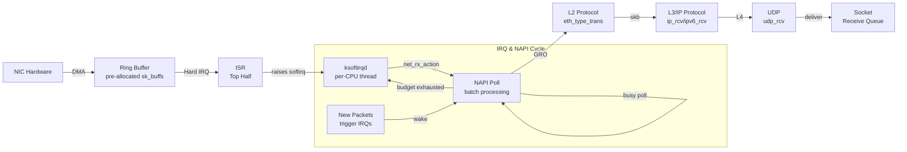

# Linux Network Stack: Principles, Monitoring & Tuning

## Core Content

### Architecture
The "stack" encompasses the entire data path from NIC arrival through kernel protocol stack to user-space applications. Linux 5.10 kernel network stack covers:
- IRQ/softirq mechanisms
- RX/TX data paths
- Kernel protocol stack layers (L2 → L3 → L4)
- NIC drivers (Mellanox mlx5_core example)
- BPF/XDP technologies

### Monitoring Stack
Prometheus + Grafana for visualizing network metrics. The article applies 80/20 principle: most issues resolve quickly with basic monitoring, remaining cases require deep kernel network stack knowledge.

### Related Topics Covered
- Kubernetes networking: ServiceIP (L4 load balancing) and NetworkPolicy (L3/L4 access control)
- NIDS context: full packet path visibility is critical for detection

## Key Insight
Understanding the full network stack "opens new horizons" for addressing performance issues and implementing cloud-native networking solutions. This is a gateway article to a series covering RX implementation, TX implementation, and tuning guides.

## Related Pages
- [[entities/linux/network/net-stack-implementation-rx]] — RX implementation deep dive
- [[entities/linux/network/net-stack-tuning-rx]] — RX tuning guide
- [[entities/linux/kernel/irq-softirq]] — IRQ/softirq mechanics
- [[entities/linux/ebpf/ebpf-networking]] — BPF/XDP integration
- [[entities/linux/kernel/skbuff-deep-dive]] — sk_buff structure

## Images

*Figure: Linux Network Stack RX Overview — NIC to Socket path*

*Figure: DMA Ring Buffer — NIC writes packets directly to pre-allocated kernel memory*

*Figure: IRQ and NAPI Poll Cycle — interrupt-driven + polling hybrid*

*Figure: net_rx_action() — softirq handler processing packets from ring buffer*

*Figure: ksoftirqd per-CPU thread scheduling*

## Architecture Diagram

