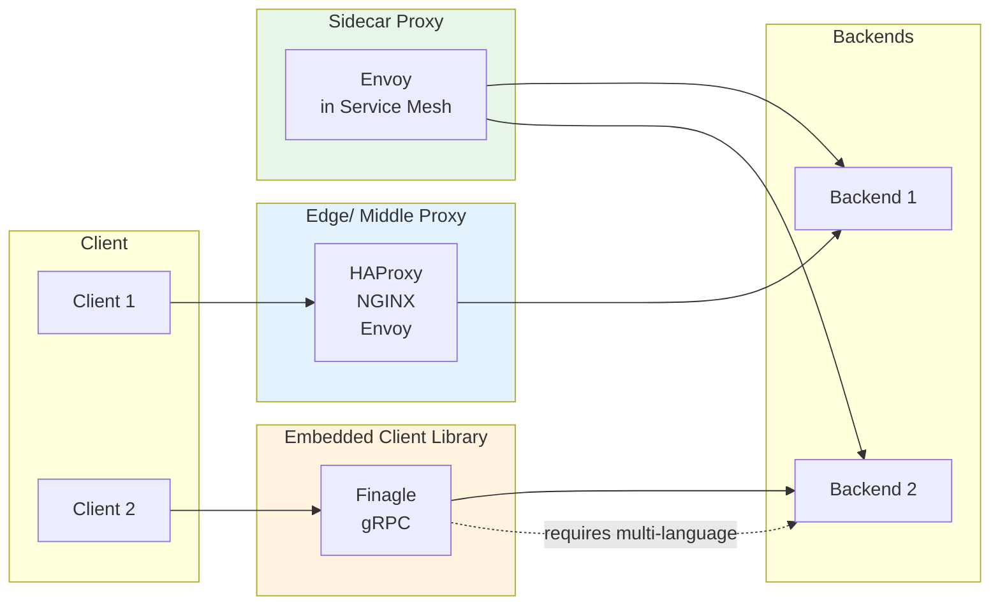

# Introduction to Modern Network Load Balancing and Proxying

## Core Thesis
Modern load balancing is foundational to reliable distributed systems. This article bridges the gap with a mid-level technical introduction.

## L4 vs L7 Load Balancing

| Aspect | L4 | L7 |
|--------|----|----|
| Layer | Connection/session | Application protocol |
| Visibility | Bytes only | HTTP, gRPC, Redis, etc. |
| Use case | Raw throughput | Content-based routing |
| Performance | Higher | Lower (more parsing) |

> "L7 load balancing is critical for modern protocols due to multiplexing and kept-alive connections creating 3000x load imbalances."

## Topology Patterns

### 1. Middle/Edge Proxy
- HAProxy, NGINX, Envoy
- Simple but introduces single points of failure

### 2. Embedded Client Library
- Finagle, gRPC
- Best performance/isolation
- Requires multi-language implementation

### 3. Sidecar Proxy
- Service mesh pattern (Envoy-based)
- Language-agnostic
- "Achieves client library benefits without lock-in"

## L4 Design Patterns

| Pattern | Description | Trade-off |
|---------|-------------|-----------|
| **Termination** | LB terminates client connection, opens new to backend | Simpler, lower client latency |
| **Passthrough** | NAT without terminating; LB maintains connection mapping | Higher throughput, enables backend congestion control |
| **DSR** | Request through LB, response directly to client | Reduces LB bandwidth |

## L4 Scalability
- **HA Pair**: Traditional, 50% idle capacity, limited fault tolerance
- **Clustering + ECMP**: Modern approach (Google Maglev, AWS NLB); horizontal scaling

## L7 Modern Innovations
- Protocol-specific observability (metrics, distributed tracing, logging)
- Dynamic configuration for ephemeral backends
- Advanced features: retries, circuit breakers, rate limiting, traffic shadowing
- Extensibility via plugins and Lua scripting

## Key Insight
> "True innovation lies in the control plane." — Global load balancers coordinate zonal failure detection, ML anomaly detection, centralized policy.

## Practical Takeaways
- Service-to-service: **sidecar proxies** (service mesh) are displacing other topologies
- Edge proxy remains necessary for public traffic
- Industry shift: proprietary hardware → commodity software (DPDK, IPVS)

## Related Pages
- [[entities/linux/network/load-balancing]] — Load balancing entity
- [[entities/linux/network/modern-lb-proxy]] — Entity page
- [[entities/linux/ebpf/ebpf-networking]] — eBPF-based load balancing (Katran)
- [[entities/linux/network/congestion-control]] — Related for backend congestion control

## Images

*Figure: Modern load balancing topology overview*

*Figure: L4 termination load balancer — LB terminates client connection, opens new to backend*

*Figure: L4 passthrough — NAT without terminating; LB maintains connection mapping*

*Figure: Direct Server Return (DSR) — response goes directly to client, reducing LB bandwidth*

*Figure: L7 termination — protocol-aware routing (HTTP, gRPC, Redis)*

## Load Balancing Topology Patterns

