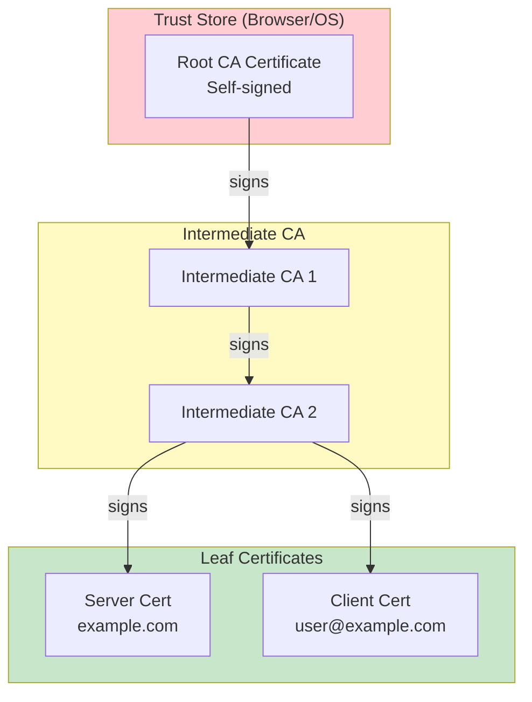

# Everything About Certificates and PKI

## Core Thesis
> "Certificates and PKI exist to bind names to public keys."

## Key Concepts

| Concept | Definition |
|---------|-----------|
| **Certificate** | Public Key + Name + CA Signature |
| **PKI** | Complete ecosystem for managing public key certificates |
| **CA** | Trusted issuer that signs certificates |
| **Trust Store** | Pre-configured collection of trusted root certificates |
| **Trust Chain** | Hierarchical validation from root CA through intermediates to leaf cert |
| **CSR** | Certificate Signing Request (PKCS#10) |
| **SAN** | Subject Alternative Name — modern naming best practice |
| **mTLS** | Mutual TLS — both client and server present certificates |

## Certificate Format Ecosystem

```
ASN.1 (abstract syntax) → DER (binary encoding) → PEM (base64 with headers)
X.509 v3 (certificate structure standard)
PKCS#7 (multiple certificates, Java)
PKCS#12 (cert chain + encrypted private key, Microsoft)
```

## PKI Types
- **Web PKI**: Browser-trusted CAs for public internet (Let's Encrypt, DigiCert)
- **Internal PKI**: Custom PKI for services, containers, VMs, enterprise

**Recommendation:** Web PKI for public-facing; Internal PKI for everything else.

## Identity Validation Types
- **DV (Domain Validation)**: Prove domain control via email/DNS/HTTP
- **OV (Organization Validation)**: Includes legal entity verification
- **EV (Extended Validation)**: Strict verification, displays org name in browser

## Trust Federation Risks & Mitigations
- **Problem**: Web PKI trusts ANY CA in trust store for ANY domain
- **Incidents**: DigiNotar (2011, fake google.com certs), Sennheiser (embedded root private key)
- **Mitigations**: CAA (restrict which CAs can issue), CT (public issuance logs), HPKP (key pinning)

## Best Practices
1. Use **SANs** for naming (DNS for machines, email for people)
2. Prefer **short-lived certificates** (24 hours or less for internal PKI)
3. Keep **private keys on subscriber machines** — never transmit
4. Don't disable certificate path validation (`curl -k` = bad)
5. **Automate certificate rotation** — expiration failures cause major incidents

## Related Pages
- [[entities/security/pki-certificates]] — Entity page
- [[entities/security/tls-handshake]] — TLS protocol details
- [[entities/security/certificate-transparency]] — CT logs

## Images


*Figure: PKI chain of trust — Root CA → Intermediate CA → Leaf Certificate*


*Figure: Certificate path validation — browser verifies each certificate in chain*


*Figure: Trust store — pre-configured trusted root certificates in browser/OS*


*Figure: Certificate issuance flow — CSR → CA signing → Certificate chain*


*Figure: Driver's license (physical identity) vs Certificate (digital identity)*

## PKI Trust Chain Architecture


