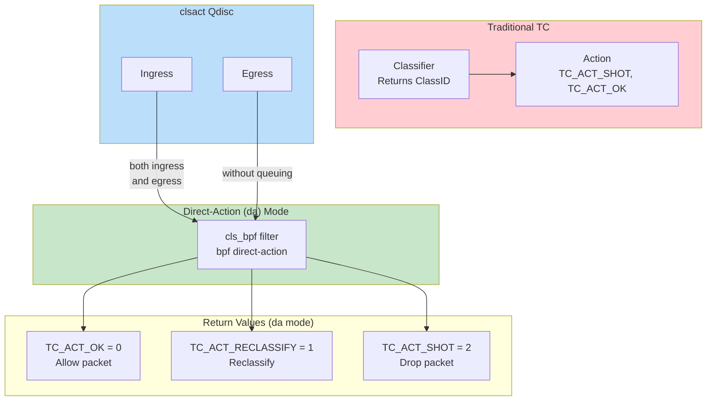

# Understanding TC eBPF Direct-Action Mode

## Traditional TC Architecture
- **qdisc**: Queueing discipline for traffic shaping
- **class**: User-defined traffic categories
- **classifier (filter)**: Matches packets, dispatches to classes
- **action**: Operations on packets (drop, allow, mirror)

Classic classifiers return **classids**, actions return operation codes (`TC_ACT_SHOT`, `TC_ACT_OK`).

## The Direct-Action Problem
Classic `classifier + action` pattern requires two separate steps for "match + act" operations. This introduces unnecessary overhead when a single BPF program could do both.

## Direct-Action (da) Mode Solution
Introduced in kernel 4.4, `direct-action` flag tells TC subsystem to interpret eBPF classifier return value as **action code** instead of classid.

**Benefits:**
- Eliminates separate action module calls
- Improves performance by avoiding external actions
- Simplifies tc eBPF program design

### Key Return Values (in da mode)
| Return | Value | Meaning |
|--------|-------|---------|
| `TC_ACT_OK` | 0 | Allow packet |
| `TC_ACT_SHOT` | 2 | Drop packet |
| `TC_ACT_RECLASSIFY` | 1 | Reclassify |

## clsact Qdisc
Added in kernel 4.5, `clsact` is a super-set of ingress qdisc supporting direct-action on **both ingress and egress** without queuing.

## Usage Example
```bash
# Create clsact qdisc
tc qdisc add dev eth0 clsact

# Attach eBPF filter with direct-action
tc filter add dev eth0 ingress bpf direct-action obj foo.o sec .text
```

## Related Pages
- [[entities/linux/ebpf/ebpf-networking]] — TC + eBPF context
- [[entities/linux/ebpf/ebpf-xdp]] — XDP comparison
- [[entities/linux/network/tc-ebpf-direct-action]] — Entity page

## Images


*Figure: Kernel commit adding direct-action (da) mode support*

## TC eBPF Direct-Action Architecture


