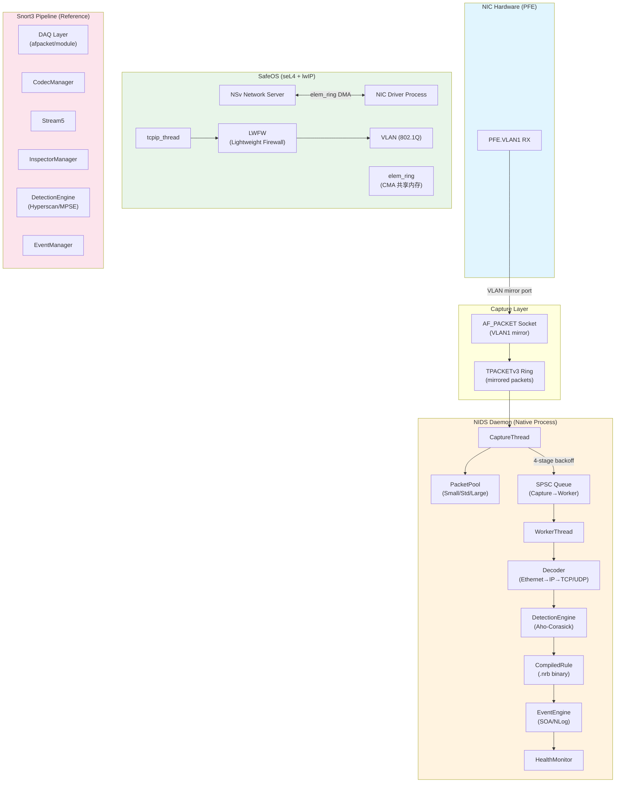
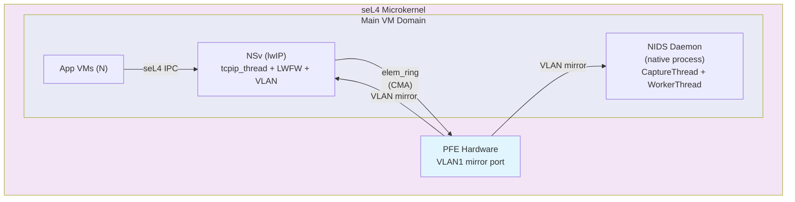
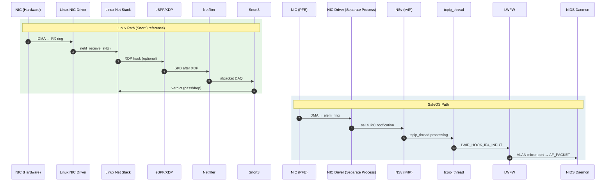
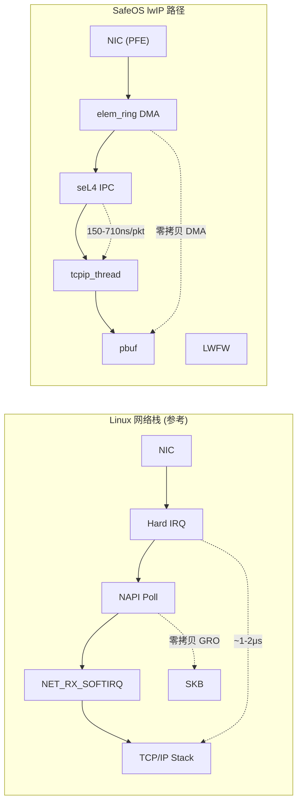
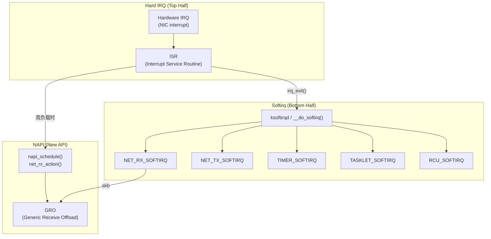
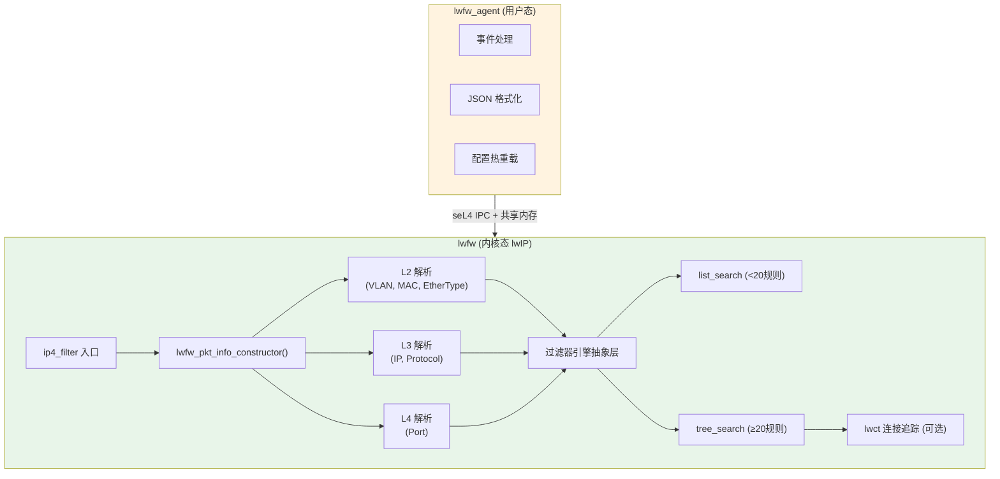
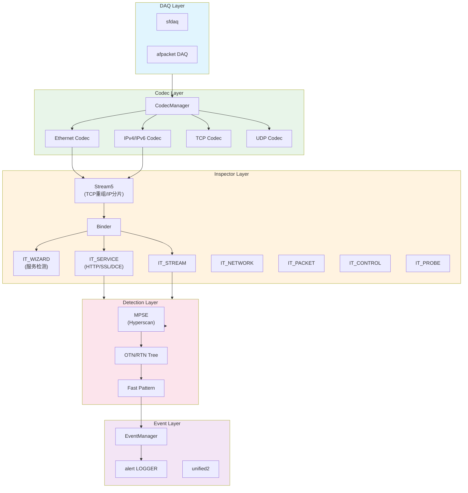
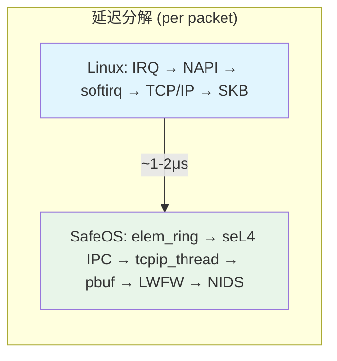

# NIDS 完整架构总览 — 跨模块合成文档

> 综合 SafeOS NIDS 全系统架构：Packet 路径从 NIC → AF_PACKET → safeOS lwIP → LWFW → Snort3 Pipeline
> 覆盖：Snort3 模块分析 (15 entities) + safeOS lwIP/VLAN/LWFW (11 entities) + Linux 网络 + eBPF + IRQ/Softirq

---

## 1. 整体架构图

### Packet 处理全路径 (Mermaid Flowchart)



### SafeOS/seL4 部署模式



---

## 2. 数据流对比：Linux vs SafeOS lwIP



### Linux vs SafeOS 关键差异

| 方面 | Linux 网络栈 | SafeOS lwIP |
|------|-------------|-------------|
| **内核态** | Monolithic kernel (全部网络在 kernel) | seL4 microkernel (网络在用户态) |
| **IPC** | 函数调用 (无 IPC) | seL4 IPC (~150-710ns/packet) |
| **多核利用** | ~100% (4核) | ~25% (tcpip_thread 单线程瓶颈) |
| **内存共享** | SKB (socket buffer) | CMA + elem_ring (零拷贝 DMA) |
| **防火墙** | iptables/nftables (Netfilter) | LWFW (lwIP hook, 可选 LWCT) |
| **包处理路径** | 中断 → NAPI → softirq → protocol | NIC RX thread → tcpip_thread |
| **抓包方式** | afpacket/pcap/DPDK | AF_PACKET on PFE.VLAN1 |
| **延迟** | ~1-2μs | ~6.4μs (seL4 IPC 开销) |
| **吞吐** | ~2 Gbps+ | ~1.87 Gbps (单核), ~2.4 Gbps (4核) |

---

## 3. 模块依赖图

### Snort3 模块 ↔ Kernel/SafeOS 依赖映射

```mermaid
flowchart TB
    subgraph Snort3Modules["Snort3 Modules (15 entities)"]
        DAQ_Layer["DAQ Layer<br/>(sfdaq/afpacket)"]
        CodecMgr["CodecManager<br/>(Codecs)"]
        Stream5["Stream5 Inspector"]
        InspectorMgr["InspectorManager"]
        IPS_Options["IpsOptions"]
        MPA["Multi-Pattern Allocator"]
        OTN["OTN Tree (RTN/PORT_RULE_MAP)"]
        Actions["Actions (alert/log/drop)"]
        Connectors["Connectors"]
        PUBSUB["PubSub (DataBus)"]
        Events["Event Logger"]
        Filters["Filters (threshold/suppress)"]
        Control["Control (startup/shutdown)"]
        Parser["Parser (Lua config)"]
        Search["Search (AC/Hyperscan)"]
    end

    subgraph KernelSafeOS["Kernel / SafeOS Features"]
        AF_PACKET["AF_PACKET<br/>(Linux)"]
        TPACKET_V3["TPACKETv3<br/>(Linux)"]
        ELEM_RING["elem_ring + CMA<br/>(SafeOS)"]
        NET_RX_SOFTIRQ["NET_RX_SOFTIRQ<br/>(Linux softirq)"]
        IRQ["IRQ / Hard IRQ<br/>(Linux)"]
        XDP["XDP / eBPF<br/>(Linux)"]
        NETFILTER["Netfilter<br/>(Linux iptables)"]
        LWFW["LWFW Hooks<br/>(SafeOS lwIP)"]
        VLAN_HOOKS["VLAN Hooks<br/>(SafeOS lwIP)"]
        SEL4_IPC["seL4 IPC<br/>(SafeOS)"]
    end

    DAQ_Layer --> AF_PACKET
    DAQ_Layer --> TPACKET_V3
    DAQ_Layer --> ELEM_RING
    CodecMgr --> VLAN_HOOKS
    Stream5 --> NET_RX_SOFTIRQ
    Stream5 --> IRQ
    IPS_Options --> XDP
    MPA --> XDP
    Actions --> NETFILTER
    Actions --> LWFW
    Connectors --> SEL4_IPC

    style Snort3Modules fill:#fce4ec
    style KernelSafeOS fill:#e8f5e9
```



### NIDS 模块 ↔ Kernel/SafeOS 依赖映射

| NIDS 模块 | 依赖 | 类型 |
|-----------|------|------|
| CaptureThread | AF_PACKET (VLAN1 mirror) | Linux socket |
| TPACKET_V3 ring | TPACKETv3 | Linux kernel |
| Decoder | VLAN (802.1Q) | SafeOS lwIP |
| DetectionEngine | CompiledRule (.nrb) | 本地数据结构 |
| SPSC Queue | 无外部依赖 | 确定性低延迟设计 |
| HealthMonitor | NIC Start/Stop | SafeOS 驱动 |
| LWFW | LWIP_HOOK_IP4_INPUT/OUTPUT | SafeOS lwIP hook |
| elem_ring | CMA | SafeOS DMA 共享内存 |

---

## 4. seL4 性能边界分析

> 来源：[[entities/linux/safeos/safeos-lwip-sel4-performance-boundary]]

### 性能数据

| 指标 | Linux (monolithic) | seL4 + lwIP (单核) | seL4 + lwIP (4核) | 差距 |
|------|--------------------|--------------------|--------------------|------|
| **Max PPS** | ~500K | ~156K | ~200K | 3.2x slower |
| **Max Throughput** | ~2 Gbps+ | ~1.87 Gbps | ~2.4 Gbps | ~1.2x |
| **单核 scaling** | ~4x (4核) | ~1.2x (4核) | — | 3.3x worse |
| **延迟/packet** | ~1-2μs | ~6.4μs | — | 3-6x |

### seL4 IPC 开销分解

| 操作 | 延迟 |
|------|------|
| seL4_Signal (单向通知) | ~50-200ns |
| seL4_Recv (blocking recv) | ~100-500ns |
| **每 packet 总开销** | **~150-710ns** |

### 瓶颈排序

| 排名 | 瓶颈 | 影响程度 | 优化方向 |
|------|------|----------|----------|
| 1 | tcpip_thread 单线程 | **极高** | 多 tcpip_thread |
| 2 | seL4 IPC (Recv) | **高** | 批处理 RX packet |
| 3 | TCPIP_CORE_LOCK 竞争 | **中** | 预分配 pbuf 池 |
| 4 | pbuf 分配/释放 | **中** | pbuf 池预分配 |
| 5 | elem_ring 操作 | **低** | — |

### 性能边界全景



---

## 5. eBPF 与 Linux 网络层次

> 来源：[[entities/linux/ebpf/ebpf-networking]], [[entities/linux/ebpf/ebpf-xdp]], [[entities/linux/kernel/irq-softirq]]

### Linux 网络处理层次

| 层次 | Hook 点 | 程序类型 | 理论吞吐 |
|------|---------|---------|---------|
| **XDP** | NIC 驱动 RX 最早期 | `BPF_PROG_TYPE_XDP` | ~20 Mpps |
| **TC Ingress** | `__netif_receive_skb_core()` | `BPF_PROG_TYPE_SCHED_CLS` | ~5 Mpps |
| **Netfilter** | iptables/nftables hooks | — | ~1 Mpps |
| **Socket Filter** | Raw socket | `BPF_PROG_TYPE_SOCKET_FILTER` | 中等 |
| **Sock_ops** | TCP 3次握手~4次挥手 | `BPF_PROG_TYPE_SOCK_OPS` | — |

### NIDS vs eBPF 定位差异

| 维度 | NIDS | eBPF (Cilium) |
|------|------|---------------|
| **定位** | IDS (检测/告警) | 安全 + 网络 + 可观测性 |
| **数据面** | Packet capture | XDP/TC programmable |
| **规则** | Snort3 规则 (.nrb) | Network policy (K8s) |
| **用户态** | native daemon | Cilium agent |
| **可见性** | L3-L4 (目标) | L3-L7 (HTTP/gRPC/Kafka) |
| **连接追踪** | LWFW LWCT (可选) | eBPF conntrack |

---

## 6. IRQ / Softirq 架构 (Linux 参考)

> 来源：[[entities/linux/kernel/irq-softirq]], [[entities/linux/network/linux-network-protocols]]

### 中断处理架构



### SafeOS NIDS 的优势：不依赖 softirq

| 方面 | Linux (Snort3) | SafeOS NIDS |
|------|---------------|-------------|
| **中断处理** | Hard IRQ → softirq | elem_ring notification → seL4 IPC |
| **NAPI** | 支持 (中断→轮询切换) | 不适用 (用户态) |
| **softirq budget** | `MAX_SOFTIRQ_TIME` | 无 (单线程处理) |
| **time_squeeze** | 存在于 /proc/net/softnet_stat | 无对应指标 |

---

## 7. VLAN 架构 (SafeOS vs Linux)

> 来源：[[entities/linux/safeos/safeos-lwip-vlan]]

### VLAN 分发对比

| 方面 | SafeOS lwIP | Linux |
|------|-------------|-------|
| **分发机制** | `LWIP_ARP_FILTER_NETIF` + IP 地址匹配 | `netdev_rx_handler` 精确 VID 匹配 |
| **VLAN netif 本质** | 独立 netif，独立 IP | 虚拟 net_device 堆叠 |
| **AF_PACKET 绑定** | 无法绑定到 VLAN netif | 正常工作 |
| **VLAN tag 解析** | `ethernet_input()` → ETHTYPE_VLAN | `__vlan_hwaccel_rx()` |
| **VLAN tag 插入** | `LWIP_HOOK_VLAN_SET` | `__vlan_put_tag()` |

### VLAN RX 解析路径

```
SafeOS lwIP:
ethernet_input()
  ├─ ETHTYPE_VLAN (0x8100) 判断
  ├─ lwip_hook_vlan_check_fn() — VID 匹配检查
  ├─ p->priority = PCP (提取到 pbuf)
  └─ type = vlan->tpid (还原真实 EtherType)

Linux:
__netif_receive_skb_core()
  └─ __vlan_hwaccel_rx() — VLAN 卸载处理
```

---

## 8. LWFW 架构详情

> 来源：[[entities/linux/lwfw/lwfw-architecture]]



### LWFW ↔ NIDS 联动

| 阶段 | LWFW | NIDS |
|------|------|------|
| **Ingress** | `LWIP_HOOK_IP4_INPUT` | AF_PACKET VLAN mirror |
| **检测** | 5-tuple 规则匹配 | Snort3 规则 (.nrb) |
| **状态追踪** | LWCT (可选连接追踪) | 无 (当前) |
| **动作** | ALLOW / DENY / EVENT | alert + log |
| **阻断** | 直接丢弃 (内核态) | 通知 LWFW 阻断 |

---

## 9. Snort3 Pipeline 详细架构

> 来源：[[entities/linux/snort3/snort3]], [[synthesis/snort3-deep-architecture]]



---

## 10. 关键交叉引用索引

### Snort3 Entities (15)

| Entity | 说明 |
|--------|------|
| [[entities/linux/snort3/snort3]] | Snort3 概述 |
| [[entities/linux/snort3/snort3-framework]] | 核心框架 |
| [[entities/linux/snort3/snort3-detection-engine]] | 检测引擎 |
| [[entities/linux/snort3/snort3-codecs]] | 协议编解码 |
| [[entities/linux/snort3/snort3-service-inspectors]] | Service Inspector |
| [[entities/linux/snort3/snort3-net-inspectors]] | Network Inspector |
| [[entities/linux/snort3/snort3-stream]] | Stream5 流重组 |
| [[entities/linux/snort3/snort3-actions]] | 动作系统 |
| [[entities/linux/snort3/snort3-events-filters]] | 事件与过滤 |
| [[entities/linux/snort3/snort3-connectors]] | 进程间连接器 |
| [[entities/linux/snort3/snort3-runtime]] | 运行时系统 |
| [[entities/linux/snort3/snort3-parser-search]] | 解析器与搜索 |
| [[entities/linux/snort3/snort3-pubsub-log]] | PubSub 日志 |
| [[entities/linux/snort3/snort3-control-startup]] | 启动控制 |
| [[entities/linux/snort3/snort3-infrastructure]] | 基础设施 |

### safeOS lwIP/LWFW/VLAN Entities (11)

| Entity | 说明 |
|--------|------|
| [[entities/linux/safeos/safeos-network-implementation]] | SafeOS 网络实现 |
| [[entities/linux/safeos/safeos-nsv]] | NSv 网络服务器 |
| [[entities/linux/safeos/safeos-lwip-vlan]] | lwIP VLAN 实现 |
| [[entities/linux/safeos/safeos-lwip-sel4-performance-boundary]] | seL4 性能边界 |
| [[entities/linux/safeos/safeos-abi-boundary]] | ABI 边界 |
| [[entities/linux/lwfw/lwfw-architecture]] | LWFW 架构 |
| [[entities/linux/lwfw/lwfw-hook-injection]] | Hook 注入机制 |
| [[entities/linux/lwfw/lwfw-core-filtering]] | 核心过滤逻辑 |
| [[entities/linux/lwfw/lwfw-filter-flow]] | 过滤流程 |
| [[entities/linux/lwfw/lwfw-rule-matching]] | 规则匹配引擎 |
| [[entities/linux/lwfw/lwfw-lwct]] | LWCT 连接追踪 |

### Linux Networking / eBPF Entities

| Entity | 说明 |
|--------|------|
| [[entities/linux/network/linux-network-protocols]] | Linux 网络协议实现 |
| [[entities/linux/kernel/irq-softirq]] | IRQ 与 Softirq |
| [[entities/linux/ebpf/ebpf-overview]] | eBPF 核心架构 |
| [[entities/linux/ebpf/ebpf-networking]] | eBPF 网络 |
| [[entities/linux/ebpf/ebpf-xdp]] | XDP 高速数据路径 |
| [[entities/linux/ebpf/ebpf-security]] | eBPF 安全监控 |
| [[entities/linux/tools/linux-network-tools]] | Linux 网络工具 |

### 现有 Synthesis 文档

| Document | 说明 |
|----------|------|
| [[synthesis/snort3-deep-architecture]] | Snort3 深度分析 (1101行) |
| [[synthesis/safeos-lwip-deep-analysis]] | SafeOS lwIP 深度分析 |
| [[synthesis/nids-vs-snort3-summary]] | NIDS vs Snort3 综合对比 |
| [[synthesis/nids-sel4-architecture]] | NIDS on seL4 部署架构 |
| [[synthesis/nids-current-architecture]] | NIDS 当前架构 |
| [[synthesis/nids-master-index]] | NIDS 分析工作综述 |

---

## 附录：关键路径延迟对比



| 阶段 | Linux | SafeOS lwIP | 差值 |
|------|--------|-------------|------|
| NIC → 协议栈 | ~500ns (DMA) | ~100ns (elem_ring) | — |
| 中断处理 | ~200ns (hard IRQ) | ~50-200ns (seL4 Signal) | — |
| 包传递 | ~300ns (softirq) | ~150-500ns (seL4 IPC) | +150ns |
| 协议处理 | ~1-2μs | ~6.4μs total | 3-6x slower |
