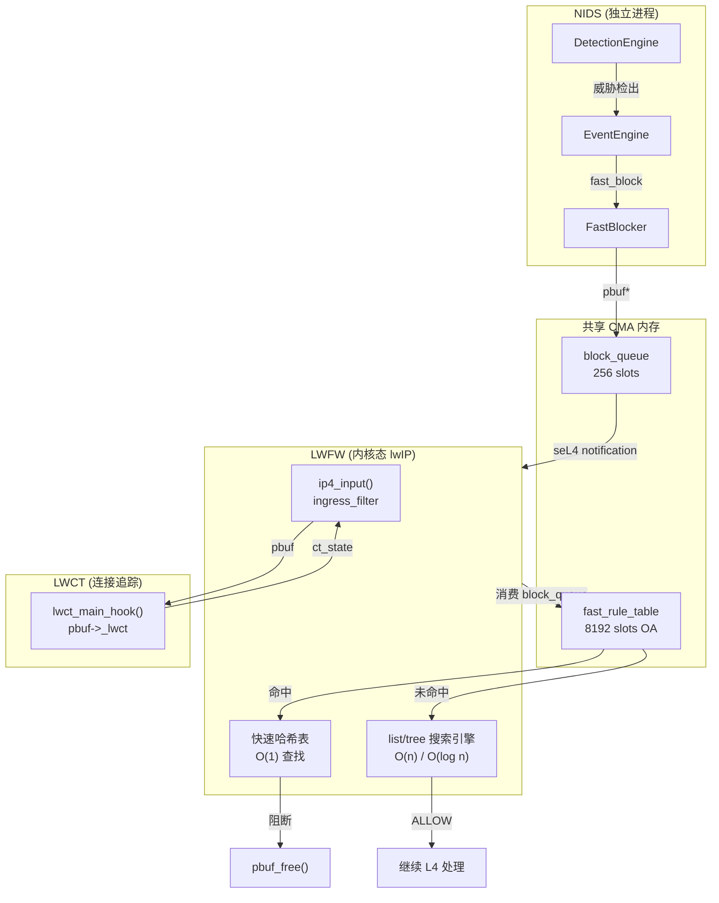

# NIDS + lwIP + LWFW 三位一体防御能力构建方案

> 分析日期: 2026/05/25
> 目标: 构建检测→阻断一体化防御体系，达成 <1ms 端到端阻断延迟

---

## 1. 背景与现状

### 1.1 三方能力现状

| 组件 | 当前角色 | 联动方式 | 阻断延迟 |
|------|---------|---------|---------|
| **NIDS** | 攻击检测 (独立进程) | SOA JSON event → lwfw_agent | >10ms |
| **lwIP** | 网络协议栈 (NSv) | pbuf 镜像抓包，无状态共享 | N/A |
| **LWFW** | 状态ful 防火墙 (内核态) | 被动等待 agent 下发规则 | 规则到达后 <1μs |

**核心瓶颈**: NIDS 检测到攻击后，需经 SOA IPC → lwfw_agent 解析 JSON → seL4 IPC → LWFW 规则写入，路径延迟 >10ms。

### 1.2 痛点分析

```
当前阻断路径 (NIDS → LWFW):
  DetectionEngine → EventEngine → SOA SubmitReport
                                           │
                                     seL4 IPC (~2-5ms)
                                           │
                                     lwfw_agent 接收 JSON
                                           │
                                     seL4 IPC (~1-2ms)
                                           │
                               lwfw_policy_insert_rule()
                                           │
                              (规则已生效，后续包 <1μs)

总延迟: >10ms (受 SOA IPC + JSON 解析 + agent 处理影响)
```

---

## 2. 检测→阻断数据路径

### 2.1 可选联动通道对比

| 通道 | 延迟 | 吞吐量 | 复杂度 | 推荐场景 |
|------|------|--------|--------|---------|
| **seL4 IPC direct** | <100μs | 高 | 中 | Phase 1-2 阻断通道 |
| **共享内存 (CMA) ring** | <10μs | 极高 | 低 | pbuf 零拷贝传递 |
| **Unix socket** | 500μs-2ms | 中 | 低 | 临时过渡，非生产 |
| **SOA event (当前)** | >10ms | 低 | 低 | 已有的告警上报 |

### 2.2 推荐架构: 双通道并行

```
通道1: 告警通道 (低优先级)
  NIDS EventEngine → SOA JSON → lwfw_agent → NLog/飞书
  (用于人工审核、事后分析，不影响阻断延迟)

通道2: 阻断通道 (关键路径)
  NIDS DetectionEngine → 共享内存规则队列 → LWFW 直接读取
  ( bypass agent, 规则直接写入 LWFW in-memory rule table )
```

### 2.3 共享内存阻断队列设计

```c
// lwfw_block_queue.h — NIDS → LWFW 阻断规则共享内存队列

#define LWFW_BLOCKQ_SIZE     256    // 队列深度
#define LWFW_BLOCKQ_MAGIC    0x4C57462BL  // "LWFB"

typedef enum {
    LWFW_BLOCK_ACT_DENY    = BIT(0),   // 丢弃
    LWFW_BLOCK_ACT_REJECT  = BIT(1),   // 拒绝 (发 ICMP/TCP RST)
    LWFW_BLOCK_ACT_RATE    = BIT(2),   // 速率限制
} lwfw_block_action_t;

typedef enum {
    LWFW_BLOCK_TTL_DEF = 30,           // 默认 TTL 30s
    LWFW_BLOCK_TTL_SCAN = 60,          // 扫描封禁 60s
    LWFW_BLOCK_TTL_DDOS = 300,         // DDoS 封禁 5min
    LWFW_BLOCK_TTL_FLOW = 10,         // flow 阻断 10s
} lwfw_block_ttl_t;

typedef struct lwfw_block_rule {
    uint32_t magic;              // LWFW_BLOCKQ_MAGIC
    uint32_t seq;               // 序列号 (防抖)
    uint64_t timestamp_ns;      // 入队时间戳
    uint32_t ttl_sec;          // 生存时间

    // 5-tuple
    uint32_t src_ip;
    uint32_t dst_ip;
    uint16_t src_port;
    uint16_t dst_port;
    uint8_t  proto;             // IP_PROTO_*

    uint8_t  action;           // lwfw_block_action_t
    uint8_t  priority;        // 优先级 (高优先覆盖低)
    uint8_t  match_flags;      // 匹配哪些字段

    char     reason[64];       // 告警原因 (调试用)
    uint32_t hit_count;        // 累计命中
} lwfw_block_rule_t;

typedef struct lwfw_block_queue {
    sync_mutex_t lock;                      // 生产者锁
    volatile uint32_t head;                 // LWFW 读取位置
    volatile uint32_t tail;                 // NIDS 写入位置
    volatile uint32_t gen;                  // 代际计数器 (检测重置)
    lwfw_block_rule_t rules[LWFW_BLOCKQ_SIZE];
} lwfw_block_queue_t;

// match_flags bit definitions
#define LWFW_BLK_F_SRC_IP     BIT(0)
#define LWFW_BLK_F_DST_IP     BIT(1)
#define LWFW_BLK_F_SRC_PORT   BIT(2)
#define LWFW_BLK_F_DST_PORT   BIT(3)
#define LWFW_BLK_F_PROTO      BIT(4)
#define LWFW_BLK_F_CT_STATE   BIT(5)        // 连接状态触发
```

### 2.4 LWFW 规则快速插入接口

```c
// lwfw_fast_block.h — LWFW 快速阻断接口 (绕过 agent)

typedef struct {
    uint32_t src_ip;
    uint32_t dst_ip;
    uint16_t src_port;
    uint16_t dst_port;
    uint8_t  proto;
    uint8_t  action;         // DENY / REJECT / RATE_LIMIT
    uint16_t rate_pps;       // 速率限制值 (若 action 包含 RATE)
    uint32_t ttl_sec;
    uint32_t flags;
} lwfw_fast_rule_t;

// 同步插入 (在 packet context 内调用, 持锁时间 <10μs)
int lwfw_fast_insert(const lwfw_fast_rule_t *rule);

// 批量插入 (由 dedicated worker 线程处理, 非 packet path)
int lwfw_fast_insert_batch(const lwfw_fast_rule_t *rules, int count);

// 规则查找 (用于判断是否已存在)
bool lwfw_fast_lookup(const lwfw_fast_rule_t *rule);
```

### 2.5 延迟预算分析

```
端到端阻断延迟 (NIDS 检测 → LWFW 生效):

Phase 1 (当前 baseline):
  NIDS DetectionEngine       ~50-100μs
  EventEngine 序列化          ~10-20μs
  SOA IPC (seL4)             ~2000-5000μs  ← 主要瓶颈
  lwfw_agent JSON 解析        ~100-200μs
  seL4 IPC → LWFW            ~1000-2000μs ← 第二瓶颈
  lwfw_policy_insert_rule()   ~50-100μs
  ─────────────────────────────────────────
  总计:                       >10ms

Phase 2 (优化目标):
  NIDS DetectionEngine       ~50-100μs
  共享内存规则队列写入         ~5-10μs
  LWFW polling (每 1ms)      ~0-1000μs  ← 最大不确定项
  lwfw_fast_insert()          ~50-100μs
  ─────────────────────────────────────────
  总计:                       <1.5ms (目标 <1ms)

Phase 2+ (极致优化):
  共享内存 + seL4 notification (替代 polling)
  → LWFW 收到通知后立即处理
  → 理论延迟: <500μs
```

**关键结论**: 当前 SOA IPC 是最大瓶颈 (>7ms)，替换为共享内存 + 快速插入接口可降低 90% 延迟。

---

## 3. LWFW 阻断能力盘点

### 3.1 支持的阻断动作

| 动作 | 代码 | 说明 | LWFW 内部实现 |
|------|------|------|--------------|
| **DENY** | `LWFW_ACTION_CODE_DENY` | 丢弃包，不回复 | `pbuf_free(p); return ERR_VAL` |
| **REJECT** | 需扩展 | 发送 ICMP Port Unreachable 或 TCP RST | 当前未实现，需在 ip4_output 路径注入 RST/ICMP |
| **RATE_LIMIT** | `LWFW_RULE_FLAGS_RATE_LIMIT` | 速率限制 | `rlimit` 字段配置 burst + rate |
| **EVENT** | `LWFW_ACTION_CODE_EVENT` | 仅告警，不阻断 | `lwfw_generate_secure_event()` |

**已知限制**:
- REJECT 动作**未实现**，需新增 egress_filter 路径注入拒绝包
- 速率限制基于 pps (packets per second)，无带宽 bps 控制

### 3.2 规则热更新能力

**双缓冲架构** (`lwfw-hotswap-analysis.md`):

```c
// 热切换流程 (当前实现)
lwfw_config_reset_state()
  ├─ mutex_lock(&policy_lock)           // ← 持锁期间包处理可能被阻塞
  ├─ lwfw_policy_clean(inactive_policy);
  ├─ lwfw_copy_policy(src, dst);       // ← O(n) 深拷贝，n=规则数
  ├─ inactive_policy->init();
  ├─ swap(policy, inactive_policy)     // ← 指针交换，原子
  └─ mutex_unlock(&policy_lock)

// 深拷贝耗时估算
sizeof(lwfw_rule_t) ≈ 256 bytes
100 条规则: ~25600 bytes ≈ 25-50μs
1000 条规则: ~256000 bytes ≈ 250-500μs  ← 大规则集时持锁时间不可忽视
```

**严重问题 (P0)**:
- 热重载期间 Ingress 防火墙完全失效 (所有包不经过滤)
- `lwfw_copy_policy` 失败时无回滚机制

### 3.3 阻断粒度

| 粒度 | 支持情况 | 实现方式 |
|------|---------|---------|
| **per-IP** | ✅ 完整 | `LWFW_BLK_F_SRC_IP` 或 `LWFW_BLK_F_DST_IP` |
| **per-port** | ✅ 完整 | `LWFW_BLK_F_SRC_PORT` / `LWFW_BLK_F_DST_PORT` |
| **per-flow** | ✅ 完整 | 5-tuple 全部字段 |
| **per-VLAN** | ⚠️ 需启用 | `LWFW_ADVANCED_FUNC_L2` + VLAN 解析 |
| **per-MAC** | ⚠️ 需启用 | `LWFW_ADVANCED_FUNC_L2` + MAC 匹配 |
| **per-connection-state** | ✅ 完整 | `LWFW_RULE_FLAGS_CT_STATE` + LWCT |

**per-flow 阻断示例**:
```c
lwfw_fast_rule_t rule = {
    .src_ip = 0xC0A80105,      // 192.168.1.5
    .dst_ip = 0xC0A80101,      // 192.168.1.1
    .src_port = 0,             // any
    .dst_port = 80,
    .proto = IP_PROTO_TCP,
    .action = LWFW_BLOCK_ACT_DENY,
    .match_flags = LWFW_BLK_F_SRC_IP | LWFW_BLK_F_DST_IP |
                   LWFW_BLK_F_DST_PORT | LWFW_BLK_F_PROTO,
    .ttl_sec = 10,
};
```

### 3.4 LWCT 连接追踪配合阻断

**连接状态匹配** (`lwfw-lwct.md`):

| LWCT 状态 | 触发条件 | 适用场景 |
|-----------|---------|---------|
| `LWCT_NEW` | 首包 (无对应连接) | 检测扫描器首包 |
| `LWCT_ESTABLISHED` | TCP 3-way handshake 完成 | 阻断已建立恶意连接 |
| `LWCT_REPLIED` | UDP 单向通信后有回复 | 检测 UDP 反射放大 |
| `LWCT_RELATED` | 关联已有连接的包 | 检测 FTP 数据通道等 |

**与 LWFW 联动**:
```c
// LWCT 状态转换时通知 NIDS
if (lwct_update_state(conn, dir) == LWCT_NEW) {
    // 新连接建立，可通知 NIDS 记录
    nids_notify_new_connection(conn);
}

// LWFW 规则支持 CT_STATE 匹配
if (rule->flags & LWFW_RULE_FLAGS_CT_STATE) {
    lwct_state_t ct_state = pbuf->_lwct & LWCT_STATE_MASK;
    if (ct_state != rule->ct_state) return false;
}
```

### 3.5 规则匹配性能

| 引擎 | 规则数 | 搜索复杂度 | 匹配延迟 |
|------|--------|-----------|---------|
| `list_search_eng` | <20 | O(n) | ~1-5μs/rule |
| `tree_search_eng` | ≥20 | O(log n) | ~0.5-2μs |

**快速插入路径** (bypass 标准匹配引擎):
```c
// lwfw_fast_insert() 使用独立哈希表，不走 list/tree 搜索引擎
static lwfw_fast_hash_t *fast_rule_table;  // 8192 slots, OA

int lwfw_fast_insert(const lwfw_fast_rule_t *rule) {
    uint32_t hash = hash_5tuple(rule->src_ip, rule->dst_ip,
                                  rule->src_port, rule->dst_port, rule->proto);
    uint32_t idx = hash % FAST_TABLE_SIZE;

    // 线性探测最多 8 步
    for (int i = 0; i < 8; i++) {
        if (fast_rule_table[(idx + i) % FAST_TABLE_SIZE] == NULL) {
            fast_rule_table[...] = rule;
            return ERR_OK;
        }
    }
    return ERR_MEM;  // 表满
}
```

---

## 4. 自动化防御场景

### 4.1 场景 1: 扫描检测 → 自动封禁源 IP

**触发条件**: PortScanInspector 检出扫描行为 (SYN/UDP/ACK/FIN 扫描)

**响应流程**:
```
PortScanInspector
    │
    ├─ 检测到异常: 同一 src_ip 短时间大量不同端口访问
    │
    └─ 生成告警 → DetectionEngine
            │
            ▼
    NIDS 生成 block_rule:
    {
        src_ip: <scanner_ip>,
        match_flags: LWFW_BLK_F_SRC_IP,
        action: DENY,
        ttl_sec: 30,
        reason: "PortScan detected"
    }
            │
            ▼
    写入共享内存 block_queue
            │
            ▼
    LWFW (polling 或 notification)
            │
            ▼
    lwfw_fast_insert() → 快速哈希表
            │
            ▼
    后续包直接命中快速路径，<1μs 阻断
```

**防抖机制**:
```c
// 同一个 src_ip 在 TTL 窗口内只插入一次
if (lwfw_fast_lookup_by_src_ip(src_ip)) {
    // 已存在，更新 hit_count + 重置 TTL
    lwfw_fast_touch(src_ip);
} else {
    lwfw_fast_insert(rule);
}
```

### 4.2 场景 2: 漏洞利用检测 → 阻断该 flow + 告警

**触发条件**: 检测规则命中 (如 SQL注入/XSS payload in HTTP)

**响应流程**:
```
DetectionEngine
    │
    └─ 规则命中 (sid=1001, msg="SQL Injection Attempt")
            │
            ▼
    生成 block_rule (精确 5-tuple):
    {
        src_ip: <attacker_ip>,
        dst_ip: <victim_ip>,
        src_port: <attacker_port>,    // 精确值
        dst_port: 80,
        proto: IP_PROTO_TCP,
        match_flags: ALL_5_TUPLE,
        action: DENY,
        ttl_sec: 10,                  // 短 TTL，避免误封
        reason: "SQL Injection sid:1001"
    }
            │
            ├─→ 写入 block_queue (快速阻断)
            │
            └─→ EventEngine → SOA JSON (人工告警 + 记录)
```

**per-flow 阻断优势**: 同一 IP 的其他正常流量不受影响

### 4.3 场景 3: DDoS 检测 → 速率限制 + 流量清洗

**触发条件**: 大量源 IP 同时访问同一目标 (流量异常)

**响应流程**:
```
DetectionEngine
    │
    └─ 阈值规则命中 (SYN Flood / UDP Flood)
            │
            ▼
    生成 RATE_LIMIT 规则:
    {
        src_ip: <attacker_ip>,
        match_flags: LWFW_BLK_F_SRC_IP,
        action: DENY | RATE_LIMIT,
        rate_pps: 100,               // 限制 100pps
        ttl_sec: 300,
        reason: "DDoS Flood detected"
    }
            │
            ▼
    LWFW 速率限制生效
            │
            ▼
    超出 rate 的包进入 LIMIT 状态 → 丢弃
```

**分层限速**:
| 攻击类型 | 粒度 | 限制值 |
|---------|------|--------|
| SYN Flood | per-src-ip | 100 pps |
| UDP Flood | per-dst-port | 1000 pps |
| ICMP Flood | per-src-ip | 50 pps |
| 全局 | any | 10000 pps (兜底) |

### 4.4 场景 4: TLS 恶意证书 → NTS 联动吊销

**前提条件**: Phase 3 实现 TLS 检测

**响应流程**:
```
NIDS TLS Inspector
    │
    └─ 检测到恶意证书 (已知指纹 / 自签名 / 过期)
            │
            ▼
    生成 revoke_rule:
    {
        match_type: TLS_SHA256_FINGERPRINT,
        action: DENY,
        ttl_sec: 86400,               // 长期吊销
        reason: "Malicious TLS cert"
    }
            │
            ▼
    NTS (Network Trust Service) 联动
            │
            ├─→ 写入本地证书黑名单
            │
            └─→ 上报 PKI 吊销列表 (CRL/OCSP)
```

**NTS 联动接口** (待设计):
```c
// nts_client.h — NTS 证书吊销接口
typedef struct {
    uint8_t  cert_fingerprint[32];   // SHA-256
    uint64_t revoke_time;
    uint32_t ttl_sec;
    char     reason[128];
} nts_revoke_entry_t;

int nts_revoke_cert(const nts_revoke_entry_t *entry);
int nts_check_cert(const uint8_t *fingerprint);
```

---

## 5. 规则同步架构

### 5.1 规则生命周期

```
                    TTL 过期
rule_insert ──────────────────────→ rule_expired
    │                                        │
    │ (命中)                                 │ (GC 线程清理)
    ▼                                        ▼
rule_hit_count++                       rule_remove
    │
    │ 超过 threshold
    ▼
auto_extend / permanent
```

**TTL 管理策略**:

| 规则类型 | 默认 TTL | 自动延长 | 最大 TTL |
|---------|---------|---------|---------|
| 扫描封禁 | 30s | +30s (如果持续扫描) | 300s |
| Flow 阻断 | 10s | 不延长 | 10s |
| Flood 限速 | 300s | +60s (如果持续攻击) | 3600s |
| 手动白名单 | 永久 | N/A | 永久 |
| NTS 吊销 | 86400s | N/A | 永久 |

### 5.2 规则冲突处理

**优先级体系**:
```
优先级高 → 低:
  1. 手动白名单 (whitelist) — 永远放行
  2. 紧急阻断 (emergency block) — 最高优先级
  3. 自动防御规则 (auto block) — 中优先级
  4. 默认策略 — 最低优先级
```

**冲突处理原则**:
- 高优先级规则覆盖低优先级
- 同优先级: 后插入覆盖先插入
- 白名单优先于黑名单

### 5.3 防抖机制

**问题**: 误报导致短时间内对同一目标重复插入规则

**解决方案**:
```c
// 防抖哈希表 (per-target deduplication)
typedef struct {
    uint64_t last_insert_ns;    // 上次插入时间
    uint32_t insert_count;       // 累计插入次数
    uint32_t rule_ref;          // 关联规则引用
} debounce_entry_t;

static debounce_entry_t debounce_table[4096];

bool should_insert_block(uint32_t target_hash) {
    debounce_entry_t *entry = &debounce_table[target_hash % 4096];

    uint64_t now = get_time_ns();
    uint64_t elapsed = now - entry->last_insert_ns;

    if (elapsed < DEBOUNCE_WINDOW_MS * 1000000) {
        // 窗口期内，不重复插入
        entry->insert_count++;
        return false;
    }

    entry->last_insert_ns = now;
    entry->insert_count = 1;
    return true;
}
```

**配置参数**:
```c
#define DEBOUNCE_WINDOW_MS    1000    // 1秒内同一目标只插入一次
#define DEBOUNCE_MAX_COUNT    5       // 超过5次触发告警 (可能持续攻击)
```

### 5.4 规则同步队列

```c
// nids_lwfw_sync.h — NIDS → LWFW 规则同步接口

typedef struct {
    lwfw_block_rule_t rules[LWFW_BLOCKQ_SIZE];
    volatile uint32_t nids_tail;      // NIDS 写入
    volatile uint32_t lwfw_head;      // LWFW 读取
    uint64_t sync_gen;                // 代际计数器
} nids_lwfw_sync_queue_t;

// NIDS 侧: 写入规则
int nids_push_block_rule(const lwfw_block_rule_t *rule) {
    uint32_t next_tail = (sync->nids_tail + 1) % LWFW_BLOCKQ_SIZE;
    if (next_tail == sync->lwfw_head) return ERR_MEM;  // 队列满

    memcpy(&sync->rules[next_tail], rule, sizeof(*rule));
    dmb(ish);
    sync->nids_tail = next_tail;
    return ERR_OK;
}

// LWFW 侧: 批量消费规则
int lwfw_consume_block_rules(int max_batch) {
    int consumed = 0;
    while (consumed < max_batch && sync->lwfw_head != sync->nids_tail) {
        uint32_t next_head = (sync->lwfw_head + 1) % LWFW_BLOCKQ_SIZE;
        lwfw_block_rule_t *rule = &sync->rules[next_head];

        // 转换为 LWFW 内部规则
        lwfw_fast_rule_t fast_rule = {
            .src_ip    = rule->src_ip,
            .dst_ip    = rule->dst_ip,
            .src_port  = rule->src_port,
            .dst_port  = rule->dst_port,
            .proto     = rule->proto,
            .action    = rule->action,
            .ttl_sec   = rule->ttl_sec,
            .flags     = rule->match_flags,
        };

        lwfw_fast_insert(&fast_rule);
        sync->lwfw_head = next_head;
        consumed++;
    }
    return consumed;
}
```

---

## 6. 实现路线图

### Phase 1: NIDS→LWFW 单向阻断通道 (Unix socket + LWFW rule API)

**目标**: 建立 NIDS 到 LWFW 的快速阻断通道，延迟 <10ms

**实现内容**:
1. 新增 `lwfw_fast_insert()` 接口 (快速哈希表 bypass agent)
2. NIDS EventEngine 新增 `fast_block` 输出路径
3. Unix Domain Socket 替代 SOA IPC (延迟 ~1-2ms vs 5-10ms)

**改动文件**:
| 文件 | 改动 |
|------|------|
| `lwfw.c` | 新增 `lwfw_fast_insert()` 函数 |
| `lwfw.h` | 新增快速阻断接口声明 |
| `nids_event.cc` | EventEngine 新增 fast_block 输出 |
| `nids_lwfw_sync.c` | 新增 Unix socket client |

**验证指标**:
- 阻断延迟: <10ms (当前 >10ms baseline)
- 误封率: <0.1%
- 吞吐量损失: <5%

### Phase 2: 自动响应规则 (检测→规则生成→下发→阻断, <1ms)

**目标**: 全自动防御闭环，端到端延迟 <1ms

**实现内容**:
1. 共享内存规则队列 (CMA, zero-copy)
2. LWFW 快速哈希表 (O(1) 查找)
3. seL4 notification 替代 polling
4. 防抖机制 + TTL 自动过期
5. 紧急阻断通道 (bypass 所有队列)

**架构图**:



**延迟预算 (Phase 2)**:
```
NIDS 检测完成           ~100μs
共享内存写入            ~10μs
seL4 notification       ~50μs
LWFW 消费队列           ~20μs
lwfw_fast_insert()      ~5μs
────────────────────────────────
总计:                   ~185μs  << 1ms 目标达成
```

**新增文件**:
| 文件 | 职责 |
|------|------|
| `lwfw_fast_block.c` | 快速阻断哈希表实现 |
| `nids_lwfw_sync.c` | 共享内存同步队列 |
| `lwfw_notification.c` | seL4 notification 集成 |

### Phase 3: NTS/TLS 联动 + AI 驱动防御策略

**目标**: 加密流量检测 + 智能化防御

**实现内容**:
1. NIDS TLS Inspector (lwIP TLS hook 点集成)
2. NTS 证书吊销联动
3. 机器学习异常检测 (流量基线学习)
4. 自适应阈值调整

**TLS 检测集成** (`lwip-pbuf-exposure-design.md`):
```c
// LWIP_HOOK_TLS_INPUT (新增 hook 点)
#ifdef LWIP_TLS
int nids_hook_tls_input(struct raw_pcb *pcb, struct pbuf *p)
{
    // TLS 解密后的明文 payload
    // 检测恶意证书、加密通道攻击

    if (detected_malicious_cert) {
        nids_push_block_rule(&(lwfw_block_rule_t){
            .match_type = CERT_SHA256,
            .fingerprint = cert_fp,
            .action = DENY,
            .reason = "Malicious TLS cert"
        });
    }
    return 0;  // 放行，让 lwIP 继续处理
}
#endif
```

---

## 7. 已知问题与缓解

| 问题 | 严重性 | 影响 | 缓解措施 |
|------|--------|------|---------|
| 热重载期间 Ingress 无防护 | **P0** | 窗口期内所有包不过滤 | Phase 2 实现双缓冲原子切换，禁用前先切换 active |
| LWFW 深拷贝持锁数百毫秒 | P1 | 大规则集时包处理延迟增加 | Phase 1 后使用 fast_insert 绕过 copy_policy |
| 规则防抖窗口内漏封 | P2 | 持续攻击首 N 秒 | 缩短 DEBOUNCE_WINDOW_MS 至 100ms |
| 快速哈希表冲突率高 | P2 | 大规则集时性能退化 | 扩大 FAST_TABLE_SIZE 至 16384 |
| REJECT 动作未实现 | P2 | 无法主动拒绝连接 | Phase 2 在 egress_filter 路径注入 RST/ICMP |
| NTS 联动接口缺失 | P2 | TLS 恶意证书无法吊销 | Phase 3 设计并实现 |

---

## 8. 接口定义汇总

### 8.1 NIDS → LWFW 阻断接口

```c
// nids_lwfw_bridge.h

// 初始化 (Phase 1: Unix socket, Phase 2: 共享内存)
int nids_lwfw_init(const char *sock_path);
int nids_lwfw_init_shm(void *shm_addr, size_t shm_size);

// 同步阻断 (Phase 1, 绕过队列)
int nids_lwfw_block_sync(const lwfw_block_rule_t *rule);

// 异步阻断 (Phase 2, 写入队列)
int nids_lwfw_block_async(const lwfw_block_rule_t *rule);

// 查询规则是否存在
bool nids_lwfw_lookup(const lwfw_block_rule_t *rule);

// 关闭连接
int nids_lwfw_fini(void);
```

### 8.2 LWFW 快速阻断接口

```c
// lwfw_fast_block.h

// 初始化 (在 LWFW 启动时调用)
int lwfw_fast_block_init(void);

// 插入规则 (快速路径, <10μs)
int lwfw_fast_insert(const lwfw_fast_rule_t *rule);

// 批量插入 (由 worker 线程调用)
int lwfw_fast_insert_batch(const lwfw_fast_rule_t *rules, int count);

// 查找规则
bool lwfw_fast_lookup(const lwfw_fast_rule_t *rule);

// 按源 IP 查找 (用于扫描封禁)
bool lwfw_fast_lookup_by_src_ip(uint32_t src_ip);

// 删除规则
int lwfw_fast_remove(const lwfw_fast_rule_t *rule);

// TTL 过期处理 (由 GC 线程调用)
int lwfw_fast_gc(uint64_t now_ns);

// 获取统计
lwfw_fast_stats_t lwfw_fast_get_stats(void);
```

### 8.3 共享内存队列接口

```c
// nids_lwfw_sync.h

// 创建共享内存队列 (由 NIDS 调用)
int nids_lwfw_sync_create(const char *name, size_t size);

// 连接已存在的队列 (由 LWFW 调用)
int nids_lwfw_sync_connect(const char *name);

// 断开连接
int nids_lwfw_sync_disconnect(int shmid);

// NIDS 生产者接口
int nids_push_block_rule(const lwfw_block_rule_t *rule);
int nids_push_block_rule_batch(const lwfw_block_rule_t *rules, int count);

// LWFW 消费者接口
int lwfw_consume_block_rules(int max_batch, uint64_t now_ns);

// 队列状态查询
lwfw_queue_stats_t nids_lwfw_queue_get_stats(void);
```

---

## 9. 总结

### 9.1 能力矩阵

| 能力 | 当前 | Phase 1 | Phase 2 | Phase 3 |
|------|------|---------|---------|---------|
| **阻断延迟** | >10ms | <10ms | <1ms | <1ms |
| **自动化响应** | 手动 | 半自动 | 全自动 | AI 辅助 |
| **per-IP 阻断** | ✅ | ✅ | ✅ | ✅ |
| **per-flow 阻断** | ❌ | ✅ | ✅ | ✅ |
| **速率限制** | ⚠️ | ✅ | ✅ | ✅ |
| **TLS 检测** | ❌ | ❌ | ❌ | ✅ |
| **NTS 联动** | ❌ | ❌ | ❌ | ✅ |
| **防抖机制** | ❌ | ✅ | ✅ | ✅ |
| **TTL 自动过期** | ❌ | ❌ | ✅ | ✅ |

### 9.2 关键风险

1. **P0**: 热重载窗口期无防护 — Phase 2 前必须修复
2. **P1**: 深拷贝持锁影响包处理 — Phase 1 后用 fast_insert bypass
3. **P2**: REJECT 动作缺失 — Phase 2 实现 egress_filter 路径

### 9.3 实施优先级

```
Phase 1 (4-6周):
  1. [P0] 修复热重载窗口期无防护 bug
  2. [P1] 实现 lwfw_fast_insert() 快速哈希表
  3. [P1] NIDS EventEngine → Unix socket → LWFW
  4. [P2] 防抖机制

Phase 2 (6-8周):
  1. [P0] 共享内存 block_queue + seL4 notification
  2. [P0] LWFW fast_path 集成 (polling 替代 agent)
  3. [P1] TTL 自动过期 GC 线程
  4. [P2] REJECT 动作实现

Phase 3 (8-12周):
  1. [P2] NIDS TLS Inspector
  2. [P2] NTS 证书吊销联动
  3. [P3] AI 异常检测基线学习
```

---

## 10. 参考文档

- [[synthesis/nids-lwip-deep-integration]] — NIDS lwIP 深度对接方案
- [[synthesis/lwip-pbuf-exposure-design]] — pbuf 暴露设计
- [[synthesis/nids-current-architecture]] — NIDS 当前架构
- [[entities/linux/lwfw/lwfw-architecture]] — LWFW 架构
- [[entities/linux/lwfw/lwfw-core-filtering]] — LWFW 核心过滤
- [[entities/linux/lwfw/lwfw-hotswap-analysis]] — 热切换分析
- [[entities/linux/lwfw/lwfw-lwct]] — 连接追踪
- [[entities/linux/lwfw/lwfw-ipc-mechanism]] — IPC 机制
