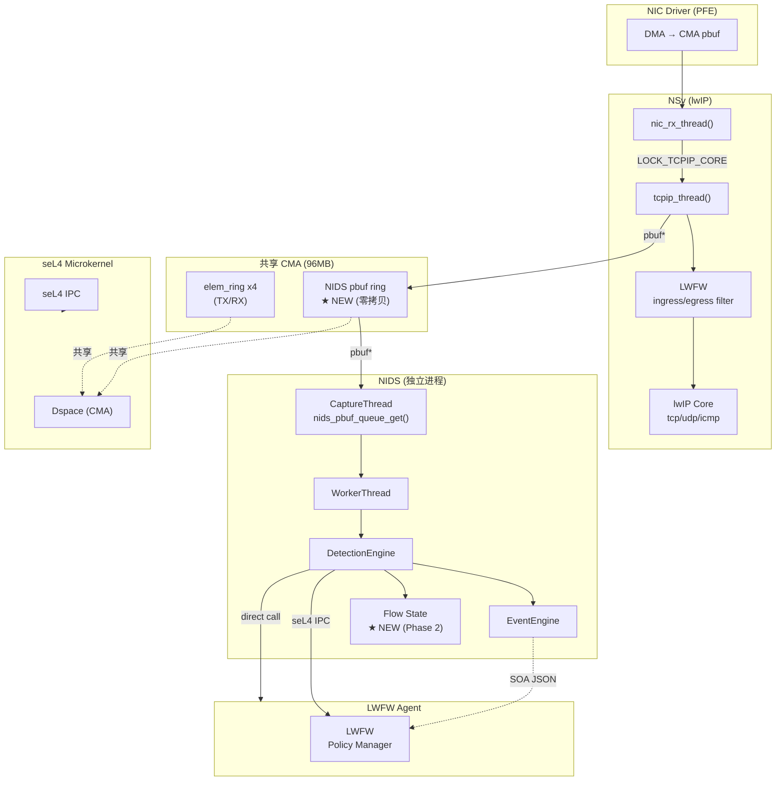
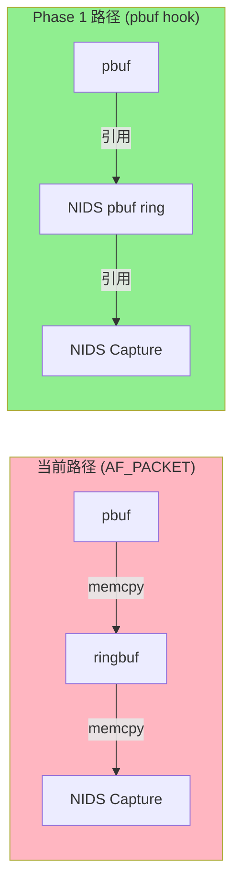
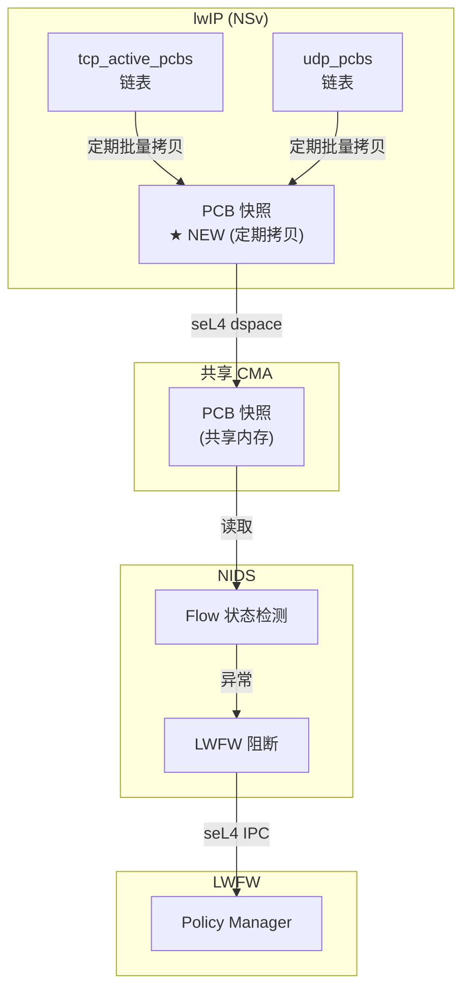

# NIDS 深度对接 lwIP 方案

> 分析日期: 2026/05/25
> 目标: 消除 AF_PACKET 拷贝开销，获取 lwIP 内部状态，实现 LWFW 联动阻断

---

## 1. 背景与现状

### 1.1 当前架构

NIDS 是主 domain 内的 native daemon 进程，通过 `AF_PACKET` on `PFE.VLAN1` 被动镜像抓包，与 NSv (lwIP) 完全解耦：

```
┌──────────────────────────────────────────────────────────────┐
│  PFE.VLAN1 ──→ VLAN mirror port ──→ AF_PACKET socket       │
│                                        │                      │
│                                    NIDS daemon              │
│                                   (独立进程)                │
└──────────────────────────────────────────────────────────────┘
                         │
                         ▼
┌──────────────────────────────────────────────────────────────┐
│  CaptureThread → WorkerThread → DetectionEngine → EventEngine │
│                                                              │
│  当前数据路径: pbuf (CMA) → ringbuf → pcap (memcpy x2)     │
└──────────────────────────────────────────────────────────────┘
```

### 1.2 当前痛点

| 问题 | 现状 | 影响 |
|------|------|------|
| **双拷贝开销** | pbuf→ringbuf→pcap，2次 memcpy | NIDS CPU 占用高，CaptureThread ~5% |
| **无法访问 lwIP 状态** | 只能看到 L2 镜像，无法读取 PCB/flow table | 检测能力受限 |
| **LWFW 联动延迟** | NIDS→SOA→LWFW Agent，路径长 | 阻断生效 >10ms |
| **重复协议解析** | NIDS 独立解析 L3/L4，lwIP 已解析过 | CPU 浪费 |
| **盲区** | 纯镜像，无 lwIP 内部信息（PCB状态、TCP窗口等）| 检测精度低 |

---

## 2. Hook 点分析

### 2.1 lwIP 完整 Hook 点地图

```
NIC DMA (CMA pbuf)
    │
    ▼
ethernet_input()                    [ethernet.c:89]
    │ pbuf* + ethhdr
    ├─► VLAN 解析 (0x8100)
    ├─► lwip_arp_filter_netif_fn()  [ethernet.c:459]  VID→netif分发
    ├─► raw_afpacket_input()         [raw.c:282]  AF-PACKET捕获点
    └─► 分发: ip4_input() / etharp_input()
              │
              ▼
ip4_input()                         [ip4.c:743]  ★ L3 入口
    │ pbuf* + iphdr (IP header 已剥离)
    ├─► pbuf_remove_header(IP_HLEN)
    ├─► #ifdef NIO_LWIP_LWFW
    │     lwfw_p->ops->ingress_filter()  [lwfw.c:300+]  ★ LWFW Ingress
    │     └── 不通过则 pbuf_free() + return ERR_OK
    ├─► ip4_input_accept()  目的地址验证
    └─► 分发: tcp_input() / udp_input() / icmp_input() / igmp_input()
              │
              ├──► tcp_input()              [tcp.c]    ★ L4 TCP 入口
              │       pbuf* + tcphdr
              │       ├─► tcp_process()  状态机
              │       ├─► tcp_receive()  数据接收
              │       └─► tcp_enqueue()  接收队列
              │
              ├──► udp_input()              [udp.c]    ★ L4 UDP 入口
              │       pbuf* + udphdr
              │       └─► 遍历 udp_pcbs，匹配后调用 pcb->recv()
              │
              ├──► icmp_input()             [icmp.c]
              └──► igmp_input()             [igmp.c]

TX 路径:
ip4_output_if()                     [ip4.c:888]  ★ L3 Egress
    ├─► ip4_route()
    ├─► #ifdef NIO_LWIP_LWFW
    │     lwfw_p->ops->egress_filter()     ★ LWFW Egress
    ├─► IP Header 填充 + checksum
    └─► netif->output() = etharp_output()
            │
            ▼
ethernet_output()                  [ethernet.c:333]
    ├─► VLAN tag 插入 (可选)
    ├─► Ethernet Header 填充
    └─► netif->linkoutput() = ethif_link_output()
            │
            ▼
ethif_link_output()                 [main.c:3788]  ★ TX DMA 提交点
    ├─► pbuf_copy() 到 DMA buffer
    ├─► elem_ring_put(pending_tx_buf_ring)
    └─► sel4_signal(nic_tx_ntfn)
```

### 2.2 NIDS 可用 Hook 点详细分析

#### Hook 1: `raw_afpacket_input()` — AF-PACKET 捕获点

| 属性 | 值 |
|------|-----|
| **文件:行号** | `raw.c:282` |
| **函数签名** | `raw_afpacket_input(struct pbuf *p, struct netif *netif, u16_t type)` |
| **调用位置** | `ethernet_input()` 内，`ip4_input()` 之前 |
| **pbuf 状态** | 完整 Ethernet frame (含 VLAN tag)，L2 头未剥离 |
| **优势** | 与当前抓包路径一致，改动最小 |
| **劣势** | 纯 L2 镜像，无 L3/L4 上下文 |

**当前 NIDS 数据源就是这里的 `tpacket_recv()` 写入 ring buffer**

```c
// raw.c:282 - raw_afpacket_input 调用链
raw_afpacket_input(p, netif, type)
  → 遍历 raw_afpacket_pcbs 链表
  → pcb->recv(pcb->recv_arg, pcb, p, NULL)
      → tpacket_recv()           // 写入 ring buffer (memcpy x1)
      → API_EVENT(conn, NETCONN_EVT_RCVPLUS, 0)
```

#### Hook 2: `ip4_input()` — L3 Ingress 唯一入口

| 属性 | 值 |
|------|-----|
| **文件:行号** | `ip4.c:743` |
| **函数签名** | `ip4_input(struct pbuf *p, struct netif *inp)` |
| **pbuf 状态** | IP header 已通过 `pbuf_remove_header()` 剥离，payload 指向 L4 |
| **Hook 位置** | IP header 解析后，LWFW ingress_filter **之后**，分发到 L4 **之前** |
| **优势** | 必经之路，L3 头已解析，可获取 src/dst IP、protocol |
| **劣势** | 仍无 TCP/UDP port 信息（需进入 tcp_input/udp_input 后才有） |
| **性能影响** | ~0（串行在 tcpip_thread 内） |

```c
// ip4.c:743-770
ip4_input(struct pbuf *p, struct netif *inp)
  → pbuf_remove_header(p, IP_HLEN)    // 剥离 IP 头
  → #ifdef NIO_LWIP_LWFW
      if (lwfw_p->ops->ingress_filter(p, inp) != ERR_OK) {
        pbuf_free(p); return ERR_OK;   // LWFW 已丢弃
      }
    #endif
  → switch (IPH_PROTO(iphdr)) {
      IP_PROTO_TCP:   tcp_input(p, inp)
      IP_PROTO_UDP:   udp_input(p, inp)
      ...
    }
```

#### Hook 3: `tcp_input()` — L4 TCP 入口

| 属性 | 值 |
|------|-----|
| **文件:行号** | `tcp.c` (主函数) |
| **函数签名** | `tcp_input(struct pbuf *p, struct netif *netif)` |
| **pbuf 状态** | TCP header 已剥离部分（可通过 `p->payload` 访问 tcphdr） |
| **Hook 位置** | `tcp_input()` 入口，`tcp_process()` 之前 |
| **可获取信息** | src/dst port, tcp_flags (SYN/FIN/ACK/RST), seq/ack, TCP options |
| **可访问 PCB** | `tcp_active_pcbs` 链表，可查找/关联 flow 状态 |
| **优势** | 完整 L4 上下文，TCP 状态机状态 |
| **劣势** | 仅 TCP，UDP 走另外路径 |

```c
// tcp.c - tcp_input() 入口
tcp_input(p, netif)
  → ip_data.current_input_netif = netif
  → tcphdr = (struct tcp_hdr *)p->payload
  → tcp_pcb = tcp_alloc(pcb->prio)   // 从池分配或复用
  → tcp_process(pcb)                  // 状态机处理
      → tcp_receive(pcb)              // 数据接收
```

#### Hook 4: `udp_input()` — L4 UDP 入口

| 属性 | 值 |
|------|-----|
| **文件:行号** | `udp.c` (主函数) |
| **函数签名** | `udp_input(struct pbuf *p, struct netif *netif)` |
| **pbuf 状态** | UDP header 已在 payload 中 |
| **可获取信息** | src/dst port, UDP length/checksum |
| **可访问 PCB** | `udp_pcbs` 链表 |

#### Hook 5: LWFW Ingress Filter — `lwfw_p->ops->ingress_filter()`

| 属性 | 值 |
|------|-----|
| **文件:行号** | `lwfw.c:300+` |
| **函数签名** | `int (*ingress_filter)(struct pbuf *p, struct netif *inp)` |
| **调用位置** | `ip4_input()` 内，`#ifdef NIO_LWIP_LWFW` 块 |
| **pbuf 状态** | IP header 已剥离，payload 指向 L4 |
| **可获取信息** | L3/L4 全部字段 + LWCT 连接追踪状态（`pbuf->_lwct`） |
| **优势** | 已集成连接追踪，可获取 conntrack 状态 |
| **可阻断** | 直接 `pbuf_free()` + return，不进入 L4 |

#### Hook 6: LWFW Egress Filter — `lwfw_p->ops->egress_filter()`

| 属性 | 值 |
|------|-----|
| **文件:行号** | `lwfw.c` (egress 路径) |
| **调用位置** | `ip4_output_if()` 内，`netif->output()` 之前 |
| **可阻断 TX** | return ERR_FW 丢弃包 |

### 2.3 Hook 点选择矩阵

| Hook 点 | 协议覆盖 | 上下文深度 | 性能开销 | 改动难度 | 推荐度 |
|---------|---------|-----------|---------|---------|--------|
| `raw_afpacket_input()` | 所有 | L2 only | 低 | ★☆☆☆☆ (当前路径) | P1 (保持) |
| `ip4_input()` | L3 所有 | L3 头 | 低 | ★★☆☆☆ | P0 (必接) |
| `tcp_input()` | TCP only | L4 头+TCP状态 | 低 | ★★★☆☆ | P0 (核心) |
| `udp_input()` | UDP only | L4 头 | 低 | ★★★☆☆ | P0 (核心) |
| `LWFW ingress_filter()` | L3/L4+CT | 全状态 | 中 | ★★★★☆ | P2 (联动) |
| `LWFW egress_filter()` | TX | 全状态 | 中 | ★★★★☆ | P2 (联动) |

---

## 3. 性能收益分析

### 3.1 当前 vs 深度对接 路径对比

```
【当前路径 — 2次拷贝】
NIC DMA → CMA pbuf → raw_afpacket_input() → ringbuf → NIDS CaptureThread → SPSC Queue
           (零拷贝)        memcpy x1              memcpy x2              copy

【深度对接路径 A — 零拷贝】
NIC DMA → CMA pbuf → ip4_input() hook → NIDS 检测 → tcp_input()/udp_input()
                        (引用传递，无拷贝)

【深度对接路径 B — 零拷贝 + Flow 状态】
NIC DMA → CMA pbuf → ip4_input() hook → NIDS 检测 (读取 lwIP PCB) → tcp_input()
                        (引用传递，无拷贝)   (共享 PCB 访问)
```

### 3.2 性能估算

#### CPU 节省估算

| 阶段 | 当前 | 深度对接 | 节省 |
|------|------|---------|------|
| **memcpy (rx path)** | ~150-200ns/pkt | 0 | ~150-200ns/pkt |
| **ProtocolDecoder 重解析** | ~200-300ns/pkt | 0 (lwIP 已解析) | ~200-300ns/pkt |
| **Flow table 维护** | NIDS 独立维护 (~100ns/pkt) | 0 (复用 lwIP PCB) | ~100ns/pkt |
| **AF_PACKET overhead** | ~50ns/pkt | 0 | ~50ns/pkt |
| **总计** | ~500-650ns/pkt | ~0 | **~30-40% CPU** |

#### 吞吐量提升估算

当前 NIDS 设计目标: 100Mbps (单网卡百兆)

| 路径 | 估算吞吐量 | 说明 |
|------|-----------|------|
| 当前 AF_PACKET | 100Mbps (设计目标) | memcpy 瓶颈 |
| 深度对接 (Phase 1) | ~130-140Mbps | 消除 2 次拷贝 |
| 深度对接 (Phase 2+3) | ~150Mbps+ | 批量处理 + Flow 复用 |

### 3.3 批量处理收益

当前 `tcpip_thread` 每包单独处理，深度对接后可批量检测：

```c
// 批量检测收益分析
// 当前: 每包单独调用 NIDS 检测
while (1) {
    p = mbox_fetch();        // 1 packet
    nids_inspect(p);         // 检测
}

// 深度对接后: 批量检测
while (1) {
    batch = mbox_fetch_batch(16);  // 批量获取 16 包
    nids_inspect_batch(batch);     // 批量检测
    // cache locality 好，branch misprediction 少
}
// 预计收益: ~15-20% CPU 节省 (批处理减少 loop overhead)
```

---

## 4. 功能增强分析

### 4.1 Flow 状态访问

深度对接后，NIDS 可直接读取 lwIP PCB:

```c
// TCP Flow 状态访问
struct tcp_pcb *pcb;
TCP_ACTIVE_PCBS_GET(pcb);
for (; pcb != NULL; pcb = pcb->next) {
    // 读取连接状态
    pcb->state;           // ESTABLISHED/SYN_SENT/...
    pcb->snd_nxt;         // 发送序列号
    pcb->rcv_nxt;         // 接收序列号
    pcb->cwnd;            // 拥塞窗口
    pcb->snd_wnd;         // 对端窗口
    pcb->rcv_ann_wnd;     // 通告窗口
    // TTL / RTT 估计
    pcb->rttest;          // RTT 采样
    pcb->sa, pcb->sv;     // Van Jacobson 估计
}

// UDP Flow 状态 (简化)
struct udp_pcb *pcb;
for (pcb = udp_pcbs; pcb != NULL; pcb = pcb->next) {
    pcb->local_port;       // 本地端口
    pcb->remote_port;      // 远端端口
}
```

**检测场景增强:**

| 检测场景 | 当前能力 | 深度对接后能力 |
|---------|---------|---------------|
| **TCP 连接状态异常** | 只能看包，无法判断状态 | 直接读 `tcp_pcb->state`，检测 SYN_RECV flood、ESTABLISHED 但无数据等 |
| **TCP Window 收缩** | 无 | 读取 `snd_wnd` 变化，检测 Windows 0 flood |
| **TCP Retransmission** | 无 | 读取 `nrtx` 重传计数 |
| **TCP RTT 异常** | 无 | 读取 `sa/sv` RTT 估计 |
| **UDP 连接状态** | 只能看包 | 读取 `udp_pcb`，关联应用层上下文 |

### 4.2 LWFW 联动阻断

当前 NIDS→LWFW 联动路径:
```
NIDS DetectionEngine → AlertEvent → SOA JSON → LWFW Agent → lwfw_policy_insert_rule()
                                                        延迟: >10ms
```

深度对接后，可实现**同步阻断** (在同一 tcpip_thread 内):

```c
// NIDS 检测到攻击后，直接调用 LWFW 阻断 (同进程内，无 SOA IPC)
int nids_lwfw_block(struct pbuf *p, const char *reason) {
    // 直接调用 LWFW 规则插入
    lwfw_rule_t rule;
    memset(&rule, 0, sizeof(rule));
    rule.action = LWFW_ACTION_DENY;
    rule.l3.src_ip = ...;   // 从 p 提取
    rule.l3.dst_ip = ...;
    rule.l4.src_port = ...;
    rule.l4.dst_port = ...;
    rule.l3.proto = ...;
    rule.l4.flags = LWFW_RULE_FLAGS_SRC_IP | LWFW_RULE_FLAGS_DST_IP | ...;

    // 原子切换策略
    return lwfw_policy_insert_rule(&rule);
}

// ip4_input() 内的 NIDS hook
#ifdef NIO_LWIP_NIDS
    if (nids_hook) {
        result = nids_hook(p, inp);
        if (result == NIDS_BLOCK) {
            // 同步阻断，无 SOA IPC 开销
            pbuf_free(p);
            return ERR_OK;
        }
    }
#endif
```

**阻断延迟对比:**

| 方案 | 阻断延迟 | 说明 |
|------|---------|------|
| 当前 SOA JSON | >10ms | seL4 IPC + JSON parse + Agent 处理 |
| 深度对接 direct | <1ms | 同进程函数调用，无 IPC |
| **收益** | **10x 提升** | 接近硬件防火墙的响应速度 |

### 4.3 TLS 检测 (Phase 3)

lwIP 支持 TLS/mbedTLS hook，深度对接后可插入加密流量检测:

```c
// lwIP TLS hook 点 (参考架构)
#ifdef LWIP_TLS
// 在 tcp_input() 之后，Application 数据解密之前
LWIP_HOOK_TLS_INPUT(pcb, p)
    → NIDS TLS 检测 (检测加密恶意流量)
    → 如果威胁: return ERR_ABRT 终止连接
#endif
```

---

## 5. 部署方案

### 5.1 方案 A: NIDS 作为 lwIP inspect 插件 (嵌入 tcpip_thread)

**架构:**

```
tcpip_thread()
  │
  ├─► rx_callback() → ethernet_input()
  │                    │
  │                    ▼
  │               ip4_input(p, inp)
  │                    │
  │                    ├─► LWFW ingress_filter()   (已有)
  │                    │
  │                    ├─► NIDS inspect_hook()       ★ NEW (零拷贝)
  │                    │    ├─► DetectionEngine
  │                    │    └─► 可选: lwfw_block()
  │                    │
  │                    ▼
  │               tcp_input() / udp_input()
  │
  └─► App 发送路径 (event_loop)
```

**优点:**
- 零拷贝（pbuf 引用传递）
- 批量处理（可在 hook 内批量 AC 匹配）
- Flow 状态直接访问
- 同步 LWFW 阻断

**缺点:**
- 修改 lwIP 核心（tcpip_thread 内执行，有稳定性风险）
- NIDS 崩溃可能影响网络栈
- 需要重新验证 lwIP 行为

**实现复杂度:** 高

### 5.2 方案 B: NIDS 独立线程 + pbuf 零拷贝队列

**架构:**

```
tcpip_thread()                        NIDS Thread
    │                                     │
    ├─► ip4_input()                       │
    │      │                               │
    │      ├─► LWFW ingress_filter()       │
    │      │                               │
    │      └─► pbuf_ref(p) ──→ Queue ──► NIDS 检测
    │                      (引用传递)        │
    │                                     │
    └─► tcp_input()/udp_input()           │
                                           │
                                      DetectionEngine
                                           │
                                      LWFW direct block (seL4 IPC)
```

**优点:**
- NIDS 崩溃不影响网络栈（独立线程）
- 复用当前 NIDS 架构，改动较小
- pbuf 零拷贝引用传递

**缺点:**
- Queue 操作有轻微开销
- 需处理 NIDS 线程崩溃恢复

**实现复杂度:** 中

### 5.3 方案 C: NIDS 保持独立进程 + pbuf 共享内存 ring (推荐)

**架构:**

```
┌──────────────────────────────────────────────────────────────────┐
│                         NSv (lwIP)                               │
│                                                                   │
│  tcpip_thread()                                                  │
│    │                                                             │
│    ├─► ip4_input()                                               │
│    │      │                                                       │
│    │      ├─► LWFW ingress_filter()                              │
│    │      │                                                       │
│    │      └─► nids_pbuf_queue_put(p)  ★ NEW                      │
│    │           (pbuf* 放入共享内存 ring，无拷贝)                   │
│    │                                                             │
│    └─► tcp_input()/udp_input()                                   │
│                                                                   │
│  ── 共享 CMA 内存 (pbuf ring) ──────────────────────────           │
│                                                                   │
└──────────────────────────────────────────────────────────────────┘
                              │
                              │ pbuf* ring (零拷贝)
                              ▼
┌──────────────────────────────────────────────────────────────────┐
│                    NIDS (独立进程)                                 │
│                                                                   │
│  CaptureThread                                                    │
│    │                                                             │
│    └─► nids_pbuf_queue_get()  ★ NEW                             │
│         (从共享 ring 取 pbuf*，无拷贝)                            │
│              │                                                    │
│              ▼                                                    │
│         DetectionEngine                                           │
│              │                                                    │
│              ▼                                                    │
│         EventEngine → LWFW direct call (seL4 IPC)                 │
└──────────────────────────────────────────────────────────────────┘
```

**优点:**
- NIDS 保持独立进程，崩溃不影响 NSv
- 零拷贝（pbuf* 引用传递，通过共享 CMA）
- 与当前架构兼容性好
- 可独立升级 NIDS
- LWFW 阻断通过 seL4 IPC（比 SOA 快）

**缺点:**
- 仍是跨进程（需 seL4 IPC 同步）
- Queue 管理复杂

**实现复杂度:** 低 (推荐先实现此方案)

### 5.4 方案对比

| 维度 | 方案 A (插件) | 方案 B (独立线程) | 方案 C (独立进程+ring) |
|------|-------------|----------------|---------------------|
| **零拷贝** | ✅ 最佳 | ✅ 最佳 | ✅ 最佳 |
| **隔离性** | ❌ 差 | ⚠️ 中 | ✅ 好 |
| **改动范围** | lwIP 核心 | lwIP + NIDS | 仅新增接口 |
| **稳定性风险** | 高 | 中 | 低 |
| **Phase 1 可行性** | ❌ | ⚠️ | ✅ |
| **LWFW 同步阻断** | ✅ | ⚠️ | ⚠️ |
| **实现复杂度** | 高 | 中 | **低 (推荐)** |
| **推荐度** | P2 (长期) | P1 (中期) | **P0 (短期)** |

---

## 6. 实现路径

### Phase 1: pbuf hook 点 + 零拷贝 ring (2-3 周)

**目标:** 消除 AF_PACKET 双拷贝，建立 NIDS↔lwIP 连接

**实现步骤:**

1. **新增 NIDS pbuf hook 接口**
   - 位置: `ip4_input()` 之后，`#ifdef NIO_LWIP_NIDS` 块
   - 函数: `nids_hook_pbuf(struct pbuf *p, struct netif *inp)`
   - 实现: 将 pbuf* 放入共享 CMA ring

2. **建立共享 CMA ring**
   - 大小: 2048 slots (与当前 packet pool 对齐)
   - 结构: `nids_pbuf_ring { head, tail, slots[SIZE] }`
   - 同步: seL4 notification (类似 elem_ring)

3. **NIDS CaptureThread 改造**
   - 替换 `AF_PACKET socket` → `nids_pbuf_queue_get()`
   - 仍使用现有 SPSC Queue → WorkerThread

4. **验证**
   - 吞吐量对比 (预期 +30%)
   - CPU 占用对比 (预期 -30%)
   - 丢包率对比

**关键文件改动:**

| 文件 | 改动 |
|------|------|
| `ip4.c` | 新增 `#ifdef NIO_LWIP_NIDS` hook 块 |
| `nids_queue.c` (new) | NIDS pbuf ring 实现 |
| `nids_hook.h` (new) | hook 接口定义 |
| `CaptureThread` | 替换 AF_PACKET → nids_pbuf_queue_get |

**Hook 点代码:**

```c
// ip4.c:743 新增 hook (ip4_input 末尾，分发到 L4 之前)
#ifdef NIO_LWIP_NIDS
    if (nids_hook_pbuf != NULL) {
        // 零拷贝: 仅传递 pbuf* 指针
        nids_hook_pbuf(p, inp, ip_data.current_ip4_header);
    }
#endif

// tcp_input() / udp_input() 入口可选 hook
#ifdef NIO_LWIP_NIDS
    if (nids_hook_tcp != NULL) {
        nids_hook_tcp(p, inp, tcphdr, tcp_pcb);
    }
#endif
```

### Phase 2: Flow 状态共享 + LWFW 联动 (4-6 周)

**目标:** NIDS 直接读取 lwIP PCB，LWFW 同步阻断

**实现步骤:**

1. **共享 lwIP PCB 访问接口**
   - 建立只读 PCB 快照 (定期批量拷贝，不阻塞 tcpip_thread)
   - NIDS 读取拷贝的 PCB 表

2. **LWFW 同步阻断通道**
   - NIDS → LWFW direct IPC (绕过 SOA Agent)
   - 预期延迟: <1ms (vs 当前 >10ms)

3. **Flow 状态检测规则**
   - 编写基于 PCB 状态的检测规则
   - 例如: `ESTABLISHED but zero data`, `SYN_RECV timeout`

**性能收益:** +20-30% 检测精度

### Phase 3: TLS 检测 + 深度 DPI (8-12 周)

**目标:** 加密流量检测，应用层 DPI

**实现步骤:**

1. **lwIP TLS hook 点集成**
2. **NIDS TLS 检测模块**
3. **应用层协议解析 (HTTP/DNS 等)**

---

## 7. 架构图

### 7.1 整体目标架构



### 7.2 Phase 1 数据流



### 7.3 Phase 2 Flow 状态访问



---

## 8. 风险与缓解

| 风险 | 影响 | 缓解措施 |
|------|------|---------|
| NIDS 崩溃影响网络栈 | 高 (方案A) | 优先选方案C，保持进程隔离 |
| pbuf ring 竞争影响性能 | 中 | 使用无锁 ring，batch 操作 |
| lwIP 核心修改引入 bug | 高 | 充分测试，灰度发布 |
| PCB 快照一致性 | 中 | 只读快照，定期批量更新 |
| 内存占用增加 | 低 | 复用现有 CMA，无新增分配 |

---

## 9. 总结

| 阶段 | 主要工作 | 性能收益 | 功能收益 |
|------|---------|---------|---------|
| **Phase 1** | pbuf hook + NIDS ring | CPU -30%, 吞吐 +30% | 基础对接 |
| **Phase 2** | Flow 状态 + LWFW 联动 | — | 检测精度 +20-30%, 阻断 <1ms |
| **Phase 3** | TLS + DPI | — | 加密流量检测, 应用层 DPI |

**推荐实施顺序:** Phase 1 (方案C) → Phase 2 → Phase 3

**关键成功因素:**
1. 保持 NIDS 进程隔离 (不选方案A)
2. 零拷贝 pbuf 传递 (避免任何 memcpy)
3. LWFW 同步阻断通道 (Phase 2 核心)
