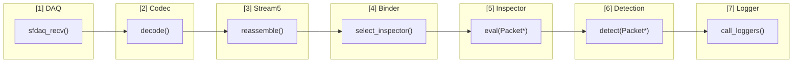
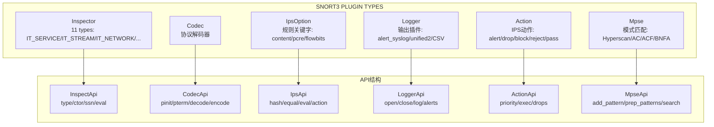
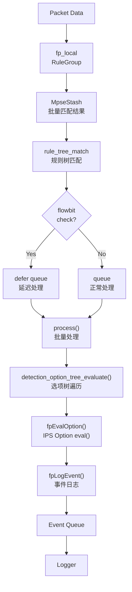

# Snort3 深度架构分析文档

## 目录

1. [系统概览](#1-系统概览)
2. [Packet Pipeline (完整数据流)](#2-packet-pipeline-完整数据流)
3. [插件体系 (6类)](#3-插件体系-6类)
4. [Detection Engine (核心)](#4-detection-engine-核心)
5. [Stream/Flow](#5-streamflow)
6. [配置 & 管理](#6-配置--管理)
7. [代码目录速查](#7-代码目录速查)

---

## 1. 系统概览

### 1.1 Snort3 定位

Snort3 是一个基于 C++17 的**多线程 Intrusion Prevention System (IPS)**，采用完全插件化架构。

```
┌─────────────────────────────────────────────────────────────────┐
│                        Snort3 架构                                │
├─────────────────────────────────────────────────────────────────┤
│  主线程 (Main Thread)                                            │
│  ├── 控制平面: Signal Handler, Shell Commands                   │
│  ├── 配置管理: Lua 解析, Module 系统                              │
│  └── 插件加载: PluginManager, SO 动态库                          │
├─────────────────────────────────────────────────────────────────┤
│  Packet 线程 (Pig Threads)                                       │
│  ├── DAQ Layer: sfdaq 原始数据包获取                              │
│  ├── Codec Layer: 多协议解码 (Ethernet→IP→TCP/UDP→...)          │
│  ├── Inspector Layer: 业务逻辑处理                               │
│  └── Detection Layer: 规则匹配引擎                               │
├─────────────────────────────────────────────────────────────────┤
│  reload 机制: atomic config swap, SIGHUP 热重载                  │
└─────────────────────────────────────────────────────────────────┘
```

### 1.2 整体架构图

```
┌──────────────────────────────────────────────────────────────────────────┐
│                           PACKET PROCESSING FLOW                         │
├──────────────────────────────────────────────────────────────────────────┤
│                                                                          │
│   ┌─────────┐    ┌─────────┐    ┌─────────┐    ┌─────────┐             │
│   │   DAQ   │───▶│  Codec  │───▶│ Stream5 │───▶│ Binder  │             │
│   │ (sfdaq) │    │ Manager │    │         │    │         │             │
│   └─────────┘    └─────────┘    └─────────┘    └────┬────┘             │
│                                                      │                  │
│         ┌────────────────────────────────────────────┼─────────────┐    │
│         │                                            ▼             │    │
│         │         ┌─────────────────────────────────────────┐     │    │
│         │         │           InspectorManager              │     │    │
│         │         │  ┌──────────────────────────────────┐  │     │    │
│         │         │  │     IT_WIZARD  (服务检测)        │  │     │    │
│         │         │  ├──────────────────────────────────┤  │     │    │
│         │         │  │     IT_SERVICE (HTTP/SSL/DCE)    │  │     │    │
│         │         │  ├──────────────────────────────────┤  │     │    │
│         │         │  │     IT_STREAM   (TCP/UDP/IP)     │  │     │    │
│         │         │  ├──────────────────────────────────┤  │     │    │
│         │         │  │     IT_NETWORK  (ARP/BO)         │  │     │    │
│         │         │  ├──────────────────────────────────┤  │     │    │
│         │         │  │     IT_PACKET   (normalize)      │  │     │    │
│         │         │  ├──────────────────────────────────┤  │     │    │
│         │         │  │     IT_CONTROL  (appid)          │  │     │    │
│         │         │  ├──────────────────────────────────┤  │     │    │
│         │         │  │     IT_PROBE    (perf_monitor)    │  │     │    │
│         │         │  └──────────────────────────────────┘  │     │    │
│         │         └─────────────────────────────────────────┘     │    │
│         │                          │                               │    │
│         │                          ▼                               │    │
│         │         ┌─────────────────────────────────────────┐     │    │
│         │         │        DetectionEngine                    │     │    │
│         │         │  ┌─────────────────────────────────┐    │     │    │
│         │         │  │  Fast Pattern (Mpse/Hyperscan)  │    │     │    │
│         │         │  ├─────────────────────────────────┤    │     │    │
│         │         │  │  Rule Tree (OTN/RTN)            │    │     │    │
│         │         │  ├─────────────────────────────────┤    │     │    │
│         │         │  │  Event Queue                    │    │     │    │
│         │         │  └─────────────────────────────────┘    │     │    │
│         │         └─────────────────────────────────────────┘     │    │
│         │                          │                               │    │
│         └──────────────────────────┼───────────────────────────────┘    │
│                                    ▼                                     │
│                         ┌─────────────────┐                           │
│                         │  Event Manager  │                           │
│                         │  (Logger/Alert) │                           │
│                         └─────────────────┘                           │
│                                                                          │
└──────────────────────────────────────────────────────────────────────────┘
```

### 1.3 关键设计哲学

- **无异常 (No Exceptions)**: 禁用 RTTI，使用错误码而非异常
- **插件化**: 所有组件通过 API 接口暴露，支持动态 SO 加载
- **线程本地存储 (Thread-Local)**: Packet 线程独立处理，数据隔离
- **批量处理 (Batch)**: MpseBatch 支持批量模式匹配
- **硬件卸载**: 支持 offload 到硬件加速器

---

## 2. Packet Pipeline (完整数据流)

### 2.1 数据流阶段

```
┌────────────────────────────────────────────────────────────────────────┐
│                     PACKET LIFECYCLE                                   │
├────────────────────────────────────────────────────────────────────────┤
│                                                                        │
│  [1] DAQ ──────▶ [2] Codec ──────▶ [3] Stream5 ──────▶ [4] Binder     │
│     │                │                │                │                 │
│     ▼                ▼                ▼                ▼                 │
│  sfdaq_recv()     decode()        reassembly()    select_inspector()  │
│                                                                        │
│  [5] Inspector ──▶ [6] Detection ──▶ [7] Logger                       │
│       │                 │                │                             │
│       ▼                 ▼                ▼                             │
│   eval(Packet*)    detect(Packet*)   call_loggers()                    │
│                                                                        │
└────────────────────────────────────────────────────────────────────────┘
```

### 2.2 各阶段详细说明

| 阶段 | 组件 | 输入 | 输出 | 关键函数 |
|------|------|------|------|----------|
| 1. DAQ | sfdaq | 原始网卡数据 | DAQ_PktHdr_t + raw buffer | `sfdaq::receive()` |
| 2. Codec | CodecManager | raw buffer | Packet 结构 (已解码协议层) | `Codec::decode()` |
| 3. Stream | Stream5 | IP fragments / TCP segments | 重组后数据包 | `Stream::reassemble()` |
| 4. Binder | Binder | Packet + Flow | 目标 Inspector | `Binder::find_binding()` |
| 5. Inspector | IT_* inspectors | Packet | 修改后的 Packet / 生成 events | `Inspector::eval()` |
| 6. Detection | DetectionEngine | Packet + rules | Event queue | `DetectionEngine::detect()` |
| 7. Logger | EventManager | Event + Packet | 输出文件/网络 | `EventManager::call_loggers()` |

### 2.3 关键函数调用链

```cpp
// 主循环 (main.cc)
Snort::run() ──▶ Pig::thread_run() ──▶ Analyzer::process_packet()

// 详细调用链
sfdaq_instance recv()           // 获取数据包
  └─▶ PacketManager::process()  // 主导入函数
        ├─▶ CodecManager::decode()      // 协议解码
        │     └─▶ EthernetCodec::decode()
        │         └─▶ Ip4Codec::decode()
        │             └─▶ TcpCodec::decode()
        │
        ├─▶ Stream5::process()          // 流重组
        │     └─▶ TcpStream::reassemble()
        │
        ├─▶ InspectorManager::execute()  // 分发到 inspector
        │     ├─▶ Binder::eval()         // 选择目标 inspector
        │     └─▶ Inspector::eval()      // 执行检查
        │
        └─▶ DetectionEngine::detect()    // 规则检测
              ├─▶ fp_local.mpse.search()  // 快速模式匹配
              ├─▶ fp_search()            // 搜索匹配
              └─▶ queue_event()           // 事件入队
                    └─▶ fpLogEvent()      // 日志输出
```

---

## 3. 插件体系 (6类)

### 3.1 插件类型总览

```
┌─────────────────────────────────────────────────────────────────────┐
│                      SNORT3 PLUGIN ARCHITECTURE                      │
├─────────────────────────────────────────────────────────────────────┤
│                                                                     │
│   ┌─────────────┐    ┌─────────────┐    ┌─────────────┐            │
│   │  Inspector  │    │    Codec    │    │ IpsOption   │            │
│   │  (11 types) │    │  (协议解码)  │    │ (规则关键字) │            │
│   └──────┬──────┘    └──────┬──────┘    └──────┬──────┘            │
│          │                  │                  │                     │
│   ┌──────┴──────┐    ┌──────┴──────┐    ┌──────┴──────┐            │
│   │InspectApi  │    │ CodecApi    │    │  IpsApi     │            │
│   │─────────────│    │─────────────│    │─────────────│            │
│   │type        │    │pinit/pterm │    │hash/equal  │            │
│   │ctor/dtor   │    │tinit/tterm │    │eval/action │            │
│   │ssn        │    │decode/encode│    │cursor_type │            │
│   └─────────────┘    └─────────────┘    └─────────────┘            │
│                                                                     │
│   ┌─────────────┐    ┌─────────────┐    ┌─────────────┐            │
│   │   Logger    │    │   Action    │    │    Mpse     │            │
│   │  (输出插件)  │    │  (IPS 动作)  │    │(模式匹配引擎)│            │
│   └──────┬──────┘    └──────┬──────┘    └──────┬──────┘            │
│          │                  │                  │                     │
│   ┌──────┴──────┐    ┌──────┴──────┐    ┌──────┴──────┐            │
│   │LoggerApi   │    │ActionApi    │    │  MpseApi    │            │
│   │─────────────│    │─────────────│    │─────────────│            │
│   │open/close  │    │priority     │    │add_pattern  │            │
│   │log/alerts  │    │exec/drops   │    │prep_patterns│            │
│   │             │    │             │    │search       │            │
│   └─────────────┘    └─────────────┘    └─────────────┘            │
│                                                                     │
└─────────────────────────────────────────────────────────────────────┘
```

### 3.2 Inspector (核心组件)

#### 11 种 Inspector 类型

| 类型 | 枚举值 | 说明 | 典型实现 |
|------|--------|------|----------|
| PACKET | IT_PACKET | 原始数据包处理 | normalize, capture |
| STREAM | IT_STREAM | 流跟踪和重组 | stream5_tcp, stream5_udp, stream5_ip |
| NETWORK | IT_NETWORK | 非服务数据包处理 | arp, back_orifice |
| SERVICE | IT_SERVICE | 服务 PDU 分析 | http_inspect, ssl_inspect, dce_inspect |
| CONTROL | IT_CONTROL | 检测前处理 | appid |
| PROBE | IT_PROBE | 检测后处理 | perf_monitor, port_scan |
| WIZARD | IT_WIZARD | 服务检测 | wizard |
| FILE | IT_FILE | 文件识别 | file_id |
| FIRST | IT_FIRST | 新流首包/重载后首包 |  |
| PROBE_FIRST | IT_PROBE_FIRST | PROBE 的先头 | packet_capture |
| PASSIVE | IT_PASSIVE | 仅配置或数据消费 | binder, ftp_client |

#### Inspector 生命周期

```cpp
// inspector.h 中的关键接口
class Inspector {
public:
    virtual ~Inspector();
    virtual bool configure(SnortConfig*);     // 配置阶段
    virtual void tear_down(SnortConfig*);      // 卸载配置
    virtual void tinit();                       // 线程初始化
    virtual void tterm();                       // 线程终止
    virtual bool likes(Packet*);                // 过滤: 是否处理此包
    virtual void eval(Packet*);                 // 主处理函数
    virtual void clear(Packet*);                // 清理函数
    virtual StreamSplitter* get_splitter(bool); // 流分割器 (IT_SERVICE)
};
```

#### 典型 Inspector 实现示例

```cpp
// http_inspect 简化结构
class HttpInspect : public Inspector {
public:
    HttpInspect(Module* m) { /* 构造 */ }
    ~HttpInspect() override { /* 析构 */ }

    bool configure(SnortConfig*) override;  // 配置 http 检测参数
    void tinit() override;                   // 初始化线程本地数据
    void eval(Packet*) override;              // HTTP 协议解析和检测

    // 流分割: HTTP 是基于流的服务
    StreamSplitter* get_splitter(bool to_server) override {
        return new HttpSplitter(to_server);
    }

private:
    HttpBuffers buffers;  // HTTP 相关 buffer
    HttpParaPara* hpp;   // HTTP 检测参数
};
```

### 3.3 Codec (协议解码器)

```cpp
// codec.h
class Codec {
public:
    static const uint32_t PKT_MAX = 14 + 4 + 1500 + 65535;  // 65553

    virtual bool decode(const RawData&, CodecData&, DecodeData&) = 0;
    virtual bool encode(const uint8_t*, uint16_t, EncState&, Buffer&, Flow*);
    virtual void update(...) { }
    virtual void log(TextLog*, const uint8_t*, uint16_t);

protected:
    Codec(const char* s) { name = s; }
    const char* name;
};

// CodecApi 结构
struct CodecApi {
    BaseApi base;
    CdAuxFunc pinit, pterm;     // 进程级初始化/清理
    CdAuxFunc tinit, tterm;     // 线程级初始化/清理
    CdNewFunc ctor;              // 创建实例
    CdDelFunc dtor;              // 销毁实例
};
```

#### 协议栈解码顺序

```
Ethernet (DLT_EN10MB)
  └─▶ Vlan
       └─▶ IPv4 / IPv6
            └─▶ TCP / UDP / ICMP
                 └─▶ 应用层协议 (HTTP, SSL, DNS, ...)
```

### 3.4 IpsOption (规则关键字插件)

```cpp
// ips_option.h
class IpsOption {
public:
    virtual ~IpsOption() = default;

    virtual uint32_t hash() const;
    virtual bool operator==(const IpsOption&) const;

    // packet thread functions
    virtual bool is_relative();
    virtual bool retry(Cursor&);
    virtual void action(Packet*);

    enum EvalStatus { NO_MATCH, MATCH, NO_ALERT, FAILED_BIT };
    virtual EvalStatus eval(Cursor&, Packet*) = 0;

    virtual CursorActionType get_cursor_type() const;
};

// IpsApi
struct IpsApi {
    BaseApi base;
    const char* name;
    RuleOptType type;           // CONTENT, PCRE, HEADER, etc.
    IpsOptFunc ctor;            // 创建选项
    IpsOptFunc dtor;            // 销毁选项
};
```

#### 常见 IpsOption 类型

| 类型 | 关键字 | 说明 |
|------|--------|------|
| CONTENT | content | 字节串匹配 |
| PCRE | pcre | 正则表达式 |
| FLOW | flow | 流状态匹配 |
| FLOWBITS | flowbits | 流标志位操作 |
| CLASSTYPE | classification | 分类 |
| SID | sid | 规则 ID |
| MSG | msg | 消息文本 |

### 3.5 Logger (输出插件)

```cpp
// loggers 目录
class Logger {
public:
    virtual ~Logger() = default;
    virtual void open() = 0;
    virtual void close() = 0;
    virtual void log(Packet*, const char* msg, void* data) = 0;
    virtual void alert(Packet*, const char* msg, void* data) = 0;
};

// 事件优先级
enum IpsActionPriority {
    IAP_OTHER = 1,
    IAP_LOG = 10,
    IAP_ALERT = 20,
    IAP_REWRITE = 30,
    IAP_DROP = 40,
    IAP_BLOCK = 50,
    IAP_REJECT = 60,
    IAP_PASS = 70
};
```

### 3.6 Action (IPS 动作)

```cpp
// ips_action.h
class IpsAction {
public:
    virtual ~IpsAction() = default;

    virtual void exec(Packet*, const ActInfo&) = 0;
    virtual bool drops_traffic() { return false; }

    static std::string get_string(Type);
    static Type get_type(const char*);
    static Type get_max_types();
    static bool is_valid_action(Type);

    void pass();
    void log(Packet*, const ActInfo&);
    void alert(Packet*, const ActInfo&);

protected:
    IpsAction(const char* s, ActiveAction* a);
    const char* name;
    ActiveAction* active_action;
};

// 动作类型
enum Type {
    ALERT, DROP, BLOCK, REJECT, PASS, LOG, REDIRECT, ALERT_ONCE, ... 
};
```

### 3.7 Mpse (模式匹配引擎)

```cpp
// framework/mpse.h
class Mpse {
public:
    enum MpseType { MPSE_TYPE_NORMAL = 0, MPSE_TYPE_OFFLOAD = 1 };

    virtual int add_pattern(
        const uint8_t* pat, unsigned len,
        const PatternDescriptor&, void* user) = 0;

    virtual int prep_patterns(SnortConfig*) = 0;

    virtual int search(
        const uint8_t* T, int n,
        MpseMatch, void* context, int* current_state) = 0;

    virtual void search(MpseBatch&, MpseType);

    virtual MpseRespType receive_responses(MpseBatch&, MpseType);
    static MpseRespType poll_responses(MpseBatch*&, MpseType);

    const char* get_method();
    int get_pattern_count() const;

protected:
    Mpse(const char* method);
};

// MpseApi
struct MpseApi {
    BaseApi base;
    uint32_t flags;  // MPSE_REGEX, MPSE_ASYNC, MPSE_MTBLD

    MpseOptFunc activate;
    MpseOptFunc setup;
    MpseExeFunc start;
    MpseExeFunc stop;
    MpseNewFunc ctor;
    MpseDelFunc dtor;
    MpsePollFunc poll;
};
```

#### 模式匹配实现

| 实现 | 说明 | 位置 |
|------|------|------|
| Hyperscan | Intel 硬件加速正则/模式匹配 | search_engines/hyperscan.cc |
| AC (Aho-Corasick) | 多模式精确匹配 | search_engines/acsmx2.cc |
| ACF (AC Full) | 全匹配 AC | search_engines/ac_full.cc |
| BNFA | 双数组 NFA | search_engines/bnfa_search.cc |

---

## 4. Detection Engine (核心)

### 4.1 快速模式匹配流程

```
┌─────────────────────────────────────────────────────────────────────────┐
│                    FAST PATTERN DETECTION FLOW                           │
├─────────────────────────────────────────────────────────────────────────┤
│                                                                         │
│   Packet Data                                                           │
│        │                                                                │
│        ▼                                                                │
│   ┌─────────────┐    ┌─────────────┐    ┌─────────────┐               │
│   │ fp_local    │───▶│ MpseStash   │───▶│rule_tree   │               │
│   │ (RuleGroup) │    │ (批量匹配)   │    │_match      │               │
│   └──────┬──────┘    └──────┬──────┘    └──────┬──────┘               │
│          │                  │                   │                        │
│          │           ┌──────┴──────┐           │                        │
│          │           │  OtnxMatch  │           │                        │
│          │           │  Data       │           │                        │
│          │           └──────┬──────┘           │                        │
│          │                  │                  │                        │
│          ▼                  ▼                  ▼                        │
│   ┌─────────────────────────────────────────────────────┐               │
│   │              MatchArray (MAX_EVENT_MATCH = 100)      │               │
│   │   [ OTN1, OTN2, OTN3, ... ]  匹配到的规则节点列表    │               │
│   └─────────────────────────────────────────────────────┘               │
│                              │                                          │
│                              ▼                                          │
│                      fpLogEvent()                                       │
│                              │                                          │
│                              ▼                                          │
│                      Event Queue ──▶ Logger                             │
│                                                                         │
└─────────────────────────────────────────────────────────────────────────┘
```

### 4.2 数据结构

#### RuleTreeNode (RTN) - 规则头

```cpp
// treenodes.h
struct RuleTreeNode {
    using Flag = uint8_t;
    static constexpr Flag ENABLED       = 0x01;
    static constexpr Flag ANY_SRC_PORT  = 0x02;
    static constexpr Flag ANY_DST_PORT  = 0x04;
    static constexpr Flag BIDIRECTIONAL = 0x10;
    static constexpr Flag ANY_SRC_IP    = 0x20;
    static constexpr Flag ANY_DST_IP    = 0x40;

    RuleFpList* rule_func;     // 匹配函数列表
    RuleHeader* header;        // 规则头信息

    sfip_var_t* sip;           // 源 IP
    sfip_var_t* dip;           // 目的 IP
    PortObject* src_portobject;
    PortObject* dst_portobject;

    SnortProtocolId snort_protocol_id;
    snort::IpsAction::Type action;  // alert/drop/pass/...
    uint8_t flags;
};
```

#### OptTreeNode (OTN) - 规则体

```cpp
// treenodes.h
struct OptTreeNode {
    using Flag = uint8_t;
    static constexpr Flag WARNED_FP  = 0x01;
    static constexpr Flag STATELESS  = 0x02;
    static constexpr Flag TO_CLIENT  = 0x10;
    static constexpr Flag TO_SERVER  = 0x20;
    static constexpr Flag BIT_CHECK  = 0x40;  // 使用 flowbits
    static constexpr Flag SVC_ONLY   = 0x80;

    SigInfo sigInfo;               // 签名信息 (gid, sid, msg, ...)
    OptFpList* opt_func;           // 选项匹配函数列表
    OutputSet* outputFuncs;        // 输出函数
    snort::IpsOption* agent;       // 主检测选项

    OptFpList* normal_fp_only;     // 普通快速模式
    OptFpList* offload_fp_only;    // 卸载快速模式

    THD_NODE* detection_filter;    // 检测过滤器
    TagData* tag;

    RuleTreeNode** proto_nodes;     // 指向 RTN 的指针数组
    OtnState* state;                // 状态和统计

    unsigned evalIndex;            // 评估索引
    unsigned num_detection_opts;   // 检测选项数量
    uint16_t longestPatternLen;    // 最长模式长度
};
```

#### PORT_RULE_MAP

```cpp
// ports/port_group.h
struct RuleGroup {
    RULE_NODE* nfp_head;           // 非快速模式链表
    RULE_NODE* nfp_tail;

    using PmList = std::vector<PatternMatcher*>[snort::PS_MAX + 1];
    PmList pm_list;                 // 按包/文件/PDU 分组的模式匹配器

    void* nfp_tree;                 // 非快速模式树
    unsigned rule_count;
    unsigned nfp_rule_count;
};

struct PatternMatcher {
    enum Type { PMT_PKT, PMT_FILE, PMT_PDU };
    Type type;
    const char* name;
    snort::MpseGroup group;         // MPSE 实例
    snort::IpsOption* fp_opt;       // 快速模式选项
};
```

### 4.3 规则编译流程

```
┌────────────────────────────────────────────────────────────────────────┐
│                      RULE COMPILATION FLOW                              │
├────────────────────────────────────────────────────────────────────────┤
│                                                                        │
│   文本规则文件 (snort.rules)                                            │
│         │                                                               │
│         ▼                                                               │
│   Parser::parse_rule()                                                  │
│         │                                                               │
│         ▼                                                               │
│   ┌─────────────────────────────────────────────────────────────┐      │
│   │ 1. 解析规则头: action, protocol, src_ip, src_port, dir,     │      │
│   │    dst_ip, dst_port                                         │      │
│   │    ↓                                                        │      │
│   │ 2. 创建/查找 RTN (RuleTreeNode)                             │      │
│   │    ↓                                                        │      │
│   │ 3. 解析规则体选项 (content, pcre, flowbits, ...)           │      │
│   │    ↓                                                        │      │
│   │ 4. 创建 OTN (OptTreeNode)                                   │      │
│   │    ↓                                                        │      │
│   │ 5. IpsManager::option_set() 创建 IpsOption                 │      │
│   │    ↓                                                        │      │
│   │ 6. AddOptFuncToList() 添加到 OTN->opt_func                 │      │
│   │    ↓                                                        │      │
│   │ 7. 提取快速模式内容, 添加到 fp_list                         │      │
│   └─────────────────────────────────────────────────────────────┘      │
│         │                                                               │
│         ▼                                                               │
│   fp_local.mpse.add_pattern()  // 添加到 Hyperscan/AC                  │
│         │                                                               │
│         ▼                                                               │
│   RuleGroup.pm_list  // 最终的快速模式匹配器列表                          │
│                                                                        │
└────────────────────────────────────────────────────────────────────────┘
```

### 4.4 Event 处理流程

```cpp
// detection_engine.h / detect.cc

// 事件入队
int DetectionEngine::queue_event(const OptTreeNode* otn)
{
    // 添加到上下文的事件队列
    context->equeue = sfeventq_add(context->equeue, otn);
}

// 快速模式事件日志
int fpLogEvent(const RuleTreeNode* rtn, const OptTreeNode* otn, Packet* p)
{
    // 1. 获取 OTN 的动作
    snort::IpsAction::Type action = rtn->action;

    // 2. 调用动作执行函数
    if (action == IAP_ALERT or action == IAP_LOG)
        CallAlertFuncs(p, otn, head);
    else if (action == IAP_DROP or action == IAP_BLOCK)
        DropSession(p, action);

    // 3. 触发 output 插件
    EventManager::call_loggers(...);
}

// 检测完成后的后处理
void IpsContext::post_detection()
{
    // 执行 post_callbacks (如 file processing)
    for (auto cb : post_callbacks)
        cb(this);
}
```

### 4.5 Fast Pattern 匹配流程

```cpp
// detection/fp_detect.cc

// 主检测入口
void fp_full(Packet* p)
{
    // 1. 遍历所有匹配的规则
    for (int i = 0; i < match_count; i++)
    {
        const OptTreeNode* otn = match_array[i];

        // 2. 执行 RTN 头检查
        if (!fp_eval_rtn(rtn, p, check_ports))
            continue;

        // 3. 遍历 OTN 选项链
        for (OptFpList* opt = otn->opt_func; opt; opt = opt->next)
        {
            // 4. 执行选项检测函数
            if (opt->OptTestFunc(opt->option_data, cursor, p) != MATCH)
                break;  // 失败则停止

            // 5. 移动 cursor
            if (opt->ips_opt->get_cursor_type() == CAT_ADJUST)
                cursor.offset += ...;
        }

        // 6. 所有选项匹配成功, 生成事件
        fpLogEvent(rtn, otn, p);
    }
}
```

---

## 5. Stream/Flow

### 5.1 Stream5 架构

```
┌─────────────────────────────────────────────────────────────────────────┐
│                         STREAM5 ARCHITECTURE                             │
├─────────────────────────────────────────────────────────────────────────┤
│                                                                         │
│   Flow Key (5-tuple)                                                    │
│   ┌──────────────────────────────────────────┐                          │
│   │  src_ip | dst_ip | protocol | src_port | dst_port                  │
│   └──────────────────────────────────────────┘                          │
│                              │                                          │
│                              ▼                                          │
│   ┌─────────────────────────────────────────────────────────────┐       │
│   │                    Flow Cache (LRU)                          │       │
│   │   Flow* get_flow(const FlowKey&)                            │       │
│   │   void delete_flow(Flow*)                                    │       │
│   │   void purge_flows()                                         │       │
│   └─────────────────────────────────────────────────────────────┘       │
│                              │                                          │
│          ┌───────────────────┼───────────────────┐                     │
│          ▼                   ▼                   ▼                     │
│   ┌─────────────┐     ┌─────────────┐     ┌─────────────┐              │
│   │ TcpStream   │     │ UdpStream   │     │  IpStream   │              │
│   │ (TCP 重组)   │     │ (UDP 流)     │     │ (IP 分片)   │              │
│   └──────┬──────┘     └─────────────┘     └─────────────┘              │
│          │                                                            │
│          ▼                                                            │
│   ┌─────────────────────────────────────────────────────────────┐       │
│   │                      Session                                 │       │
│   │   - flow_state: ESTABLISHED, CLOSED, ...                   │       │
│   │   - ssn_flags: SSNFLAG_SEEN_CLIENT, SSNFLAG_ESTABLISHED    │       │
│   │   - stream_ptr: 重组后的数据                                │       │
│   │   - flush_policy: 根据数据/窗口/事件触发 flush               │       │
│   └─────────────────────────────────────────────────────────────┘       │
│                                                                         │
└─────────────────────────────────────────────────────────────────────────┘
```

### 5.2 Flow 数据结构

```cpp
// flow/flow.h
class Flow {
public:
    Flow();
    ~Flow();

    // 5-tuple 键
    const FlowKey* flow_key;

    // 流状态
    uint32_t ssn_flags;      // SSNFLAG_SEEN_CLIENT, SSNFLAG_ESTABLISHED, ...
    uint8_t flow_state;     // STREAM_STATE_ESTABLISHED, STREAM_STATE_CLOSED, ...

    // 流数据
    uint8_t* server_data;
    uint8_t* client_data;

    // 流统计
    uint32_t client_bytes;
    uint32_t server_bytes;
    uint32_t client_pkts;
    uint32_t server_pkts;

    // 时间戳
    struct timeval start_time;
    struct timeval last_time;

    // 协议信息
    SnortProtocolId proto_id;
    AppId app_id;

    // FlowData 列表 (inspector 状态)
    std::list<FlowData*> flow_data;

    // 高可用性状态
    FlowHAState* ha_state;
};
```

### 5.3 TCP 重组

```cpp
// stream5/tcp/tcp_stream.cc

class TcpStream {
public:
    // 重组模式
    enum FlushPolicy {
        FP_FOOTPRINT,    // 基于 footprint
        FP_WINDOW,       // 基于窗口
        FP_IPS,          // IPS 模式
        FP_IGNORE,       // 忽略
        FP_ON_DATA,      // 有数据就 flush
        FP_ALWAYS        // 总是 flush
    };

    // 重组段
    struct Segment {
        uint8_t* data;
        uint32_t len;
        uint32_t seq;
        uint8_t type;      // SEG_DATA, FIN, RST, ...
        bool is_queued;
    };

    // 重组算法: 从无序段中重建有序数据流
    int queue_segment(TcpStream*, const TcpSegment*);
    uint8_t* flush_to_seq(uint32_t seq, uint32_t* len);
};
```

### 5.4 Flowbits 状态机

```cpp
// flowbits 操作在 ips_options/content.cc 中实现

// Flowbits 状态存储在 Flow 中
// 每个 flow 维护一个 flowbits 位图

// 支持的操作:
// flowbits:set(name)       - 设置标志
// flowbits:isset(name)     - 检测标志
// flowbits:unset(name)     - 清除标志
// flowbits:toggle(name)    - 翻转标志
// flowbits:isnotset(name)  - 检测未设置

// 示例规则:
// alert tcp any 80 -> any any (msg:"HTTP Request"; flowbits:set,http_req; content:"GET";)
// alert tcp any any -> any 80 (msg:"HTTP Response"; flowbits:isset,http_req; content:"200 OK";)
```

---

## 6. 配置 & 管理

### 6.1 Lua 配置系统

```
┌─────────────────────────────────────────────────────────────────────────┐
│                         LUA CONFIGURATION                                │
├─────────────────────────────────────────────────────────────────────────┤
│                                                                         │
│   snort.lua (主配置)                                                    │
│   ├── snort_defaults.lua (默认配置)                                      │
│   │                                                                     │
│   ├── -- 网络配置                                                        │
│   │   config network = { ... }                                          │
│   │   config bindings = { ... }                                         │
│   │                                                                     │
│   ├── -- 规则加载                                                        │
│   │   rules = [[                                                         │
│   │       alert tcp any any -> any any (msg:"test"; content:"test";)    │
│   │   ]]                                                                 │
│   │                                                                     │
│   └── -- 插件配置                                                        │
│       http_inspect = { ... }                                            │
│       perf_monitor = { ... }                                            │
│                                                                         │
└─────────────────────────────────────────────────────────────────────────┘
```

### 6.2 Module 系统

```cpp
// framework/module.h

class Module {
public:
    virtual ~Module() = default;

    // 配置参数
    virtual bool set(const char*, Value&, SnortConfig*) = 0;
    virtual bool begin(const char*, int, SnortConfig*) = 0;
    virtual bool end(const char*, int, SnortConfig*) = 0;

    // 统计信息
    virtual void show_stats() { }
    virtual void show_interval() { }

    // 配置验证
    virtual bool verify(const SnortConfig*) const { return true; }

    // 导出参数表
    virtual const Parameter* get_parameters() const = 0;

    const char* get_name() const;
    const char* get_help() const;

protected:
    Module(const char* s, const Parameter*);
};

// IpsManager 管理所有 ips_option 模块
class IpsManager {
    static void add_plugin(const snort::IpsApi*);
    static void instantiate(const snort::IpsApi*, snort::Module*, snort::SnortConfig*);
    static void global_init(const snort::SnortConfig*);
};
```

### 6.3 热重载 (SIGHUP)

```
┌─────────────────────────────────────────────────────────────────────────┐
│                           HOT RELOAD FLOW                                 │
├─────────────────────────────────────────────────────────────────────────┤
│                                                                         │
│   SIGHUP 信号                                                            │
│       │                                                                 │
│       ▼                                                                 │
│   Snort::reload_config()                                                │
│       │                                                                 │
│       ├── 1. 解析新配置文件                                              │
│       │   └─▶ SnortConfig* new_sc = parse_snort_conf()                 │
│       │                                                                 │
│       ├── 2. 创建 Swapper (old_config, new_config)                     │
│       │                                                                 │
│       ├── 3. 广播 ACSwap 命令到所有 Packet 线程                         │
│       │   └─▶ Pig::queue_command(new ACSwap(swapper))                  │
│       │                                                                 │
│       ├── 4. Packet 线程在安全点执行 swap                               │
│       │   └─▶ SnortConfig::set_conf(atomic swap)                        │
│       │                                                                 │
│       └── 5. 旧配置在所有线程完成后释放                                  │
│           └─▶ delete old_config                                         │
│                                                                         │
└─────────────────────────────────────────────────────────────────────────┘
```

### 6.4 性能监控

```cpp
// profiler/profiler.h

struct ProfileStats {
    hr_duration elapsed;         // 总耗时
    hr_duration elapsed_max;     // 最大耗时
    uint64_t checks;             // 检查次数
    uint64_t matches;            // 匹配次数
};

// 关键性能计数器
THREAD_LOCAL ProfileStats mpsePerfStats;    // Mpse 匹配性能
THREAD_LOCAL ProfileStats rulePerfStats;    // 规则评估性能
THREAD_LOCAL ProfileStats bindPerfStats;    // Binder 性能

// perf_monitor inspector 收集和报告性能数据
class PerfMonitor : public Inspector {
    void eval(Packet*) override;
    void tterm() override;  // 输出统计信息
};
```

---

## 7. 代码目录速查

### 7.1 核心目录结构

| 目录 | 功能 | 关键文件 |
|------|------|----------|
| `src/main/` | 主入口 | `snort.cc`, `snort.h`, `pig.cc` |
| `src/framework/` | 框架接口 | `inspector.h`, `codec.h`, `mpse.h`, `ips_option.h` |
| `src/detection/` | 检测引擎 | `detection_engine.cc`, `fp_detect.cc`, `treenodes.h` |
| `src/managers/` | 插件管理 | `inspector_manager.h`, `ips_manager.h`, `codec_manager.h` |
| `src/stream/` | 流处理 | `stream.h`, `stream5.cc` |
| `src/flow/` | Flow 管理 | `flow.h`, `flow_cache.cc`, `flow_key.cc` |
| `src/codecs/` | 协议解码 | `codec.cc`, `ethernet.cc`, `ip4.cc`, `tcp.cc` |
| `src/ips_options/` | 规则选项 | `ips_content.cc`, `ips_pcre.cc`, `ips_flowbits.cc` |
| `src/loggers/` | 日志输出 | `log.cc`, `alert_fast.cc` |
| `src/actions/` | IPS 动作 | `ips_actions.cc` |
| `src/search_engines/` | 模式匹配 | `hyperscan.cc`, `acsmx2.cc`, `bnfa_search.cc` |
| `src/packet_io/` | 数据包 IO | `sfdaq.cc`, `active.cc` |
| `src/network_inspectors/` | 网络检查器 | `binder/`, `normalizer/` |
| `src/service_inspectors/` | 服务检查器 | `http_inspect/`, `ssl_inspect/` |
| `src/protocols/` | 协议定义 | `tcp.h`, `udp.h`, `ip.h` |

### 7.2 关键文件路径索引

| 功能 | 文件路径 |
|------|----------|
| **入口** | `src/main.cc`, `src/main/snort.cc` |
| **Inspector 基类** | `src/framework/inspector.h` |
| **Inspector 管理** | `src/managers/inspector_manager.h` |
| **检测引擎** | `src/detection/detection_engine.h`, `src/detection/fp_detect.cc` |
| **规则树节点** | `src/detection/treenodes.h` |
| **检测上下文** | `src/detection/ips_context.h` |
| **Codec 基类** | `src/framework/codec.h` |
| **Codec 管理** | `src/managers/codec_manager.h` |
| **Binder** | `src/network_inspectors/binder/binder.cc` |
| **Flow** | `src/flow/flow.h`, `src/flow/flow.cc` |
| **Stream5** | `src/stream/stream.h`, `src/stream5/` |
| **Mpse** | `src/framework/mpse.h` |
| **Hyperscan** | `src/search_engines/hyperscan.cc` |
| **IpsOption** | `src/framework/ips_option.h` |
| **IpsManager** | `src/managers/ips_manager.h` |
| **Action** | `src/framework/ips_action.h` |
| **Logger** | `src/loggers/`, `src/managers/event_manager.h` |
| **配置解析** | `src/parser/`, `src/lua/` |
| **模块系统** | `src/framework/module.h` |
| **插件加载** | `src/managers/plugin_manager.h` |

### 7.3 关键数据结构速查表

| 结构 | 定义位置 | 用途 |
|------|----------|------|
| `Packet` | `protocols/packet.h` | 数据包表示 |
| `Flow` | `flow/flow.h` | 流状态 |
| `IpsContext` | `detection/ips_context.h` | 检测上下文 |
| `RuleTreeNode` | `detection/treenodes.h` | 规则头 |
| `OptTreeNode` | `detection/treenodes.h` | 规则体 |
| `RuleGroup` | `ports/port_group.h` | 快速模式组 |
| `PatternMatcher` | `ports/port_group.h` | MPSE 包装器 |
| `Codec` | `framework/codec.h` | 协议编解码器 |
| `Inspector` | `framework/inspector.h` | 检查器基类 |
| `IpsOption` | `framework/ips_option.h` | 规则选项 |
| `Mpse` | `framework/mpse.h` | 模式匹配引擎 |
| `IpsAction` | `framework/ips_action.h` | IPS 动作 |

### 7.4 核心函数调用索引

| 函数 | 文件:行 | 用途 |
|------|---------|------|
| `Snort::run()` | `main.cc:???` | 主循环 |
| `Pig::thread_run()` | `pig.cc` | Packet 线程入口 |
| `Analyzer::process_packet()` | `packet_io/` | 数据包处理 |
| `PacketManager::process()` | `packet_io/` | 主导入函数 |
| `CodecManager::decode()` | `managers/` | 协议解码 |
| `InspectorManager::execute()` | `managers/` | Inspector 分发 |
| `DetectionEngine::detect()` | `detection/` | 规则检测 |
| `fp_full()` | `detection/fp_detect.cc` | 快速模式检测 |
| `queue_event()` | `detection/` | 事件入队 |
| `fpLogEvent()` | `detection/` | 事件日志 |
| `Stream::reassemble()` | `stream/` | 流重组 |
| `Binder::eval()` | `network_inspectors/` | 选择 Inspector |
| `EventManager::call_loggers()` | `managers/` | 调用日志输出 |

---

## 附录: 架构图例

### 插件生命周期

```
┌─────────────────────────────────────────────────────────────────────────┐
│                      PLUGIN LIFECYCLE                                   │
├─────────────────────────────────────────────────────────────────────────┤
│                                                                         │
│   加载阶段 (main thread)                                                │
│   ┌─────────────────────────────────────────────────────────────────┐   │
│   │ PluginManager::load_plugins()                                   │   │
│   │   │                                                             │   │
│   │   ├── 1. Load static plugins (插件 API 表)                      │   │
│   │   │                                                             │   │
│   │   ├── 2. dlopen() SO 动态库                                     │   │
│   │   │                                                             │   │
│   │   └── 3. get_plugin_api() 获取插件接口                           │   │
│   │         │                                                       │   │
│   │         ▼                                                       │   │
│   │   ┌─────────────────────────────────────────────────────────┐   │   │
│   │   │ API Manager (IpsManager, InspectorManager, ...)          │   │   │
│   │   │   └── add_plugin(api)  // 注册到管理器                   │   │   │
│   │   └─────────────────────────────────────────────────────────┘   │   │
│   └─────────────────────────────────────────────────────────────────┘   │
│                              │                                          │
│                              ▼                                          │
│   配置阶段 (main thread)                                                │
│   ┌─────────────────────────────────────────────────────────────────┐   │
│   │ ModuleManager::instantiate()                                     │   │
│   │   │                                                             │   │
│   │   ├── IpsManager::instantiate(api, module, config)               │   │
│   │   │     └── ips_option = api->ctor(module)                       │   │
│   │   │                                                             │   │
│   │   └── InspectorManager::instantiate(api, module, config)        │   │
│   │         └── inspector = api->ctor(module)                        │   │
│   └─────────────────────────────────────────────────────────────────┘   │
│                              │                                          │
│                              ▼                                          │
│   运行阶段 (packet thread)                                             │
│   ┌─────────────────────────────────────────────────────────────────┐   │
│   │ Inspector::tinit()  // 线程本地初始化                            │   │
│   │   │                                                             │   │
│   │   Inspector::likes(Packet*)  // 过滤                             │   │
│   │   │                                                             │   │
│   │   Inspector::eval(Packet*)   // 主处理                           │   │
│   │   │                                                             │   │
│   │   Inspector::clear(Packet*)  // 清理                             │   │
│   │   │                                                             │   │
│   │   Inspector::tterm()  // 线程本地清理                            │   │
│   └─────────────────────────────────────────────────────────────────┘   │
│                                                                         │
└─────────────────────────────────────────────────────────────────────────┘
```

---

## 可视化

### 1. Packet Processing Pipeline



### 2. Plugin Architecture (6类)



### 3. Fast Pattern Detection Flow



*文档版本: 2026.05*
*Snort3 源码版本: 3.x (基于 ~/workspace/github/snort3/)*
