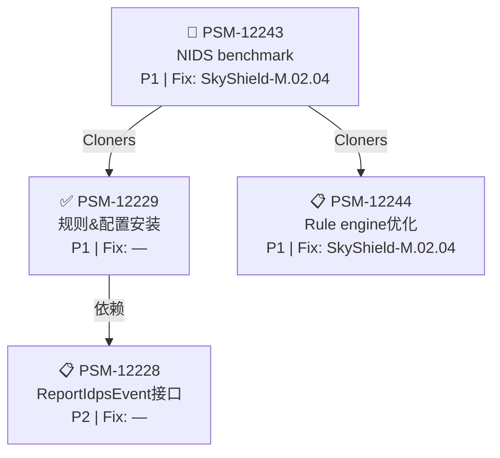

# PSM-12243 依赖关系 + 冲突分析

> [IDPS] NIDS performance test benchmark
> Status: In Progress | Priority: P1 | FixVersion: SkyShield-M.02.04.00.00

## 依赖树

## 属性矩阵

| Issue | Status | Priority | Due | FixVersion | Parent |
|-------|--------|----------|-----|------------|--------|
| PSM-12243 | 🔄 In Progress | P1 Critical | — | SkyShield-M.02.04 | — |
| PSM-12229 | ✅ Done | P1 Critical | — | — | — |
| PSM-12228 | 📋 In Review | P2 High | — | — | — |
| PSM-12244 | 📋 In Review | P1 Critical | — | SkyShield-M.02.04 | — |

## 🚨 冲突分析

### 1. FixVersion 不一致
| 冲突 | 详情 |
|------|------|
| PSM-12229 无 FixVersion | PSM-12243 的前置依赖已完成，但未关联任何发布版本。若 PSM-12229 是在之前版本完成的，需确认其产出是否已合入 SkyShield-M.02.04 |
| PSM-12228 无 FixVersion | 二级依赖，且状态为 In Review，FixVersion 缺失可能导致遗漏 |

### 2. 状态倒挂
| 冲突 | 详情 |
|------|------|
| PSM-12229=Done 但 PSM-12228=In Review | **严重** — PSM-12229 标记为完成时，其依赖 PSM-12228 仍在 In Review。意味着 PSM-12229 要么不依赖 PSM-12228，要么 Done 标记过早 |

### 3. 优先级矛盾
| 冲突 | 详情 |
|------|------|
| PSM-12228 为 P2，其余为 P1 | 最底层的依赖优先级最低。PSM-12228 阻塞 PSM-12229→PSM-12243 链，应至少升为 P1 |

### 4. Due Date 全部缺失
| 冲突 | 详情 |
|------|------|
| 4 张票均无 Due Date | SkyShield-M.02.04 的交付时间线不可追踪，建议补上 |

## 建议

| # | 行动 | 优先级 |
|---|------|--------|
| 1 | PSM-12228 升为 P1，补 FixVersion | P0 |
| 2 | PSM-12229 补 FixVersion (SkyShield-M.02.04) | P0 |
| 3 | 确认 PSM-12229 Done 时 PSM-12228 的实际状态 | P0 |
| 4 | 全部补 Due Date | P1 |
